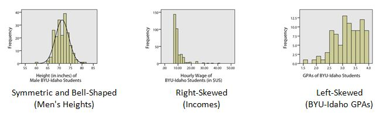

<script type="text/javascript">
 function showhide(id) {
    var e = document.getElementById(id);
    e.style.display = (e.style.display == 'block') ? 'none' : 'block';
 }
</script>

<!--

<div style="float:right;width=40%;">
<br />
<div style="padding-left:10%;">**Optional Lesson Video**</div>
<iframe width="90%" align="right" src="https://www.youtube.com/embed/videoseries?list=PLaZryQtbPQC_w9Z1CWsBjtdmcQdJwuAay" frameborder="1" allow="autoplay; encrypted-media" allowfullscreen></iframe>
</div>
<br>

-->

## Lesson Outcomes

<a href="javascript:showhide('oc')"><span style="font-size:8pt;">Show/Hide Outcomes</span></a>
<div id="oc" style="display:none;">

By the end of this lesson, you should be able to:

* Determine the shape of a distribution using a histogram.
* Interpret the mean, median, and mode for quantitative data.
* Use R to find the mean, median, and mode.
* Determine the location of the mean relative to the median of left-skewed, right-skewed, or bell-shaped distributions visually using a histogram.
* Interpret a histogram.  
* Distinguish between a parameter and a statistic.

</div>
<br>

## Review of the Five Steps of the Statistical Process

We will use the five steps in the Statistical Process throughout the course. Recall the five steps (and the mnemonic "Daniel Can Discern More Truth) before you begin this lesson.

<div style="padding-left:30px;padding-right:30px;">

| The Statistical Process | Mnemonic | 
|:------------------------|:---------|
| Step 1: **D**esign the Study | **D**aniel |
| Step 2: **C**ollect Data | **C**an |
| Step 3: **D**escribe Data | **D**iscern |
| Step 4: **M**ake Inference | **M**ore |
| Step 5: **T**ake Action | **T**ruth |

</div>


<br>

## Case Study: Tuberculosis


<div style="float:right;padding:15px;">

**Cost to Treat Tuberculosis in India**


</div>


<br />


<br>
**Step 1: Design the study.** 

Tuberculosis (TB) is the deadliest bacterial disease in the world. In 2009, nine million new cases of tuberculosis were diagnosed, leading to almost 2 million deaths worldwide. Currently, the principal vaccine used to prevent tuberculosis is Bacille Calmette Guerin (BCG). Unfortunately, BCG is only moderately effective at preventing tuberculosis. Historically, India has had a high number of tuberculosis cases. The Indian Government wants to reduce the prevalence of this disease.

In this activity, you will compare the average costs of treating a person who contracts tuberculosis to the costs of preventing a case of tuberculosis in India.


<br />


<br>
**Step 2: Collect data.** 

Health Care records of tuberculosis patients in India were surveyed to estimate the cost to treat patients with tuberculosis. The following data are representative of the total costs (in US dollars) incurred by society in the treatment of 10 randomly selected tuberculosis patients in India.

<center>15,100 &nbsp; &nbsp; 19,000 &nbsp; &nbsp; 4,800 &nbsp; &nbsp; 6,500 &nbsp; &nbsp; 14,900 &nbsp; &nbsp; 600 &nbsp; &nbsp; 23,500 &nbsp; &nbsp; 11,500 &nbsp; &nbsp; 12,900 &nbsp; &nbsp; 32,200</center>

These costs include health care treatment, time missed from work, and in some cases utility lost due to death.


<br />


<br>
**Step 3: Describe the data.**

### Visualizing Quantitative Data: Histograms {.tabset .tabset-fade}  

The following data are representative of the total costs (in US dollars) incurred by society in the treatment of 10 randomly selected tuberculosis patients in India.

<center>15,100 &nbsp; &nbsp; 19,000 &nbsp; &nbsp; 4,800 &nbsp; &nbsp; 6,500 &nbsp; &nbsp; 14,900 &nbsp; &nbsp; 600 &nbsp; &nbsp; 23,500 &nbsp; &nbsp; 11,500 &nbsp; &nbsp; 12,900 &nbsp; &nbsp; 32,200</center>

To help us visualize these data, we will create a graph called a histogram. To make a histogram, we will divide the number line from 0 to 35,000 in seven equal parts. We will then count the number of data points in each of these intervals:

<div style="padding-left:30px;padding-right:30px;">

| Interval | Number of Observations |
|:---------|:----------------------:|
| At least 0 and less than 5,000 | 2 |
| At least 5,000 and less than 10,000 | 1 |
| At least 10,000 and less than 15,000 | 3 |
| At least 15,000 and less than 20,000 | 2 |
| At least 20,000 and less than 25,000 | 1 |
| At least 25,000 and less than 30,000 | 0 |
| At least 30,000 and less than 35,000 | 1 |

</div>

For each of these intervals, we draw a bar on the histogram. The width of the bars is determined by the width of the interval (5000 in this example). The height of the bars is equal to the number of observations that fall in each interval. As we look at the histogram shown below, we see bars ranging from \$0 to \$35,000. Higher bars indicate values that occurred more frequently. Note that the highest bar is in the middle between \$10,000 to \$15,000, where there were three observations. 
<!--
If we computed the average of the values contained in our histogram, we would compute the number
$$
  \frac{15,100 + 19,000 + 4,800 + 6,500 + 14,900 + 600 + 23,500 + 11,500 + 12,900 + 32,200}{10} = 14,100
$$
showing that the *center* of the histogram (or average) is at \$14,100. 
-->

**Histogram of these data created in R:**
<br>

```{r, echo=FALSE, fig.width=5}
tuberc <- c(15100, 19000, 4800, 6500, 14900, 600, 23500, 11500, 12900, 32200)
hist(tuberc, 
#     col="skyblue", 
     main="Histogram of Costs to Treat Tuberculosis", 
     xlab="Cost in Dollars",
     ylab="Number of Individuals")
```


<br />

### R Instructions for Histograms

<div class="SoftwareHeading">R Instructions</div>
<div class="Software" style="padding:10px;">


<a href="javascript:showhide('r_instr_1_hist')"><span style="font-size:8pt;">Show/Hide R Instructions</span></a>
<div id="r_instr_1_hist" style="display:none;">

<br> 
Follow these steps to create a histogram in R.
<br />

<br>
**Step 0**

You need to have R and RStudio installed. This procedure was included in the reading for Lesson 1. If you have not yet installed these programs, first follow the instructions here: [Installing RStudio](RHelp.html#installing-r-and-rstudio).
<br />

<br>

**Step 1**

Open RStudio from your Apps on your computer. It should look like this. (Using the "Search" bar is a quick way to find RStudio in your apps.)

<!--

-->

<br />


**Step 2**

Load the data into RStudio. 

If your data set is small, then you can load the data into RStudio by using the "combine function" `c(...)` where the `...` is a list of numbers separated by commas, the "assignment operator" `<-` and some name you come up with to store the data into. 

* The **assignment operator** `<-` is written by typing a less than symbol "<" and a minus sign "-" together as one symbol: `<-`. It allows you to "save things" into an "object name." It's kind of like saving a document on your computer. By later typing the name you "assigned" data into, you can access the data without having to type it in again. 
* The **combine function** `c(...)` is like a back pack where you can "zip up" or "combine" a bunch of things into a single bag, or "object."

<div class="note">
If your data is already stored in a file somewhere, then use these instructions on [Reading in Data](RHelp.html#reading-in-data) to get the data out of an existing data set. For this particular example, we will just type in the data directly. In a later example we will practice reading in the data from a dataset.
</div>

<div id="enter-in-data">

To enter in the tuberculosis data you would use:

```{}
tuberc <- c(15100, 19000, 4800, 6500, 14900, 600, 23500, 11500, 12900, 32200)
```

Notice that numbers like "15,100" are written as just "15100" because the comma "," is used to separate each number. So R would get really confused if you wrote 15,100, 19,000, and would think you wanted the numbers "15," "100," "19", "000" and so on.  Also, the name `tuberc` could have been any word you wanted to come up with, but "tuberculosis" is hard to spell, so using `tuberc` was easier. It is recommended that you use short names, but not single letter names. So don't use `t` or `tuberculosis` for your names, but `tub` or `tuber` or `tuberc` or other things like that instead.

In RStudio, it would look like this:


</div>


<br />
<br />

**Step 3**

Now that you have created an object in R called `tuberc` that contains the 10 data points of the Tuberculosis data, you can create a histogram using the `hist(...)` function.

For the tuberculosis data, since you used the assignment operator to store the data in the `tuberc` object, you would access the data and make a histogram of it using the code:

```{r, eval=FALSE}
hist(tuberc)
```

In RStudio, it would look like this.


</div> <!-- id="r_instr_1" style="display:none;"> -->
</div>

<br>
<br>


### R Instructions for More Advanced Histograms (Optional)

<div class="SoftwareHeading">R Instructions (Optional)</div>
<div class="Software" style="padding:10px;">

<a href="javascript:showhide('r_instr_1_hist_fancy')"><span style="font-size:8pt;">Show/Hide R Instructions</span></a>
<div id="r_instr_1_hist_fancy" style="display:none;">

<br> 
You can use the code below as a template to create fancier histograms in R. This is not required for this course, but you may want to explore some of R's capabilities.
<br />

It is useful to add color and descriptive axis labels. In general, you can control the color and axis labels with the following optional commands, each separated by a comma.

* **col = ** allows you to specify the color of the graph. For lots of fun colors you could use, go here: [R Color Options](http://www.stat.columbia.edu/~tzheng/files/Rcolor.pdf).
* **main = ** allows you to specify the main title at the top of your graph.
* **xlab = ** allows you to specify the x-axis title below the x-axis of your graph.
* **ylab = ** allows you to specify the y-axis title to the left of the y-axis of your graph.

For the Tuberculosis data we could use the code

```{}
hist(tuberc, 
      col = "skyblue", 
      main = "Histogram of Costs to Treat Tuberculosis", 
      xlab = "Cost in Dollars", 
      ylab = "Number of Individuals")
```

```{r, echo = FALSE}
hist(tuberc, 
     col = "skyblue", 
     main = "Histogram of Costs to Treat Tuberculosis", 
     xlab = "Cost in Dollars", 
     ylab = "Number of Individuals")
```

</div> <!-- id="r_instr_1" style="display:none;"> -->
</div>

<br>
<br>


<br>
**Step 4: Make inferences.** 


After summarizing the data from our sample of the populations both numerically and graphically, we can use this information to make inference about the full population. 
<br>

In the past, the total average cost to society to treat a case of tuberculosis in India was known to be \$13,800. As shown in our Step 3 calculations, the 10 randomly selected patients showed an average cost that was higher than the historic value at \$14,100. This might make us believe that the *actual* total average cost to society is also \$14,100. However, in depth statistical calculations (that you will be taught how to do later this semestr) show that there is a 46% chance that our sample had an average of \$14,100 just by random chance. This isn't too hard to believe since we only had a sample size of 10 people, and \$14,100 is only $300 above \$13,800, so it turns out to be fairly likely (46% chance) that because of random chance our sample had an average that was a little higher than the actual value from the population. So we will conclude that the total average cost to society is still essentially the same as it has been in the past.

<br>


<br>
**Step 5: Take action.** 

After making inferences, you take action. The motivation for conducting a study like this is usually to see if there is inflation in the costs. Actions may include seeking additional funding for the treatment of tuberculosis.

<div class="QuestionsHeading">Answer the following question:</div>
<div class="Questions">
1. Given our conclusion in Step 4 (that the results of our random sample being at an average \$14,100 had a 46% probability of just being caused by random chance) do you think the Government of India needs to take any special action to stop the increase in the cost to treat tuberculosis?

<a href="javascript:showhide('Q2')"><span style="font-size:8pt;">Show/Hide Solution</span></a>
<div id="Q2" style="display:none;">
* Answers may vary.  -- However, we could not say that the true mean cost has really changed from $13,800.  So, there is not enough evidence of inflation.  There is no need for the Government of India to take action.
</div>
&nbsp;
</div>
<br>

## Shape of a Distribution

One benefit of using a histogram is that it allows you to visualize the distribution of the data. A histogram illustrates the overall shape of the distribution of the data. The height of the bars show how many observations fall in that range.

<div class="QuestionsHeading">Answer the following question:</div>
<div class="Questions">
2. Which bin of the histogram of tuberculosis costs contained the most data points?

<a href="javascript:showhide('Q1')"><span style="font-size:8pt;">Show/Hide Solution</span></a>
<div id="Q1" style="display:none;">
* The bin going from \$10,000 to \$15,000 contained 3 observations (\$11,500, \$12,900, and \$14,900), which was the most of any of the bins in the histogram. This can be seen visually in the histogram by looking at the height of each bar and the starting and stopping points of the bar along the x-axis of the graph.
</div>
&nbsp;
</div>


<br />

We will describe the shape of the distribution of a data set using the following basic categories: symmetric, bell-shaped, skewed right, and skewed left. Additionally, we can label the shape of a distribution as uniform, unimodal, bimodal, or multimodal.

A distribution is symmetric if both the left and right side of the distribution appear to be roughly a mirror image of each other. A special symmetric distribution is a bell-shaped distribution. When data follow a bell-shaped distribution, the histogram looks like a bell. Bell-shaped distributions play an important role in Statistics and will play a role in most of the future lessons.

A distribution is right-skewed if a histogram of the distribution shows a long right tail. This can occur if there are some very large outliers on the right-hand side of the distribution. A distribution is left-skewed if a histogram shows that it has a long tail to the left.

```{r, echo=FALSE}
library(readxl)
par(mai=c(1.5,1,.1,1))
ClassSurvey <- read_excel("./Data/ClassSurvey.xlsx")

CS_males <- subset(ClassSurvey, Gender=="M")

hist(CS_males$Height, xlab="Height (in inches) of \n Male BYU-Idaho Students", col="wheat3", main="", breaks=8, ylab="Number of Students")
curve(dnorm(x, mean(CS_males$Height, na.rm=TRUE), sd(CS_males$Height, na.rm=TRUE))*150, add=TRUE)
```




If a distribution has only one peak, it is said to be **unimodal**. The three distributions illustrated above are all unimodal distributions. Some people might argue that there are several peaks in the GPA data, so it should not be considered unimodal. Even though there are jagged bumps in the histogram, it is important to visualize the overall shape in the data. When interpreting a histogram, it can be helpful to blur your eyes and imagine the overall shape after smoothing out the bumps. If the overall trend indicates that there is more than one bump, then we do not consider the distribution to be unimodal. We will usually only work with unimodal data sets in this course.

Some distributions have no distinct peak, others have more than one peak. When there is no distinct peak, and the histogram shows a relatively flat shape, we might say the data follow a **uniform** distribution. If there are two distinct peaks, a distribution is called bimodal. If there are more than two peaks, we refer to the distribution as **multimodal**.


<br />
<br />


## Center of a Distribution


**Step 3: Describe the data.** 

Sometimes people talk about the "typical" BYU-Idaho student or the average waiting time for a bus. But what does it mean for something or someone to be "average?" How can we quantify what it means to be typical or average? In the example below, we will explore one way to define what "average" means. 

When we talk about the "typical" or "average" value, we are essentially describing the center of a population. If we want to estimate the "average" costs to treat a tuberculosis patient, there are several ways we can do it.

<br>

### Measuring the Center of a Distribution

#### Mean

The sample mean or sample arithmetic mean is the most common tool to estimate the center of a distribution. It is referred to simply as the mean. It is computed by adding up the observed data and dividing by the number of observations in the data set.

In Statistics, important ideas are given a name. Very important ideas are given a symbol. The sample mean has both a name (mean) and a symbol ($\bar x$, called "x-bar").

$$
  \bar{x} \text{ is used to denote the sample mean}
$$

You may have heard people refer to the sample mean as the average. Technically, the word average refers to any number that is used to estimate the center of a distribution. The mean, median and mode are all examples of "averages." To avoid confusion, it is best to use the words mean, median, and mode instead of the word average, so that it is clear which "average" your are referencing.

<div class="QuestionsHeading">Answer the following question:</div>
<div class="Questions">
3. Practice finding the mean, $\bar x$, for the tuberculosis treatment costs of the 10 patients in India by simplifying the following:
$$\bar x=\frac{15100 + 19000 + 4800 + 6500 + 14900 + 600 + 23500 + 11500 + 12900 + 32200}{10}=$$

<a href="javascript:showhide('Q3')"><span style="font-size:8pt;">Show/Hide Solution</span></a>
<div id="Q3" style="display:none;">
* The mean cost to treat the 10 TB patients in India is:  $\bar x = \$14,100$.
</div>
&nbsp;
</div>
<br>


#### Median

The median is the middle value in a sorted data set. Half of the observations in the data set are below the median and half are above the median. To find the median, you:

* Sort the values from smallest to largest
  + Do one of the following:
    + If there are an odd number of values, the median is the middle value in the sorted list.
    + If there are an even number of values, the median is the mean of the two middle values in the sorted list.

<div class="QuestionsHeading">Answer the following questions:</div>
<div class="Questions">
4. Practice finding the median of the tuberculosis treatment costs for the 10 patients in India. First, sort the data from smallest to largest.

<a href="javascript:showhide('Q4')"><span style="font-size:8pt;">Show/Hide Solution</span></a>
<div id="Q4" style="display:none;">
* 600
* 4800
* 6500
* 11500
* 12900
* 14900
* 15100
* 19000
* 23500
* 32200
</div>
<br>

5. Since there are an even number of observations (n=10), the median is computed as the mean of the middle two values. Use your answer to the previous question to find the median of the data. What is the median?

<a href="javascript:showhide('Q5')"><span style="font-size:8pt;">Show/Hide Solution</span></a>
<div id="Q5" style="display:none;">
* 600
* 4800
* 6500
* 11500
- **12900**
- **14900**
* 15100
* 19000
* 23500
* 32200

The middle two numbers are 12900 and 14900.  The mean of these two numbers is:

<center>$\text{Median } = \frac{12900 + 14900}{2} = 13900$</center>

The median cost to treat the ten TB patients in India is $13,900.
</div>
&nbsp;
</div>
<br>

#### Mode
The most frequently occurring value is called the mode. Sometimes there is more than one mode. For example, in the data set

$${1,~~2, ~~2, ~~2, ~~3, ~~4, ~~4, ~~5, ~~5, ~~5, ~~6}$$ 

the modes are 2 and 5. Both of these values occur three times, which is more times than any other value.

If no number occurs more than once in the data set, we say that there is no mode. For the data set representing the costs to treat tuberculosis in India, none of the values is repeated. So, there is no mode for these data.


<div class="QuestionsHeading">Answer the following question:</div>
<div class="Questions">
6. For a particular data set, which of the following can occur?

a. There may be no mode.

b. There may be exactly one mode.

c. There may be several modes.

d. Only A and B can occur.

e. A, B, and C can all occur.


<a href="javascript:showhide('Q6')"><span style="font-size:8pt;">Show/Hide Solution</span></a>
<div id="Q6" style="display:none;">
e. A, B, and C can all occur.
</div>
&nbsp;
</div>
<br>

### R Instructions for Mean, Median, and Mode

<div class="SoftwareHeading">R Instructions</div>
<div class="Software" style="padding:10px;">

<a href="javascript:showhide('r_instr_1_center')"><span style="font-size:8pt;">Show/Hide R Instructions</span></a>
<div id="r_instr_1_center" style="display:none;">

<br>
**To calculate numerical summaries** (such as the mean, median, and mode) in R, follow these steps:
<br />

1. Open RStudio.

2. You can store data into a vector by giving the name of the vector `tuberc` followed by the assignment operator `<-`, and then combining the individual data values into a vector using the combine function `c(...)`, where the values are listed in the parentheses.

```{}
tuberc <- c(15100, 19000, 4800, 6500, 14900, 600, 23500, 11500, 12900, 32200)
```

<div class="note">
However, if your data is stored in a file, then use these instructions on [Reading in Data](RHelp.html#reading-in-data) to read in data from an existing data set.
</div>


**Caculate a Mean**

For the tuberculosis patient costs in India, compute the mean with the R code:

```{}
mean(tuberc)
```

In RStudio this looks like:


<br>

**Calculate a Median**

For the tuberculosis patient costs in India, compute the median with the R code:

```{}
median(tuberc)
```

```{r, echo=FALSE}
median(tuberc)
```

The value printed above is the median cost of treating tuberculosis in our sample.


<br />

**Calculate a Mode**

R does not directly calculate a mode, but you can tabulate (or count) how many times each value in the data occurs using the `table(...)` function.

For the tuberculosis patient costs in India, count up how many times each value occurs using the code

```{}
table(tuberc)
```

```{r, echo=FALSE}
table(tuberc)
```

This shows us that all values occur just once in our sample, so there is no mode. (The "1" printed below each number tells us how many times that number occurred. The mode, if there was one, would be the number that occurred more often than all of the other numbers.)


</div> <!-- End of R instructions for measures of center -->

</div>
<br />


## Parameters and Statistics

We only have data on the cost to treat ten randomly selected tuberculosis patients. This represents a random sample from the population. The sample obtained by the researchers depends on random chance. If the study was repeated and a new sample of ten patients was randomly drawn from all cases of tuberculosis in India, would we observe the same data values? Certainly not!

However, if we took a second random sample from the population, we would expect the mean of the new sample to be somewhat similar to the mean for our original sample. And if we took a third sample of data, we should expect the mean of this sample to be different than the means of the other two samples. In fact, every sample will give us a different sample mean, but all of these sample means will be fairly similar in value.

One of the primary purposes of collecting and analyzing data is to estimate the true mean of a population. Since collecting data on the entire population is usually not feasible, we usually never know what the true mean is. So we estimate the true population mean with the sample mean from a single sample of data from the population.

The sample mean is an example of a statistic. A statistic is a number that describes a sample. The true (usually unknown) population mean is an example of a parameter. A parameter is any number that describes a population. 

An easy way to distinguish between a parameter and a statistic is to note the repetition in the first letters:

- **P**opulation **P**arameter True (usually unknown) value describing a population
- **S**ample **S**tatistic Estimate of the population parameter obtained from a sample

In the example above, the sample mean $\bar x$ = \$14,100 is a statistic. Over the last few years, the total mean cost to treat tuberculosis in India has been \$13,800. This \$13,800 is considered a parameter because it is the "known" value for the full population.

Different symbols are used to distinguish between the sample mean (a statistic) and the population mean (a parameter). The symbol for the sample mean is $\bar x$. The symbol for the population mean is $\mu$.

**Perspective**

The mean cost to treat the ten tuberculosis patients in the sample was $\bar x$ = \$14,100. This number gives us some useful information. However, if this was all we were given, we would not be able to distinguish the data above from a situation where the cost for each of the ten patients was exactly \$14,100. Notice that if the cost for each patient was \$14,100, the mean would be:

$$\bar x=\frac{14100 + 14100 + 14100 + 14100 + 14100 + 14100 + 14100 + 14100 + 14100 + 14100}{10} =14,100$$

Even though measures of center are important, we need to consider the shape, center and spread of a distribution of data.  When evaluating data, it is sometimes tempting to compute a mean but to avoid creating a histogram.  This can lead to errant decisions based on a misunderstanding or incorrect transcription of data.  If there is a transcription error in the data, it is sometimes easiest to detect it as an outlier in a histogram.

<br>
<br>


## Summary

<div class="SummaryHeading">Remember...</div>
<div class="Summary">


- A **histogram** allows us to visually interpret data. Histograms can be left-skewed, right-skewed, or symmetrical and bell-shaped.

- The **mean**, **median**, and **mode** are measures of the center of a distribution. The mean is the most common measure of center and is computed by adding up the observed data and dividing by the number of observations in the data set.

- A **parameter** is a true (but usually unknown) number that describes a population. A **statistic** is an estimate of a parameter obtained from a sample of the population. 

- R functions that were discussed in this lesson include:

    * how to make a histogram using [`hist(...)`](Lesson03.html#r-instructions-for-histograms) 
    * how to compute the [`mean(...)`, `median(...)`, and mode `table(...)`](Lesson03.html#r-instructions-for-mean-median-and-mode). 
    * how to [manually type in data](Lesson03.html#enter-in-data) using the assignment operator `<-` and combine function `c(...)`. 

<br />

</div>
<br>


## Navigation

<center>
| **Previous Reading** | **This Reading** | **Next Reading** |
| :------------------: | :--------------: | :--------------: |
| [Lesson 2: The Statistical Process & Design of Studies](Lesson02.html) | Lesson 3: Describing Quantitative Data (Shape & Center) | [Lesson 4: Describing Quantitative Data (Spread)](Lesson04.html) |
</center>
