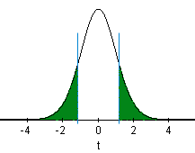

<script type = "text/javascript">
 function showhide(id) {
    var e = document.getElementById(id);
    e.style.display = (e.style.display == 'block') ? 'none' : 'block';
 }
</script>

<!--
<div style = "float:right;width = 40%;">
<br/>
<div style = "padding-left:10%;">**Optional Lesson Video**</div>
<iframe width = "90%" align = "right" src = "https://youtu.be/vc2MAsSrwwU?list=PLaZryQtbPQC-eXvWi8id9S0NiKSyGYr6j" frameborder = "1" allow = "autoplay; encrypted-media" allowfullscreen></iframe>
</div>
-->

## Lesson Outcomes

<a href = "javascript:showhide('outcomes')"><span style = "font-size:8pt;">Show/Hide Outcomes</span></a>
<div id = "outcomes" style = "display:none;">
By the end of this lesson, you should be able to do the following with regards to confidence intervals and hypothesis testing.

* Compute a confidence interval for one mean with σ unknown using the following steps:
  + Determine the level of confidence
  + Create numerical and graphical summaries of the data
  + Create a confidence interval using software
  + Check the requirements of the confidence interval
  + Interpret a confidence interval for one mean with σ unknown
* Perform a hypothesis test for one mean with σ unknown using the following steps:
  + State the null and alternative hypotheses
  + State the level of significance (α)
  + Create numerical and graphical summaries of the data
  + Calculate the test-statistic, degrees of freedom and P-value of the test using software
  + Assess statistical significance by comparing the P-value to the level of significance (α)
  + State the appropriate conclusion for the hypothesis test
  + Check the requirements for the hypothesis test
</div>
<br>

## What If We Don't Know $\sigma$?


In practice, we almost never know the population standard deviation, $\sigma$.  So, it is generally not appropriate to use the formula
$$
z = \frac{ \bar x - \mu }{ \sigma / \sqrt{n} }
$$
In 1908, William Sealy Gosset published a solution to this problem<!--<cite>Gosset08</cite>-->.  He found a way to appropriately compute the confidence interval for the mean when $\sigma$ is not known.  The basic idea is to use the sample standard deviation, $s$, in the place of the true population standard deviation, $\sigma$.  If $\sigma$ is not known, we cannot base the calculations on the standard normal distribution, and we can no longer use the formula above to compute the $P$-value of a hypothesis test.

In a remarkable piece of work, Gosset found the appropriate distribution to use when $\sigma$ is unknown. At the time of this discovery, Gosset worked for the Guinness brewery.  To avoid problems with industrial espionage, Guinness prohibited employees from publishing any research results.  Knowing his work provided a significant contribution to Statistics, Gosset convinced his employer to allow him to publish under a fictitious name.  He chose the pseudonym "Student".  Gosset's test statistic was denoted by the letter $t$, this distribution has come to be known as **Student's t-distribution**. The formula for Gosset's test statistic is

$$
t = \frac{ \bar x - \mu }{ s / \sqrt{n} }
$$

The $t$-distribution is bell-shaped and symmetrical.  The $t$-distribution has a mean of 0, but it has more area in the tails than the standard normal distribution.    The exact shape of the $t$-distribution depends on a parameter called the **degrees of freedom** (abbreviated $df$).  The degrees of freedom is related to the sample size.  As the sample size goes up, the degrees of freedom increase accordingly.  For the procedures discussed in this lesson, the degrees of freedom is one less than the sample size: $df = n-1$.

[Click here](http://byuimath.com/apps/normprobwitht.html) to explore how the shape of the $t$-distribution changes with the degrees of freedom.  Notice that as the degrees of freedom increases, the shape of the $t$-distribution (dark curve) gets closer to the standard normal distribution (lighter curve).  The lighter gray curve is identical (always normal) in the three images below, while the darker curve changes shape as the degrees of freedom increase.

<center>
<table style = "table-layout: fixed; width: 100%;">
<thead>
<tr class = "header">
<th style = "text-align:center;"><p>$t$-distribution<br />
with $df = 1$</p></th>
<th style = "text-align:center;"><p>$t$-distribution<br />
with $df = 5$</p></th>
<th style = "text-align:center;"><p>$t$-distribution<br />
with $df = 15$</p></th>
</tr>
</thead>
<tbody>
<tr class = "odd">
<td style = "width:33.3%;">

```{r, echo = FALSE, fig.width = 4, fig.height = 4}
par(mai = c(.6,.6,.3,.1))
curve(dnorm(x), xlim = c(-3.2,3.2), col = "gray", lwd = 3, xlab = "", ylab = "")
curve(dt(x, 1), add = TRUE, col = "darkolivegreen4", lwd = 4)
abline(h = 0, lty = 1, col = "gray")
legend("topright", legend = c("Normal", "t"), col = c("gray","darkolivegreen4"), lwd = c(2,4), bty = "n", cex = .8)
mtext(side = 2, las = 2, "density", at = 0.43, line = .3)
```

</td>
<td style = "width:33.3%;">

```{r, echo = FALSE, fig.width = 4, fig.height = 4}
par(mai = c(.6,.6,.3,.1))
curve(dnorm(x), xlim = c(-3.2,3.2), col = "gray", lwd = 3, xlab = "", ylab = "")
curve(dt(x, 5), add = TRUE, col = "darkolivegreen4", lwd = 4)
abline(h = 0, lty = 1, col = "gray")
legend("topright", legend = c("Normal", "t"), col = c("gray","darkolivegreen4"), lwd = c(2,4), bty = "n", cex = .8)
mtext(side = 2, las = 2, "density", at = 0.43, line = .3)
```

</td>
<td style = "width:33.3%;">

```{r, echo = FALSE, fig.width = 4, fig.height = 4}
par(mai = c(.6,.6,.3,.1))
curve(dnorm(x), xlim = c(-3.2,3.2), col = "gray", lwd = 3, xlab = "", ylab = "")
curve(dt(x, 15), add = TRUE, col = "darkolivegreen4", lwd = 4)
abline(h = 0, lty = 1, col = "gray")
legend("topright", legend = c("Normal", "t"), col = c("gray","darkolivegreen4"), lwd = c(2,4), bty = "n", cex = .8)
mtext(side = 2, las = 2, "density", at = 0.43, line = 0.3)
```

</td>
</tr>
<tr class = "even">
<td></td>
<td></td>
<td></td>
</tr>
</tbody>
</table>
</center>


<br>

## Hypothesis Tests


### Case Study: Body Temperatures Revisited

We will apply the $t$-distribution to the body temperature data we explored previously.  

This hypothesis test is conducted in a manner similar to a test for a single mean where $\sigma$ is known, except that instead of using the population standard deviation, $\sigma$, in the calculations, we estimate this value using the sample standard deviation, $s$.  This leads to a $t$-distribution, rather than a normal distribution for the test statistic. We will not need to compute the value of this test statistic by hand, it will be calculated using software.


**Summarize the relevant background information**

We want to conduct a hypothesis test to determine if the mean body temperature is different from 98.6&deg; Fahrenheit.  Previously, we assumed that we knew the value of $\sigma$.  Actually, this value is not known.

**State the null and alternative hypotheses and the level of significance**

$$
\begin{array}{rl}
H_0: \mu = 98.6\\
H_a: \mu \ne 98.6\\
\end{array}
$$

$$
\alpha = 0.05
$$


**Describe the data collection procedures**

We will use the body temperature data in the data frame `body_temp`, collected by Dr. Mackowiak and his colleagues to conduct the test. <!-- <cite>Mackowiak92</cite> -->
Download these data from https://byuistats.github.io/M221R/data/body_temp.xlsx.
You can [click here](https://byuistats.github.io/M221R/RHelp.html#Reading_in_Data) for instructions on how to import the dataset into R.

```{r, include = FALSE}
library(openxlsx)
body_temp <- read.xlsx("https://byuistats.github.io/M221R/data/body_temp.xlsx")
```


**Give the relevant summary statistics**

We calculate summary statistics in RStudio after importing the data ([click here](RHelp.html#reading-in-data) for a reminder how to import data into RStudio). We can get the mean ($\bar x$), standard deviation ($s$), and sample size ($n$) using the code:


```{r, include = FALSE}
library(mosaic)
```

```{r, eval = FALSE}
library(mosaic)
favstats(body_temp$temperature) 
```

```{r, echo = FALSE}
favstats(body_temp$temperature) 
```

From this output, we extract the following:

$$
\begin{array}{l}
\bar x = 98.23\\
s = 0.738\\
n = 148
\end{array}
$$

**Make an appropriate graph (e.g. a histogram) to illustrate the data**

A histogram of the Body Temperatures could be created in R with the code

```{r}
hist(body_temp$temperature, #select the data to use for the graph
     col = "tan3", #set the color
     xlab = "Body Temperature (Degrees Fahrenheight)",
     main = "Body Temperatures of 148 Healthy Adults")
```

Similarly, we can create a boxplot. Boxplots can be presented either vertically or horizontally. Often, when presenting a single boxplot, they look better visually when presented horizontally. They also match up with histograms better when presented horizontally.


```{r}
boxplot(body_temp$temperature,       # Select the data to use for the graph
        horizontal = TRUE,           # Rotates the plot horizontally
        col = "tan3",                # Set the color
        xlab = "Body Temperature (Degrees Fahrenheight)",
        main = "Body Temperatures of 148 Healthy Adults")
```

In both the histogram and boxplot, there is evidence that the mean is not 98.6 degrees Fahrenheit but some lower value. We will test this formally using a one-sample $t$-test.


</br>


**Verify the requirements have been met**

- We assume that the individuals chosen to participate in the study represent a (simple) random sample from the population.
- $\bar x$ will be normally distributed, because the sample size is large.  (Note: We could have also noticed that the body temperature data appears to be normally distributed, so even with a small sample size, $\bar x$ would be normal.)

**Give the test statistic and its value**

We will need to conduct the analysis using software, so we can report this value.

### R Instructions for One Sample t Test

<div class = "SoftwareHeading">R Instructions</div>
<div class = "Software">
Here are the instructions for conducting the one sample t-test in R:

**Step 1.** Load the data frame you will be using for the one sample t-test. 

For this t test, we are using the `body_temp` data.

**Step 2.** Ensure you know both the null hypothesis and alternative hypothesis of your test. In this case, the null hypothesis is $H_0: \mu = 98.6$ and the alternative was $H_a: \mu \neq 98.6$.

**Step 3.** Use `t.test(...)` as follows to run the One Sample t Test in R.

A few notes about using `t.test(...)`.

* The null hypothesis is established by **mu = 98.6** 
* The alternative hypothesis is established by **alternative = "two.sided"**. Other options for the alternative hypothesis are **alternative = "less"** and **alternative = "greater"**.
* We access the data we will use for the test by using the name of the data frame, followed by a `$` sign, followed by the name of the column we want to use for the test. 

```{r, eval = FALSE}
t.test(body_temp$temperature, mu = 98.6, alternative = "two.sided")
```

Note, by default the `t.test(...)` function uses a 95% Confidence Level in creating the confidence interval that is provided in the summary output of the test. However, if you wanted to use a different confidence level, you would use `t.test(..., conf.level = 0.99)` or `t.test(..., conf.level = 0.90)`.

When, the above `t.test(...)` code is run in RStudio, it produces the following results. These results look a little messy at first, but after you study them for a moment, you should recognize the various important pieces we are looking for.

```{r, echo = FALSE, comment = NA}
t.test(body_temp$temperature, mu = 98.6, alternative = "two.sided")
```

**Identifying the various elements of the t test summary ouput.**

* The name of the test is printed first in the output.
* The data used for the test is printed next.
* Then the test statistic (t), degrees of freedom (df), and p-value of the test are all printed.
* The alternative hypothesis of either "less," "greater," or "not equal" is restated so that we know if this was a "one-sided" or "two-sided" test. Also, the value of the null hypothesis (98.6) that was used for the test is printed at the end of this sentence.
* The confidence level (usually 95%) is stated, followed by the lower-bound of the confidence interval and then the upper-bound of the confidence interval.
* Finally, the sample mean, $\bar{x}$, is printed at the end of the summary output.


<br>
</div>
<br>


The interpretation of the results will follow the pattern established in the previous hypothesis tests.  If the $P$-value is less than the $\alpha$ level, we reject the null hypothesis. If the $P$-value is greater than the $\alpha$ level, we fail to reject the null hypothesis.  This is true for every hypothesis test.

The test statistic is $t$ and its value is $-6.029$.  So, we have $t = -6.029$.

Notice this is the same number we get if we use the formula:
$$
\begin{align}
t & = \frac{ \bar x - \mu }{ s / \sqrt{n} } \\
&\approx \frac{ 98.234 - 98.6 }{ 0.738 / \sqrt{148} } \\
&\approx -6.03
\end{align}
$$
Any differences are due to rounding.

**State the degrees of freedom**

In R, the degrees of freedom ($df$) are given in the summary output of the test.

$$df = 147$$

**Find the $P$-value and compare it to the level of significance**

The $P$-value is given in the software as "1.272e-08" (Remember scientific notation? 1.272e-08 = 0.00000001272, a very small number!)  Comparing the p-value to $\alpha$, we have:
$$
P\text{-value} = 1.272 \times 10^{-8} = 0.000~000~012~72 < 0.05 = \alpha
$$

**State your decision**

The interpretation of the results will follow the pattern established in the previous hypothesis tests.  If the $P$-value is less than the $\alpha$ level, we reject the null hypothesis. This is because a small p-value tells us that there is "essentially no chance of observing the results we just observed" **if the null hypothesis is true**. So it seems reasonable to reject the null hypothesis in favor of a better, alternative hypothesis that is more consistent with the results we have observed in the data. On the other hand, if the $P$-value is greater than the $\alpha$ level, we fail to reject the null hypothesis.  This is true for every hypothesis test.  

Since the $P$-value was less than $\alpha$, we reject the null hypothesis.


**Present your conclusion in an easy to understand sentence, relating the result to the context of the problem**

There is sufficient evidence to suggest that the alternative hypothesis is true, i.e., that the mean body temperature is not 98.6&deg; Fahrenheit.


### Case Study: Baby Boom


**Summarize the relevant background information**

The birth weight of a child is an important indicator of their neonatal health.  It is important that pediatric health care providers track changes in the birth weights over time.  The birth weight of children in Australia has historically had a population mean of 3373 grams.<!--<cite>Steele97,JSEdunn99</cite>-->  Is this still the mean birth weight of Australian children, or has there been a change?  We will use the 0.05 level of significance.

**State the null and alternative hypotheses and the level of significance**

$$
\begin{align}
H_0: &~ \mu = 3373 \\
H_a: &~ \mu \ne 3373
\end{align}
$$

$$ \alpha = 0.05 $$


**Describe the data collection procedures**

The birth weights of all children born on December 18, 1997 at the Mater Mothers' Hospital in Brisbane, Australia were recorded<!--<cite>JSEdunn99</cite>-->.  The time of birth (on a 24 hour clock), gender, and birth weight of each child are given in the data frame `baby_boom`.
Download these data from https://byuistats.github.io/M221R/data/baby_boom.xlsx.
You can [click here](https://byuistats.github.io/M221R/RHelp.html#Reading_in_Data) for instructions on how to import the dataset into R.

```{r, include = FALSE}
library(openxlsx)
baby_boom <- read.xlsx("https://byuistats.github.io/M221R/data/baby_boom.xlsx")
```

Using this data frame, test the hypothesis that the mean weight of babies born in Australia is 3373 grams. Use the $\alpha = 0.05$ level of significance for this problem.  Make an appropriate graph of the data.


<div class = "QuestionsHeading">Answer the following questions:</div>
<div class = "Questions">
1. **Give the relevant summary statistics**

<a href = "javascript:showhide('Q1')"><span style = "font-size:8pt;">Show/Hide Solution</span></a>
<div id = "Q1" style = "display:none;">

Once the `baby_boom` data frame is loaded into RStudio, the relevant summary statistics for the "Weight" column are computed by:

```{r}
favstats(baby_boom$weight)
```

We extract the key summary statistics from this output:

$$
\begin{align}
\bar x & = 3275.955 \textrm{g}\\
s & = 528.033 \textrm{g}\\
n & = 44
\end{align}
$$
</center>
</div>
<br>

2. **Make an appropriate graph to illustrate the data**

<a href = "javascript:showhide('Q2')"><span style = "font-size:8pt;">Show/Hide Solution</span></a>
<div id = "Q2" style = "display:none;">

The histogram is created by

```{r}
hist(baby_boom$weight, 
     col = "steelblue3",
     xlab = "Weights in grams", 
     ylab = "Number of Children", 
     main = "Babies Born December 18, 1997 \n Mater Mothers' Hospital in Brisbane, Australia")
```

We can also make a boxplot of these data:

```{r}
boxplot(baby_boom$weight,
        horizontal=TRUE,
        col = "steelblue3",
        xlab = "Weights in grams",
        ylab = "Number of Children",
        main = "Babies Born December 18, 1997 \n Mater Mothers' Hospital in Brisbane, Australia")
```


</div>
&nbsp;
</div>
<br>


**Verify the requirements have been met**

The data show a left-skewed shape, however the sample size is large ($n = 44$).  Using the Central Limit Theorem, we can conclude that the sample mean is normally distributed and the requirements are satisfied.

<div class = "QuestionsHeading">Answer the following questions:</div>
<div class = "Questions">
3. **Give the test statistic and its value**

<a href = "javascript:showhide('Q3')"><span style = "font-size:8pt;">Show/Hide Solution</span></a>
<div id = "Q3" style = "display:none;">
We perform the one sample t-test in RStudio using the code:

```{r, comment = NA}
t.test(baby_boom$weight, mu = 3373, alternative = "two.sided")
```

- The test statistic is a $t$.  The value of the test statistic is $-1.219$.  This was taken from the output above.
</div>
<br>

4. **State the degrees of freedom**

<a href = "javascript:showhide('Q4')"><span style = "font-size:8pt;">Show/Hide Solution</span></a>
<div id = "Q4" style = "display:none;">
- The degrees of freedom are given in the output above:

$$
df = 43
$$

- Notice that the degrees of freedom are one less than the sample size.  For a test for a single mean, the degrees of freedom are always equal to one less than the sample size.
</div>
&nbsp;
</div>
<br>

**Mark the test statistic and $P$-value on a graph of the sampling distribution**  

The $P$-value is shaded in green:



**Find the $P$-value and compare it to the level of significance**

$$P\text{-value} = 0.2295 > 0.05 = \alpha$$


**State your decision**

Since the $P$-value is greater than the level of significance, we fail to reject the null hypothesis. It seems reasonable to continue believing the null hypothesis is true.


**Present your conclusion in an easy to understand sentence, relating the result to the context of the problem**

There is insufficient evidence to suggest that the alternative hypothesis is true. In other words, there is insufficient evidence to believe that the mean weight of babies born in Australia is different from 3373 grams.

<br>

## Confidence Intervals

The procedure for finding confidence intervals when $\sigma$ is not known is very similar to the process when $\sigma$ is known. As a reminder, here is the confidence interval (from Lesson 10) when $\sigma$ is known: $\left( \bar x - z^* \frac{\sigma}{\sqrt{n}}, ~ \bar x + z^* \frac{\sigma}{\sqrt{n}} \right)$.

To construct the confidence interval when $\sigma$ is not known, we replace the population standard deviation, $\sigma$, with its point estimate, $s$. The appropriate distribution is a $t$, rather than a $z$.  So, we replace $z^*$ with $t^*$. So the confidence interval when $\sigma$ is not known is
$$
\left( 
  \underbrace{\bar x - t^* \frac{s}{\sqrt{n}}}_\text{lower bound} \ , 
    \ ~ 
  \underbrace{\bar x + t^* \frac{s}{\sqrt{n}}}_\text{upper bound} 
\right)
$$
where $t^*$ is the $t$-score corresponding to the confidence level and $s$ is the sample standard deviation.

These confidence intervals are automatically produced in R with the `t.test(...)` command. The values of $t^*$ and $s$ will be computed for us. Examples of this are given below. 
<!--
You can see the details by clicking on [Show Hand Calculations] in Step 4.
-->


### Case Study: Automatic Language Translation Programs


**Summarize the relevant background information**

Computer software is commonly used to translate text from one language to another.  As part of his Ph.D. thesis, Philipp Koehn developed a phrase-based translation program called Pharaoh. <!--<cite>Koehn04Pharaoh</cite>-->

The quality of the translation can vary.  A good translation system should match a professional human translation. <!--<cite>Papineni02</cite>--> It is important to be able to quantify how good the translations produced by Pharaoh are.

The IBM T. J. Watson Research Center developed methods to measure the quality of a translation from one language to another. <!--<cite>Brown90</cite>-->  One of these is the BiLingual Evaluation Understudy (BLEU). <!--<cite>Papineni02</cite>--> BLEU is a score ranging from 0 to 1 that indicates how well a computer translation matches a professional human translation of the same text.  Higher scores indicate a better match. BLEU helps companies who develop translation software "to monitor the effect of daily changes to their systems in order to weed out bad ideas from good ideas". <!--<cite>Papineni02</cite>-->


**Describe the data collection procedures**

To test Pharaoh's ability to translate, Koehn took a random sample of 100 blocks of Spanish text, each of which contained 300 sentences, and used Pharaoh to translate each of these to English.  The BLEU score was calculated for each of the 100 blocks.  The data were extracted from Figure 2 in a paper Koehn published. <!--<cite>Koehn04</cite>-->  The 100 BLEU scores are given in
the data frame `bleu`. 
Download these data from https://byuistats.github.io/M221R/data/bleu.xlsx.
You can [click here](https://byuistats.github.io/M221R/RHelp.html#Reading_in_Data) for instructions on how to import the dataset into R.

```{r, include = FALSE}
library(openxlsx)
bleu <- read.xlsx("https://byuistats.github.io/M221R/data/bleu.xlsx")
```

Koehn wants to find an estimate of the true mean BLEU score for text translated by the Pharaoh computer program.  He would like to compute a confidence interval, but he does not know the true population standard deviation, $\sigma$.


**Give the relevant summary statistics**

<div class = "SoftwareHeading">R Instructions</div>
<div class = "Software">
After loading the
`bleu`
data frame, we can compute the following.

```{r}
favstats(bleu$score)
```

$$
 \bar{x} = 0.288 \\
 s = 0.026 \\
 n = 100 
$$

```{r}
hist(bleu$score, 
     col = "steelblue3",
     xlab = "Score",
     main = "BLEU Scores")
```

```{r}
boxplot(bleu$score,
        horizontal=TRUE,
        col = "steelblue3",
        xlab = "Score",
        main = "BLEU Scores")
```

<br>
</div>
<br>


The summary statistics are:

$$
\begin{align}
\bar x = & 0.288 \\
s = & 0.026 \\
n = & 100
\end{align}
$$

**Make an appropriate graph to illustrate the data**

The histogram is included in the image above.


**Make Inference**

### R Instructions for Confidence Intervals

We will use R to find the confidence intervals for the mean.  

<div class = "SoftwareHeading">R Instructions</div>
<div class = "Software">

Do the following:

- Load the `bleu` data frame, if you haven't already.
- Run a One-sample t-test using `t.test(...)`. (Confidence intervals don't require a null hypothesis.)
- To set the confidence level use `t.test(..., conf.level = 0.95)` or 0.99, or 0.90.

In this case, we are using a 95% confidence level.  So, you set `t.test(..., conf.level = 0.95)`. The only part of the output below that we will consider is the "95 percent confidence interval:" and the "mean of x" output.

```{r, comment = NA}
t.test(bleu$score, conf.level = 0.95)
```


<br>
</div>
<br>

The 95% confidence interval for the true mean BLEU score is:

$$(0.282, 0.293)$$
where 0.282 is the lower-bound and 0.293 is the upper-bound of the confidence interval.

<!-- DEMO OF HAND CALCULATIONS

<a href = "javascript:showhide('hc')"><span style = "font-size:8pt;">Show Hand Calculations (Optional)</span></a>
<br>

<div id = "hc" style = "display:none;">
The formula for the confidence interval where $\sigma$ is known was given in the reading titled
[Lesson 10: Inference for One Mean: Sigma Known (Confidence Interval)](Lesson10.html) as
$$
\left( \bar x - z^* \frac{\sigma}{\sqrt{n}}, ~ \bar x + z^* \frac{\sigma}{\sqrt{n}} \right)
$$
It is impossible to know the true standard deviation of the BLEU scores for a new translation program like Pharaoh. Replacing $\sigma$ with $s$ and replacing $z^*$ with $t^*$, we get:
$$
\left( \bar x - t^* \frac{s}{\sqrt{n}}, ~ \bar x + t^* \frac{s}{\sqrt{n}} \right)
$$
The value of $t^*$ depends on the level of confidence and the sample size.  It must be computed using software or looked up on a table.  If you are asked to compute a confidence interval for a mean where the population standard deviation is unknown, the value of $t^*$ can be calculated with

```{r}
qt(1-0.05/2, df = 99)
```

where the `0.05` is the significance level $\alpha$, and the `df = ` is the degrees of freedom, which is $n-1$.

The other numbers ($\bar x$, $s$, and $n$) can all be obtained directly from your data.

If we want to create a 95% confidence interval for $\mu$, with 99 degrees of freedom, then $t^* = 1.9842$.

Using the sample statistics:
$$
\begin{align}
\bar x = & 0.2876 \\
s = & 0.0264 \\
n = & 100
\end{align}
$$

The 95% confidence interval for $\mu$ is:
$$
\left( 0.2876 - 1.9842 \frac{0.0264}{\sqrt{100}}, ~ 0.2876 + 1.9842 \frac{0.0264}{\sqrt{100}} \right)
$$
which reduces to:
$$
\left( 0.2824, ~ 0.2928 \right)
$$
</div>
<br>

-- END DEMO OF HAND CALCULATIONS -->


#### Verify Requirements Are Met

The requirements for creating a confidence interval for a mean with $\sigma$ unknown are the same as the requirements for this procedure when $\sigma$ is known:

There are two requirements that need to be checked:

1. A simple random sample was drawn from the population

    All we know is that "a random sample of 100 blocks of Spanish text" were used. We will assume this means they obtained a simple random sample of all possible blocks of Spanish text.

2. $\bar x$ is normally distributed

    Recall that this requirement is satisfied if the parent population data are normally distributed or if the sample size is large. Checking a histogram, the sample data look to be bell-shaped and fairly symmetric, but since the sample size is large, ($n = 100$), then the Central Limit Theorem also applies and we can be confident that the sample mean, $\bar x$, is also approximately normally distributed.  


**Present your observations in an easy to understand sentence, relating the result to the context of the problem**

We are 95% confident that the true mean BLEU score for all translations by the Pharaoh program is between 0.2824 and 0.2928.

Answer the following questions using the data frame `bleu`, which gives the BLEU scores for $n = 100$ translations from Spanish to English by the computer program Pharaoh.

<div class = "QuestionsHeading">Answer the following questions:</div>
<div class = "Questions">
5. Use R to find a 90% confidence interval for the true mean BLEU score for translations by the Pharaoh program. Give your answer accurate to 3 decimal places. Present this confidence interval in a complete sentence.

<a href = "javascript:showhide('Q5')"><span style = "font-size:8pt;">Show/Hide Solution</span></a>
<div id = "Q5" style = "display:none;">

```{r, comment = NA}
t.test(bleu$score, mu = 0, conf.level = 0.90)
```

- $(0.283, 0.292)$<br>We are 90% confident that the true mean BLEU score for translations by the Pharaoh program lies between 0.283 and 0.292.
</div>
<br>

6. Use R to find a 99% confidence interval for the true mean BLEU score for translations by the Pharaoh program. Give your answer accurate to 3 decimal places. Interpret this confidence interval in a complete sentence.

<a href = "javascript:showhide('Q6')"><span style = "font-size:8pt;">Show/Hide Solution</span></a>
<div id = "Q6" style = "display:none;">

```{r, comment = NA}
t.test(bleu$score, mu = 0, conf.level = 0.99)
```

- $(0.281, 0.295)$<br>We are 99% confident that the true mean BLEU score for translations by the Pharaoh program lies between 0.281 and 0.295.
</div>
<br>

7. What do you notice about the width of the confidence interval as the confidence level increased from 90% to 99%?

<a href = "javascript:showhide('Q7')"><span style = "font-size:8pt;">Show/Hide Solution</span></a>
<div id = "Q7" style = "display:none;">
- As the confidence level increases, the width of the confidence interval increases.  We could also say, as the confidence level increases, the margin of error increases.  The center of the confidence interval (the sample mean) is unchanged.
</div>
&nbsp;
</div>
<br>


### Case Study: Euro Weights


**Summarize the relevant background information**

A group of statisticians measured the weights of 2000 Belgian one Euro coins in eight batches.  Each batch contains coins that were all minted together. <!--<cite>JSEeuros</cite>--> You can learn more about these data at:
[http://www.amstat.org/publications/jse/](http://www.amstat.org/publications/jse/datasets/euroweight.txt)


**Describe the data collection procedures**

The coins were borrowed from a bank in Belgium, one batch at a time. The weights (in grams) of the coins are given in the data frame `euro`. 
Download these data from https://byuistats.github.io/M221R/data/euro.xlsx.
You can [click here](https://byuistats.github.io/M221R/RHelp.html#Reading_in_Data) for instructions on how to import the dataset into R.

```{r, include = FALSE}
library(openxlsx)
euro <- read.xlsx("https://byuistats.github.io/M221R/data/euro.xlsx")
```


<div class = "QuestionsHeading">Answer the following questions:</div>
<div class = "Questions">
8. **Give the relevant summary statistics**.

<a href = "javascript:showhide('Q8')"><span style = "font-size:8pt;">Show/Hide Solution</span></a>
<div id = "Q8" style = "display:none;">

Read in the `euro` data frame. Then, compute the summary statistics. 

```{r, comment = NA}
favstats(euro$weight)
```

<br>

* This gives the following summary statistics:

$$
\begin{align}
\bar x = & 7.521 \\
s = & 0.0344 \\
n = & 2000
\end{align}
$$

</div>
<br>

9. **Make an appropriate graph to illustrate the data**

<a href = "javascript:showhide('Q9')"><span style = "font-size:8pt;">Show/Hide Solution</span></a>
<div id = "Q9" style = "display:none;">

Either a histogram or boxplot would be appropriate for graphing this data. 

Note that when creating a histogram, the exact number of bins you use is up to you. The only rule to follow is to have enough bins to get a good feel for the distribution. 

```{r}
hist(euro$weight, 
     col = "brown3",
     xlab = "Weight in grams", 
     main = "Coins from a Bank in Belgium",
     breaks = 50)
# Since the sampe size was large, 
# we can use a lot of "bins" or "breaks" in the graph.
```

```{r, fig.height = 3}
boxplot(euro$weight,
        horizontal = TRUE,
        xlab = "Weight in grams", 
        main = "Coins from a Bank in Belgium", 
        col = "brown3")
```

You can see the data is relatively normal, with just a couple of potential outliers that could be investigated further.

</div>
&nbsp;
</div>
<br>


**Verify the requirements have been met**

We need to check the following two requirements:

1. A simple random sample was drawn from the population

    The coins were taken in batches, but we can think of the batches as a random sample of the possible coins that could be chosen.  
    

2. $\bar x$ is normally distributed

    The data follow a bell-shaped distribution.  There are a few potential outliers, but they are not too frequent, and the sample size is $n = 2000$, which is very large, so we can conclude that $\bar x$ is also normally distributed.


<div class = "QuestionsHeading">Answer the following question:</div>
<div class = "Questions">
10. **Find the confidence interval**:  Use R to create a 99% confidence interval for the true mean.

<a href = "javascript:showhide('Q10')"><span style = "font-size:8pt;">Show/Hide Solution</span></a>
<div id = "Q10" style = "display:none;">

```{r, comment = NA}
t.test(euro$weight, conf.level = 0.99)
```

The lower and upper bounds of the confidence interval are given by

$$
(7.519, ~ 7.523)
$$

</div>
&nbsp;
</div>
<br>


<div class = "QuestionsHeading">Answer the following questions:</div>
<div class = "Questions">
11. **Present your observations in a sentence, relating the result to the context of the problem**.

<a href = "javascript:showhide('Q11')"><span style = "font-size:8pt;">Show/Hide Solution</span></a>
<div id = "Q11" style = "display:none;">
- We are 99% confident that the true mean weight of all Belgian Euros is between 7.519 grams and 7.523 grams.
</div>
&nbsp;
</div>
<br>

## Summary
<div class = "SummaryHeading">Remember...</div>
<div class = "Summary">
- In practice we rarely know the true standard deviation $\sigma$ and will therefore be unable to calculate a z-score. **Student's t-distribution** gives us a new test statistic, $t$, that is calculated using the sample standard deviation ($s$) instead.
$$\displaystyle{ t = \frac {\bar x - \mu} {s / \sqrt{n}} }$$
You will never need to compute the $t$-statistic by hand, because R will provide it.

- The $t$-distribution is similar to a normal distribution in that it is bell-shaped and symmetrical, but the exact shape of the $t$-distribution depends on the **degrees of freedom ($df$)**.
$$df = n-1$$

- You will use R to carry out hypothesis testing and create confidence intervals involving $t$-distributions by using the `t.test(...)` function which follows the general format of `t.test(dataframe$variable, mu = , alternative = , conf.level = )` where `mu = ` the value from the null hypothesis, `alternative = ` either "two.sided", "less", or "greater", and `conf.level = ` 0.95, 0.99, or 0.90.

<br/>

</div>
<br>


## Navigation

<center>
| **Previous Reading** | **This Reading** | **Next Reading** |
| :------------------: | :--------------: | :--------------: |
| [Lesson 10: <br> Inference for One Mean: Sigma Known (Confidence Interval)](Lesson10.html) | Lesson 11: <br> Inference for One Mean: Sigma Unknown | [Lesson 12: <br> Inference for Two Means: Paired Data](Lesson12.html) |
</center>
