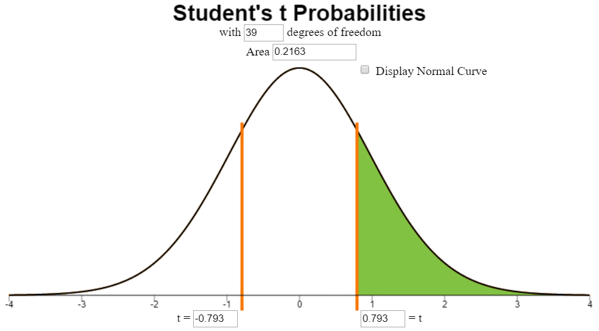

<script type = "text/javascript">
 function showhide(id) {
    var e  =document.getElementById(id);
    e.style.display  =(e.style.display = ='block') ? 'none' : 'block';
 }
</script>

<div style = "float:right;width  =40%;">
<br/>
<div style = "padding-left:10%;">**Optional Lesson Video**</div>
<iframe width = "90%" align = "right" src = "https://www.youtube.com/embed/videoseries?list  =PLaZryQtbPQC-jykAMUjbIFLALZmXRadUa" frameborder = "1" allow = "autoplay; encrypted-media" allowfullscreen></iframe>
</div>

## Lesson Outcomes

<a href = "javascript:showhide('outcome')"><span style = "font-size:8pt;">Show/Hide Outcomes</span></a>
<div id = "outcome" style = "display:none;">
By the end of this lesson, you should be able to do the following.

**Regarding Confidence Intervals for the mean of differences with dependent samples: **

- Calculate and interpret a confidence interval for the mean of differences given a confidence level.
- Identify a point estimate and margin of error for the confidence interval.
- Show the appropriate connections between the numerical and graphical summaries that support the   confidence interval.
- Check the requirements for the confidence interval.

**Regarding Hypothesis Testing for the mean of differences with dependent samples:**

  * State the null and alternative hypothesis.
  * Calculate the test-statistic, degrees of freedom and p-value of the hypothesis test.
  * Assess the statistical significance by comparing the p-value to the α-level.
  * Check the requirements for the hypothesis test.
  * Show the appropriate connections between the numerical and graphical summaries that support the hypothesis test.
  * Draw a correct conclusion for the hypothesis test.
</div>
<br>

## Introduction to Paired Data

It is very common for researchers to conduct studies in which they administer a pre-test to a group of individuals, provide some treatment to those individuals, and then give a post-test to each individual. Since each individual in the study has both a pre-test and post-test measurement, researchers can use the difference between the post- and pre-test measurements as a measure of the effect the treatment had on each particular individual. The average of these differences can also be computed to find the average effect the treatment had on indvidiuals. We call this the *mean of the differences* for paired data.

These study designs are also called a **matched-pairs** design or we say we have **dependent samples**.  Matched-pairs (or **paired-data**) designs typically involve only one population, and a pair of observations is drawn on the individuals selected for the sample (i.e., there are two measurements per individual). If an individual is selected to participate in the pre-test (i.e., they are selected to be part of group 1), they are automatically selected to participate in the post-test (i.e., they are chosen to be in group 2 automatically.)

A hypothesis test for two means with paired data (dependent samples) is conducted in the same way as a hypothesis test for a single mean with $\sigma$ unknown, the one-sample t test.  The only exception is that the pairs of data must be subtracted before you start any computations. From a practical perspective, after you compute the differences for each matched pair, then you apply the one-sample procedures you have already learned to those differences.

We will first explore an application of pre- and post-testing in a weight loss study.

## Hypothesis Tests


### Mahon's Weight Loss Study

**Background**

Annie Mahon and other researchers in Wayne Campbell's nutrition lab studied the weight loss of $n  =27$ middle aged women who consumed a prescribed low-calorie diet. <!--<cite>Mahon07</cite>-->  The women's weights were recorded (in kilograms) at the beginning of the study and after the nine-week diet period. The data are given in the file [weight_loss.xlsx](./data/weight_loss.xlsx).  An excerpt of the data is shown below.

<table>
<thead>
<tr class = "header">
<th align = "left"><p>Subject</p></th>
<th align = "left"><p>Pre Weight (kg)</p></th>
<th align = "left"><p>Post Weight (kg)</p></th>
</tr>
</thead>
<tbody>
<tr class = "odd">
<td><p>1</p></td>
<td><p>62.5</p></td>
<td><p>56.1</p></td>
</tr>
<tr class = "even">
<td><p>2</p></td>
<td><p>88.8</p></td>
<td><p>80.2</p></td>
</tr>
<tr class = "odd">
<td><p>3</p></td>
<td><p>74.7</p></td>
<td><p>70.8</p></td>
</tr>
<tr class = "even">
<td><p>$\vdots$</p></td>
<td><p>$\vdots$</p></td>
<td><p>$\vdots$</p></td>
</tr>
<tr class = "odd">
<td><p>26</p></td>
<td><p>76.3</p></td>
<td><p>73.8</p></td>
</tr>
<tr class = "even">
<td><p>27</p></td>
<td><p>82.1</p></td>
<td><p>77.9</p></td>
</tr>
<tr class = "odd">
<td></td>
<td></td>
<td></td>
</tr>
</tbody>
</table>

Notice the structure of the data.  The weight of each subject was measured before the study and at the conclusion of the study.  Each person provided a pre-study weight and a post-study weight.  Stated differently, the pre-study weights and the post-study weights are paired.  For each row of data, both of these numbers came from the same person.  When we collect two observations of the same measurement on each subject, we call it **paired data**.  Sometimes paired data are called **dependent samples**.  

<div class = "QuestionsHeading">Answer the following question:</div>
<div class = "Questions">
1. The researchers measured the initial weights of the women prior to the study, even though they were not particularly interested in this value.  What was the purpose of measuring the pre-study weights?

<a href = "javascript:showhide('Q1')"><span style = "font-size:8pt;">Show/Hide Solution</span></a>
<div id = "Q1" style = "display:none;">

* The goal of the study is to determine how much the women's weight change as as result of the study.  The researchers must measure the women's weights at the beginning of the study, so they can subtract the initial (pre-study) weight of each woman from her final (post-study) weight.
</div>
&nbsp;
</div>
<br>

### R Instructions for Computing Paired Differences

The researchers are not interested in the weights of the women, they are more interested in the *change* in the women's weights.  This will give them a measure of the effectiveness of the low-calorie diet. In other words, they are interested in the difference of the weights after the study compared with before:
$$\text{Difference}  =\text{Post Weight} - \text{Pre Weight}$$

We can calculate the difference (or change) in weight for each woman in the study:

<table>
<thead>
<tr class = "header">
<th align = "left"><p>Subject</p></th>
<th align = "left"><p>Post Weight (kg)</p></th>
<th align = "left"><p>Pre Weight (kg)</p></th>
<th align = "left"><p>Difference in Weight (kg)</p></th>
</tr>
</thead>
<tbody>
<tr class = "odd">
<td><p>1</p></td>
<td><p>56.1</p></td>
<td><p>62.5</p></td>
<td><p>56.1 $-$ 62.5  =-6.4</p></td>
</tr>
<tr class = "even">
<td><p>2</p></td>
<td><p>80.2</p></td>
<td><p>88.8</p></td>
<td><p>80.2 $-$ 88.8  =-8.6</p></td>
</tr>
<tr class = "odd">
<td><p>3</p></td>
<td><p>70.8</p></td>
<td><p>74.7</p></td>
<td><p>70.8 $-$ 74.7  =-3.9</p></td>
</tr>
<tr class = "even">
<td><p>$\vdots$</p></td>
<td><p>$\vdots$</p></td>
<td><p>$\vdots$</p></td>
<td><p>$\vdots$</p></td>
</tr>
<tr class = "odd">
<td><p>26</p></td>
<td><p>73.8</p></td>
<td><p>76.3</p></td>
<td><p>73.8 $-$ 76.3  =-2.5</p></td>
</tr>
<tr class = "even">
<td><p>27</p></td>
<td><p>77.9</p></td>
<td><p>82.1</p></td>
<td><p>77.9 $-$ 82.1  =-4.2</p></td>
</tr>
</tbody>
</table>

<a name = "SubtractDifferences"></a>

<div class = "SoftwareHeading">R Instructions </div>
<div class = "Software">
To compute the *differences* within each paired set of measurements in R, begin by reading in the [weight_loss.xlsx](./data/weight_loss.xlsx) data into RStudio. (If you need a reminder on how to read in data, [click here](RHelp.html#reading-in-data).)

Then, calculate the *differences* using the assignment operator `<-` and the selection operator `$`:

```{r, include  =FALSE}
library(readxl)
weight_loss <- read_excel("./data/weight_loss.xlsx")
```

```{r}
weight_loss$differences <- weight_loss$post - weight_loss$pre
```

Here we chose the order Post - Pre so that a positive difference would show an increase in weight (kg) from Pre-Weight to Post-Weight and a negative difference would show a decrease in weight (kg) from Pre-Weight to Post-Weight. Thus, a negative difference means the woman lost weight. This is usually the preferred order of subtraction with "Post vs. Pre" studies. 

Once the differences are computed, we can compute the mean, median, standard deviation and so on using codes like the following.

```{r, comment  =NA}
mean(weight_loss$differences)   # sample mean 
sd(weight_loss$differences)     # sample standard deviation
length(weight_loss$differences) # sample size
```

So we find that

$$
  \bar{d}  =-6.804 \\
  s_d  =3.172 \\
  n  =27
$$
To make a histogram of the differences we use the code:

```{r}
hist(weight_loss$differences, 
     col = "tan3",
     xlab = "Weight Change in Kilograms (Post - Pre)",
     main = "Weight Loss Study") 
```

</div>
<br>


<div class = "QuestionsHeading">Answer the following questions:</div>
<div class = "Questions">
2. What is the difference in the post- and pre-study weights for the first person included in the data file? 

<a href = "javascript:showhide('Q2')"><span style = "font-size:8pt;">Show/Hide Solution</span></a>
<div id = "Q2" style = "display:none;">
The first difference is found by printing the differences to the screen and looking at the first value. Do this by simply typing the name of the object "differences."

```{r, echo  =FALSE, warning  =FALSE, message  =FALSE}
library(tidyverse)
weight_loss <- weight_loss %>% select(-comments)
```


```{r, comment  =NA}
library(knitr)
kable(weight_loss)
```

The first difference is $-6.4$. So, the first woman included in the study lost 6.4 kg during the course of the study.

</div>
<br>

3. What is the mean of the *differences*? Said differently, what is the mean change in the weights of the women who participated in the study? 

<a href = "javascript:showhide('Q3')"><span style = "font-size:8pt;">Show/Hide Solution</span></a>
<div id = "Q3" style = "display:none;">

As shown in the output above,

<center>
$$
\bar{d}  =-6.804 \ \text{kg}
$$
</center>
</div>
<br>

4. Interpret the value you calculated in Question 3.

<a href = "javascript:showhide('Q4')"><span style = "font-size:8pt;">Show/Hide Solution</span></a>
<div id = "Q4" style = "display:none;">

* The mean weight change experienced by the women in the study was $-6.804$ kg. Because we calculated Post-Pre, the *negative* mean difference indicates the Pre weight was higher than the Post weight. In other words, there was a mean weight *loss* of $6.804$ kg.
</div>
&nbsp;
</div>
<br>
</div>
<br>

**Relationship to a One Sample t-test**

After you have subtracted the pre-study weights from the post-study weights, you are left with a column of differences.  We will denote the pre-study weights by $x_1$ and the post-study weights by $x_2$.  Then, the differences can be denoted as $d  =x_2 - x_1$.  The difference, $d$, is defined as the change in the volunteer's weight during the study.  

After computing the differences, we do not use the data for the individual groups anymore. The researchers are not interested in the values of the women's weights at the beginning of the study or at the end of the study.  They are interested in the difference in the weights after the participants complete the study.

After we subtract, we can conduct a hypothesis test to determine if the mean of the differences is less than zero.  We use the symbol $\mu_d$ to represent the true mean difference in the weights of women who follow the diet prescribed in this study. The null hypotheses is that the true mean difference is zero  ($\mu_d  =0$). In other words, the null hypothesis states that the prescribed diet does not influence the weights of women.  The alternative hypothesis is that there is a decrease in the weights of the women, in other words, that the true mean difference is less than zero ($\mu_d < 0$).

Notice that this is essentially a one-sample t-test where the data are the *differences in the women's weights*.  We have one column of data, the differences.  We are testing whether the true mean difference is less than zero (or not equal to zero, or greater than zero).  So, a test for the *differences of matched pairs* with dependent samples is just like a test for one mean with $\sigma$ unknown.

In the hypothesis test, we will refer to the variable representing the differences as $d$. We will use this notation throughout the hypothesis test. For example, the true population mean will be labeled $\mu_d$ and the sample mean will be labeled $\bar d$.  The sample standard deviation of the differences is denoted $s_d$.

### Hypothesis Test for Mahon's Weight Loss Data


**Summarize the relevant background information**

Twenty-seven women participated in a nine week weight loss study. During the study period, the participants were provided a reduced calorie diet.  Their weights in kilograms were recorded at the beginning of the study and nine weeks later.  The difference of the weights is defined as the post-study weights minus the pre-study weights.  The researchers expected that the mean difference in the weights would be negative--in other words, that the women would tend to lose weight.

**State the null and alternative hypotheses and the level of significance**

$$
\begin{align}
H_0: &~~ \mu_d  =0 \\
H_a: &~~ \mu_d < 0
\end{align}
$$

We will use the $\alpha  =0.05$ level of significance.


**Describe the data collection procedures**

The women's weights were recorded at the beginning of the study.  The women were provided a reduced calorie diet for nine weeks.  Then, their weights were measured again at the end of the study.  A calibrated scale was used to provide an accurate weight.


**Give the relevant summary statistics**

```{r, echo  =FALSE}
hist(weight_loss$differences, main = "Weight Loss Study \n All 27 Women Lost Weight", xlab = "Weight Change in Kilograms (Post - Pre)", col = "tan3")
```

From the R output demonstrated previously, we can see a histogram of the data and get the following numerical summaries:

$$
\begin{align}
\bar d &  =-6.804 \\
s_d &  =3.172 \\
n &  =27
\end{align}
$$


**Verify the requirements have been met**

Like the one-sample t-test, this procedure is robust, meaning that it is not very sensitive to the requirements.  If they are only mildly violated, the test will still give reasonably good results.  

The requirements for this procedure are the same as the requirements for a one-sample t-test:

- **the data represent a simple random sample from the population**    

    The subjects were recruited via advertisements for a research study.  The participants volunteered to participate.  It is not a simple random sample of all middle-aged women, so there could be some selection bias of the sample that would invalidate the results, but there is nothing obvious about how the participants were selected to immediately invalidate the results.    

    From a practical perspective, it is impossible to get a simple random sample of people in the general population.  When research trials are conducted, people must volunteer to participate.  This can lead to a selection bias, but is the accepted practice.


- **the mean of the differences $\bar{d}$ follows a normal distribution**    

    We will assume the requirement of normality of $\bar{d}$ is satisfied for Mahon's data. Though the sample size (n  =27) is not quite up to 30, the histogram of differences looks fairly normal, so $\bar d$ will be approximately normal and the requirement is satisfied. If the data had been highly skewed, or there was a more pronounced bimodal pattern in the histogram, then we would be worried about the results of the test and would have recommended they redo the study with a larger sample size in order to have confidence in the results of the t-test. 


**Give the test statistic and its value**

### R Instructions for a Paired Samples t Test

<div class = "SoftwareHeading">R Instructions </div>
<div class = "Software">
To perform a paired samples t test in R, first compute the *differences* within each paired set of measurements in R as was [shown previously](Lesson12.html#r-instructions-for-computing-paired-differences).

Then, run a t test on the differences. Since the null hypothesis for the Mahon Weight Loss study was $H_0: \mu_d  =0$, we use `t.test(..., mu  =0)`. Since the alternative hypothesis was that $H_a: \mu_d < 0$, we use the code `t.test(..., alternative  ="less")`. Putting this all together we have the following.

```{r, comment  =NA}
t.test(weight_loss$differences, mu  =0, alternative  ="less")
```

</div>
<br>


The test statistic for a test involving paired data when $\sigma$ is unknown is a $t$.  For this situation, the value is:
$$t  =\frac{-6.804 - 0}{3.17/\sqrt{27}}  =-11.145$$
See that this calculation matches the test statistic given in the R output. The degrees of freedom and p-value can also be found in the R output.

**State the degrees of freedom**

The degrees of freedom are one less than the sample size. They are also shown automatically in the output of the test results.

$$df  =n - 1  =27 - 1  =26$$

**Find the $P$-value and compare it to the level of significance**

$$
P\text{-value}  =1.059 \times 10^{-11} < 0.05  =\alpha
$$

**State your decision**

Since the $P$-value is less than the level of significance, we reject the null hypothesis.


**Present your conclusion in an English sentence, relating the result to the context of the problem**

There is sufficient evidence to suggest that the reduced calorie diet used in this study results in weight loss for middle-aged women with the average weight loss around 6.804 kg.
<br>


### Nosocomial Infections

<span id  ='17:IntroTohospital_infections'></span>


**Summarize the relevant background information**

Matched-pairs designs are not just used in pre- and post-test situations.  They are also used in situations where it is not possible to randomly assign subjects to treatment groups because of ethical reasons.  For example, nosocomial (pronounced: NO-suh-KOH-MEE-uhl) infections are infections that occur in hospitals, but are not a result of the original condition. An example of a nosocomial infection is when a heart attack patient develops a staph infection at the site of an IV injection.  The infection was not caused by the heart attack, but it was acquired in the hospital.  Nosocomial infections are very dangerous and may result in longer recovery times or increased death rates.


Health care providers suspect that nosocomial infections increase the amount of time required to recover from an illness or injury. In controlled experiments, subjects (e.g., patients) are randomly assigned to treatments.  However, it is not ethical to give patients a nosocomial infection in order to determine if it increases the duration of their hospital stay!  At best, we can collect information on the duration of hospital stays for patients who acquire nosocomial infections and compare them to the duration of the stays for patients who do not.

There are many factors that affect the amount of time that a patient will need to stay in the hospital, including: nature of illness, types of procedures conducted, overall health, gender, age, etc.  How can health care practitioners assess the effect of a nosocomial infection in the presence of so many other variables?  

One way is to match a patient who develops a nosocomial infection with another one who has similar characteristics (illness, procedures, health, gender, age group, etc.) but does not develop a nosocomial infection.  Now, the patients are matched into pairs with similar characteristics, where the principle difference between the members of each pair is whether or not they acquired a nosocomial infection.

By pairing the patients according to specific characteristics, the researchers can now subtract to observe a difference in their recovery times.  In this way, it is possible to assess if nosocomial infections increase the mean duration of a hospital stay.  Some researchers conducted such a study in which 52 pairs of patients were matched based on clinical characteristics.  A patient with a nosocomial infection was matched as closely as possible to a similar case where there was no nosocomial infection. Patients who died were excluded from the study <!--<cite>Vegas93</cite>-->.  The lengths of the hospital stays (in days) for these patients are given in the file [hospital_infections.xlsx](./data/hospital_infections.xlsx).

The difference, $d$, is defined as the duration of the hospital stay of the individual in the pair with the nosocomial infection minus the duration of the stay for the individual who did not get a nosocomial infection:
$$
difference  =infected - not_infected
$$
After computing the differences, we do not use the data for the individual groups anymore.  In fact, after we subtract, the hypothesis test is conducted (essentially) like a one-sample test for a single mean with $\sigma$ unknown.

```{r, include  =FALSE}
hospital_infections <- read_excel("./data/hospital_infections.xlsx")
```


<div class = "QuestionsHeading">Answer the following questions:</div>
<div class = "Questions">
5. **State the null and alternative hypotheses and the level of significance**

<a href = "javascript:showhide('Q5')"><span style = "font-size:8pt;">Show/Hide Solution</span></a>
<div id = "Q5" style = "display:none;">

The null hypothesis for paired data will always use $\mu_d  =0$. In this study, we want to know if the nosocomial infections are *increasing* the length of stay of patients. Since we defined the differences as $infected - not_infected$ then the alternative hypothesis needs to show $infected$ having longer durations than those who are $not_infected$, leading to the Differences being positive, i.e., $\mu_d > 0$. 

<center>
$$
\begin{align}
H_0: &~~ \mu_d  =0 \\
H_a: &~~ \mu_d > 0 \\
\end{align}
$$
</center>
* The level of significance was not specified in the problem.  You can choose any value you wish.  The most common choices are 0.05, 0.01 and 0.1.  We will illustrate this example with $\alpha  =0.05$.


</div>
&nbsp;
</div>
<br>
In order to get the correct $P$-value, we need to indicate the proper alternative hypothesis in the `t.test(..., altnerative = "greater")`. 


<br>


<div class = "QuestionsHeading">Answer the following questions:</div>
<div class = "Questions">
6. **Describe the data collection procedures**

<a href = "javascript:showhide('Q6')"><span style = "font-size:8pt;">Show/Hide Solution</span></a>
<div id = "Q6" style = "display:none;">
* Data were collected by matching hospital records of individuals who were admitted to the hospital.  Patient records were matched based on their overall health and the reason they were admitted to the hospital.  In each pair, one patient developed a nosocomial infection and one did not.  Since the characteristics of the patients in the first group determined which patients would be paired with them in the second group, the data represent dependent samples.
</div>
&nbsp;
</div>
<br>


<div class = "QuestionsHeading">Answer the following questions:</div>
<div class = "Questions">
7. **Give the relevant summary statistics**

<a href = "javascript:showhide('Q7')"><span style = "font-size:8pt;">Show/Hide Solution</span></a>
<div id = "Q7" style = "display:none;">

Recall that the differences $d$ in the duration of the patient's stay in the hospital were decided to be computed in the order, $differences  =infected - not_infected$.

```{r, comment  =NA}
hospital_infections$differences <- hospital_infections$infected - hospital_infections$not_infected
```

The numerical summaries are then computed by

```{r, comment  =NA}
mean(hospital_infections$differences)
sd(hospital_infections$differences)
length(hospital_infections$differences)
```

$$
\begin{align}
\bar d &  =11.38 \\
s_d &  =13.83 \\
n &  =52
\end{align}
$$

</div>
<br>

8. **Make an appropriate graph to illustrate the data**

<a href = "javascript:showhide('Q8')"><span style = "font-size:8pt;">Show/Hide Solution</span></a>
<div id = "Q8" style = "display:none;">
- Present a graph showing the differences.

```{r}
hist(hospital_infections$differences, main = "Matched Pairs Study \n Nosocomial Infections", xlab = "Difference in Hospital Stay (infected - not_infected)")
```

</div>
&nbsp;
</div>
<br>


<div class = "QuestionsHeading">Answer the following questions:</div>
<div class = "Questions">
9. **Verify the requirements have been met**

<a href = "javascript:showhide('Q9')"><span style = "font-size:8pt;">Show/Hide Solution</span></a>
<div id = "Q9" style = "display:none;">
* Requirement: **A simple random sample was drawn from the population.**    
    
    
    As explained previously, the data represent a convenience sample of patients, who have been matched based on their overall health and their current ailment. In fact, if we go back to the original research article and read, we find that they were college students Dr. Wayne Campbell recruited for his protein study. They were people that were willing to endure the conditions of the study for 3 months for \$600. So we fail the requirement of having a simple random sample, but we will pretend that this group of people is representative of the entire adult population in the U.S.  

* Requirement: **The sample mean ($\bar{d}$) is normally distributed.**    

    
    The sample size is large ($n  =52$), so the mean of the differences $\bar d$ will be approximately normally distributed by virtue of the Central Limit Theorem.


</div>
<br>

10. **Give the test statistic and its value**

<a href = "javascript:showhide('Q10')"><span style = "font-size:8pt;">Show/Hide Solution</span></a>
<div id = "Q10" style = "display:none;">
* The test statistic for a test for two means with paired data is a $t$.

```{r}
t.test(hospital_infections$differences, mu  =0, alternative  ="greater")
```

$$t  =5.935$$
</div>
<br>

11. **State the degrees of freedom**

<a href = "javascript:showhide('Q11')"><span style = "font-size:8pt;">Show/Hide Solution</span></a>
<div id = "Q11" style = "display:none;">
<center>
$$
df  =51
$$
</center>
</div>
<br>


13. **Find the $P$-value and compare it to the level of significance**

<a href = "javascript:showhide('Q13')"><span style = "font-size:8pt;">Show/Hide Solution</span></a>
<div id = "Q13" style = "display:none;">
The p-value can be found in the R output. As a reminder, scientific notation of $1.296e^{-7}$ is equivalent to $1.296 \times 10^{-7}$. The $-7$ tells us to move the decimal place to the left seven times, causing the number to change from $1.296$ to $0.0000001296$. So, translating what the R output gave us gives

<center>
$$
P\textrm{-value}  =1.296e^{-7}  =0.0000001296 < 0.05  =\alpha
$$
</center>


</div>
<br>

14. **State your decision**

<a href = "javascript:showhide('Q14')"><span style = "font-size:8pt;">Show/Hide Solution</span></a>
<div id = "Q14" style = "display:none;">
* Since the $P$-value is less than the level of significance, we reject the null hypothesis.
</div>
&nbsp;
</div>
<br>


<div class = "QuestionsHeading">Answer the following questions:</div>
<div class = "Questions">
15. **Present your conclusion in an English sentence, relating the result to the context of the problem**

<a href = "javascript:showhide('Q15')"><span style = "font-size:8pt;">Show/Hide Solution</span></a>
<div id = "Q15" style = "display:none;">
* There is sufficient evidence to suggest that the mean duration of hospital stays is increased when a patient develops a nosocomial infection.
</div>
&nbsp;
</div>
<br>

### Additional Worked Examples

Viewing additional examples can help your understanding.  Click on the link below to see two more examples of hypothesis tests.

<a href = "javascript:showhide('ae')"><span style = "font-size:8pt;">Show/Hide Additional Examples</span></a>
<div id = "ae" style = "display:none;">


#### Effect of Stressful Classical Music on Your Metabolism


**Summarize the relevant background information**

Obesity is a growing problem worldwide.  Many scientists are seeking creative solutions to trim down this epidemic.  Reduced energy expenditure is a potential cause of obesity.

Resting Energy Expenditure (REE) is defined as the amount of energy a person would use if resting for 24 hours.  In essence, this is the amount of energy that a person's body will consume if they do not do any physical activity.  REE is measured in terms of kilo-Joules per day (kJ/d).

REE accounts for approximately 70 to 80% of all energy that a person will expend in a day. <!--<cite>Carlsson05</cite>-->  If researchers can find simple, enjoyable activities that will increase REE, it may be possible to minimize the spread of obesity around the world.

Ebba Carlsson and other researchers in Sweden investigated whether listening to stressful classical music increases a person's REE. <!--<cite>Carlsson05</cite>-->  Each subject's REE was measuring during silence and again while listening to stressful classical music.  Data representing their results are given in the file [ree.xlsx](./data/ree.xlsx).  

Notice that this is not a pre- and post-test, but it is still a test involving paired data.  Two REE measurements were made for each subject:  (1) in silence ($REE_1$) and (2) while listening to stressful classical music ($REE_2$).

**State the null and alternative hypotheses and the level of significance**

Since we are testing for an increase in the mean REE, we let $d  =REE_2 - REE_1$. Our alternative hypothesis will be that $\mu_d > 0$.  The null and alternative hypotheses are:
$$
\begin{align}
H_0: &~~ \mu_d  =0 \\
H_a: &~~ \mu_d > 0
\end{align}
$$

We will use the $\alpha  =0.1$ level of significance.


**Describe the data collection procedures**

The REE was measured by a technique called "indirect calorimetry" using a Deltatrac II Metabolic Monitor. <!--<cite>Carlsson05</cite>-->  The REE was measured twice for each person: while the person was (1) resting in silence or (2) resting while listening to stressful classical music.  These trials were conducted in random order.  Some of the subjects had the "silence" treatment first, and others had the "stressful" treatment first.


<div class = "QuestionsHeading">Answer the following questions:</div>
<div class = "Questions">
16. We will define the difference in REE by subtracting the REE in silence from the REE while listening to stressful classical music. If listening to stressful classical music actually increases the mean REE, would you expect the value of the difference to be typically positive or negative?

<a href = "javascript:showhide('Q16')"><span style = "font-size:8pt;">Show/Hide Solution</span></a>
<div id = "Q16" style = "display:none;">
* If the REE is higher while listening to classical music than while resting in silence, we would expect the value of the difference to be positive.  In other words the following difference would tend to be positive:

$$
difference stressful - silence
$$
</div>
<br>

17. Compute the difference in REE for each person.  What is the value of the difference for the first person listed in the data file?

<a href = "javascript:showhide('Q17')"><span style = "font-size:8pt;">Show/Hide Solution</span></a>
<div id = "Q17" style = "display:none;">

First, read in the [ree.xlsx](./data/ree.xlsx) data into RStudio.

```{r, include  =FALSE}
REE_ClassicalMusic <- read_excel("./data/ree.xlsx")
```

Then, compute the differences by

```{r}
differences <- REE_ClassicalMusic$stressful - REE_ClassicalMusic$silence
```

To look at the differences, simply type

```{r, comment  =NA} 
differences
```

The first observed difference is 50 kJ/d.


</div>
<br>

**Give the relevant summary statistics**

18. Report the number of subjects ($n$), the mean difference ($\bar d$), and the standard deviation of the differences ($s_d$).

<a href = "javascript:showhide('Q18')"><span style = "font-size:8pt;">Show/Hide Solution</span></a>
<div id = "Q18" style = "display:none;">

```{r, comment  =NA}
mean(differences)
length(differences) #sample size
sd(differences)
```

$$
\begin{align}
n&  =40\\
\bar d &  =20~\text{kJ/d}\\
s_d &  =159.5~\text{kJ/d}
\end{align}
$$
</div>
<br>

**Visualize the data**

19. Create a histogram of the differences.

<a href = "javascript:showhide('Q19')"><span style = "font-size:8pt;">Show/Hide Solution</span></a>
<div id = "Q19" style = "display:none;">

```{r, comment  =NA}
hist(differences, main = "Effect of Classical Music on Energy", xlab = "Resting Energy Expenditure (Stressful - Silence", col = "darkorchid") 
```

</div>
<br>

</div>
<br>


**Verify the requirements have been met**

* Requirment: **A simple random sample was drawn from the population.**   


    We can consider the sample representative of the population even though it was not a simple random sample.  
* Requirement: **The sample mean ($\bar{d}$) is normally distributed.**    


    Because our sample size ($n  =40$) of differences is greater than 30, we can be sure the sampling distribution of $\bar d$ will be normal by the Central Limit Theorem.

The requirements for this test appear to have been satisfied.

<div class = "QuestionsHeading">Answer the following questions:</div>
<div class = "Questions">
20. **Give the test statistic and its value**

<a href = "javascript:showhide('Q20')"><span style = "font-size:8pt;">Show/Hide Solution</span></a>
<div id = "Q20" style = "display:none;">

* The test statistic for a test for two means with paired data is a $t$.

```{r, comment  =NA}
t.test(differences, mu  =0, alternative  ="greater")
```

$$t  =0.793$$
</div>
<br>

21. **State the degrees of freedom**

<a href = "javascript:showhide('Q21')"><span style = "font-size:8pt;">Show/Hide Solution</span></a>
<div id = "Q21" style = "display:none;">
<center>
$$
df  =39
$$
</center>
</div>


22. **Mark the test statistic and $P$-value on a graph of the sampling distribution**

<a href = "javascript:showhide('Q22')"><span style = "font-size:8pt;">Show/Hide Solution</span></a>
<div id = "Q22" style = "display:none;">
* The test statistic is plotted on the horizontal axis.  The degrees of freedom are entered into the top box. "The $P$-value is shaded in green. The same value can be found in the R output above. 

<center>

</center>
</div>
<br>

23. **Find the $P$-value and compare it to the level of significance**

<a href = "javascript:showhide('Q23')"><span style = "font-size:8pt;">Show/Hide Solution</span></a>
<div id = "Q23" style = "display:none;">
<center>
$P\textrm{-value}  =0.2163 > 0.1  =\alpha$
</center>
* Notice that the $P$-value is half as large for a one-tailed test as it would have been for a two-tailed test.  Since we have a one-sided alternative hypothesis, we are only interested in the right tail of the $t$-distribution.
</div>
<br>

24. **State your decision**

<a href = "javascript:showhide('Q24')"><span style = "font-size:8pt;">Show/Hide Solution</span></a>
<div id = "Q24" style = "display:none;">
* Since the $P$-value is greater than the level of significance, we fail to reject the null hypothesis.
</div>
&nbsp;
</div>
<br>


<div class = "QuestionsHeading">Answer the following questions:</div>
<div class = "Questions">
25. **Present your conclusion in an English sentence, relating the result to the context of the problem**

<a href = "javascript:showhide('Q25')"><span style = "font-size:8pt;">Show/Hide Solution</span></a>
<div id = "Q25" style = "display:none;">
- There is insufficient evidence to suggest that the mean REE is *increased* by listening to stressful classical music.  Lying still and listening to stressful classical music is probably not the best way to increase your metabolism!
</div>
&nbsp;
</div>
<br>

Note that we did not say we "accept" the null hypothesis.  We do not know that listening to stressful classical music has no effect on a person's REE.  Based on the data available to us, we were not able to reject the assertion that this type of music does not increase the mean REE.
&nbsp;
<br>


#### Cost of Airline Tickets


**Summarize the relevant background information**

Pressures of supply and demand act directly on the prices for an airline ticket.  As the seats available on the plane begin to fill, airlines raise the price.  If seats on a flight do not sell well, an airline may discount the tickets or even cancel the flight.  Business travelers frequently demand travel booked on short notice.  They must pay the current price.  Typically, tourists book their flights well in advance, hoping to buy tickets before the price rises.  We will consider the cost of a one-way ticket from London's Heathrow Airport to a variety of destinations in Europe.

Allie Henrich, a BYU-Idaho student, compared the lowest published ticket prices of one-way flights from Heathrow to various destinations in Europe.  Using Travelocity.com, she recorded the lowest published fares for nonstop midweek flights booked either 14 days in advance or 90 days in advance.  The prices (in US dollars) are given in the file [flight_costs.xlsx](./data/flight_costs.xlsx).  Notice that for some destinations, flights were not available.

The data are paired, because we are measuring the costs twice for each city.  The 14-day ticket price is paired with the 90-day price for each city.

We will conduct a hypothesis test to determine if there is a difference in the cost of the nonstop flights when tickets are purchased 14 days in advance compared to 90 days in advance. We will use the 0.01 level of significance.

<div class = "QuestionsHeading">Answer the following questions:</div>
<div class = "Questions">
26. **State the null and alternative hypotheses and the level of significance**

<a href = "javascript:showhide('Q26')"><span style = "font-size:8pt;">Show/Hide Solution</span></a>
<div id = "Q26" style = "display:none;">
<center>
$$
\begin{array}{1cl}
H_0:\mu_d  =0 \\
H_a:\mu_d \ne 0 \\
\alpha  =0.01
\end{array}
$$
</center>
</div>
&nbsp;
</div>
<br>


<div class = "QuestionsHeading">Answer the following questions:</div>
<div class = "Questions">
27. **Describe the data collection procedures**

<a href = "javascript:showhide('Q27')"><span style = "font-size:8pt;">Show/Hide Solution</span></a>
<div id = "Q27" style = "display:none;">
* The data were collected using the website Travelocity.com. The lowest advertized ticket prices were recorded for nonstop flights from Heathrow Airport. All prices were recorded in US dollars. Data are provided on the cost of a nonstop ticket purchased with 14 days notice compared to 90 days notice.
* We will compute the difference in the costs for each destination.  Some destinations did not include both flight options.  In this case, the difference is not computed and the data are omitted from the analysis.
</div>
&nbsp;
</div>
<br>


<div class = "QuestionsHeading">Answer the following questions:</div>
<div class = "Questions">
28. **Give the relevant summary statistics**

<a href = "javascript:showhide('Q28')"><span style = "font-size:8pt;">Show/Hide Solution</span></a>
<div id = "Q28" style = "display:none;">
* The differences were computed by subtracting the 90-day price from the 14-day price.  For example, for the Adnan Menderes Airport, we have

$$202.09 - 234.19  =-32.10$$

* You may have chosen to subtract in the opposite order.  If so, you would have obtained a value of $32.10$ dollars.

$$
\begin{align}
n&  =87\\
\bar d &  =24.612\\
s_d &  =136.267
\end{align}
$$


<br>
<div class = "message Note">If you defined your difference as the 90-day price minus the 14-day price, then you would have observed a value of $\bar d  =-24.612$ dollars for the mean of the differences.  You were not instructed on the order in which to subtract, so this is a correct response.  The value for the standard deviation of the difference and the number of observations (pairs) will be the same as is given above.</div>
<br>
<br>
</div>
<br>

29. **Make an appropriate graph to illustrate the data**

<a href = "javascript:showhide('Q29')"><span style = "font-size:8pt;">Show/Hide Solution</span></a>
<div id = "Q29" style = "display:none;">


```{r, include  =FALSE}
flight_costs <- read_excel("./data/flight_costs.xlsx")
```

```{r}
differences <- flight_costs$fourteen_days - flight_costs$ninety_days
hist(differences, 
     col = "tan3",
     xlab = "Difference in Dollar Cost (14 Days - 90 Days)",
     main = "Direct Flight Costs",
     breaks  =30)
```


* If you defined your difference as the 90-day price minus the 14-day price, then you would have the following histogram instead:

```{r}
differences <- flight_costs$ninety_days - flight_costs$fourteen_days
hist(differences, 
     col = "brown3",
     xlab = "Difference in Dollar Cost (90 Days - 14 Days)",
     main = "Direct Flight Costs",
     breaks  =30)
```

</div>
&nbsp;
</div>
<br>


<div class = "QuestionsHeading">Answer the following questions:</div>
<div class = "Questions">
30. **Verify the requirements have been met**

<a href = "javascript:showhide('Q30')"><span style = "font-size:8pt;">Show/Hide Solution</span></a>
<div id = "Q30" style = "display:none;">
* This is not a simple random sample of airports.  Rather, the sample was chosen from the list of the busiest airports in Europe.  However, we are not making an inference on the airports but on the difference in the cost of the flights. 
- The sample size is large, so we can conclude that the sample mean, $\bar d$ is normally distributed by virtue of the Central Limit Theorem.
</div>
<br>

31. **Give the test statistic and its value**

<a href = "javascript:showhide('Q31')"><span style = "font-size:8pt;">Show/Hide Solution</span></a>
<div id = "Q31" style = "display:none;">
* The test statistic for a test for two means with paired data is a $t$.

$$t  =1.685$$

* If you computed the difference as the 90-day price minus the 14-day price, the value of your test statistic is $-1.685$.
</div>
<br>

32. **State the degrees of freedom**

<a href = "javascript:showhide('Q32')"><span style = "font-size:8pt;">Show/Hide Solution</span></a>
<div id = "Q32" style = "display:none;">
<center>
$$
df  =86
$$
</center>
</div>
<br>

33. **Mark the test statistic and $P$-value on a graph of the sampling distribution**

<a href = "javascript:showhide('Q33')"><span style = "font-size:8pt;">Show/Hide Solution</span></a>
<div id = "Q33" style = "display:none;">
- The test statistic is plotted on the horizontal axis. The degrees of freedom are entered into the top box. The $P$-value is shaded in green. The same value can be found in the R output of the `t.test(...)`.

<center>

</center>
</div>
<br>

34. **Find the $P$-value and compare it to the level of significance**

<a href = "javascript:showhide('Q34')"><span style = "font-size:8pt;">Show/Hide Solution</span></a>
<div id = "Q34" style = "display:none;">
<center>
$$
P\textrm{-value}  =0.096 > 0.01  =\alpha
$$
</center>
 The $P$-value will be 0.096, no matter what order you subtracted the values.
</div>
<br>

35. **State your decision**

<a href = "javascript:showhide('Q35')"><span style = "font-size:8pt;">Show/Hide Solution</span></a>
<div id = "Q35" style = "display:none;">
 Since the $P$-value is greater than the level of significance, we fail to reject the null hypothesis.
</div>
&nbsp;
</div>
<br>


<div class = "QuestionsHeading">Answer the following questions:</div>
<div class = "Questions">
36. **Present your conclusion in an English sentence, relating the result to the context of the problem**

<a href = "javascript:showhide('Q36')"><span style = "font-size:8pt;">Show/Hide Solution</span></a>
<div id = "Q36" style = "display:none;">
* There is insufficient evidence to suggest that there is a difference in the mean cost of airline tickets 14-days versus 90-days in advance.
</div>
&nbsp;
</div>
<br>

## Confidence Intervals

We can compute a confidence interval for the true mean of the differences for paired data.  After the differences between two paired data sets have been calculated, we can create a confidence interval for the true mean of the differences.  To do this, we follow the instructions for creating a confidence interval for a one mean with $\sigma$ unknown, but we use the column of differences as the data set.

The requirements for creating a confidence interval for the difference of means are the same as the requirements for the hypothesis test.  We require that:

* A simple random sample was drawn from the population
* The mean of the differences is normally distributed

&nbsp;


### Mountain Pine Beetle Attacks


**Summarize the relevant background information**

Mountain pine beetles are small insects that bore into the bark of trees. The female beetles that first infest the tree emit pheromones to attract other beetles. In response to the pheromones, many beetles bore into the tree and ultimately kill it. The insects can destroy large tree stands within one year.

Lodgepole pine (*Pinus contorta* Dougl.ex Loud.) are particularly susceptible to mountain pine beetle (*Dendroctonus ponderosae* Hopkins) outbreaks.  The image above shows the destruction that can be caused by these insects. The large brown patches are pines that have been killed by the beetles.

<div class = "QuestionsHeading">Answer the following questions:</div>
<div class = "Questions">
37. The mountain pine beetle threatens many forests in the United States. These tiny insects are only 0.5 cm long--about the size of a grain of rice. This photo of a mountain pine beetle is magnified greatly. These little creatures can destroy a large, healthy forest. Can you think of a spiritual parallel?   


<a href = "javascript:showhide('Q37')"><span style = "font-size:8pt;">Show/Hide Solution</span></a>
<div id = "Q37" style = "display:none;">
* There are many great diverse answers that could be presented. Please share your thoughts with someone in your group.

<!--: The story of President Hinckley’s axe head in the notch of a tree provides a similar analogy.-->
</div>
&nbsp;
</div>
<br>


**Describe the data collection procedures**

In a study conducted in the Arapaho National Forest in Colorado, researchers from the USDA Forest Service studied the effect of pine beetle outbreaks on the average number of trees in an area. <!--<cite>Klutsch09</cite>-->  The researchers counted the number of established trees per hectare before a pine beetle outbreak and seven years after an outbreak. (One hectare is an area of 100 meters by 100 meters.)  Data representative of their observations are given in the file [pine_beetle.xlsx](./data/pine_beetle.xlsx).


<div class = "QuestionsHeading">Answer the following questions:</div>
<div class = "Questions">
**Give the relevant summary statistics**

38. Find the mean and standard deviation of the number of trees per hectare *before* the pine beetle outbreak.  How would you describe the density of the trees in this forest?  Express this in terms that make sense to you.

<a href = "javascript:showhide('Q38')"><span style = "font-size:8pt;">Show/Hide Solution</span></a>
<div id = "Q38" style = "display:none;">

```{r, include  =FALSE}
pine_beetle <- read_excel("./data/pine_beetle.xlsx")
```

```{r, comment  =NA}
mean(pine_beetle$before)
sd(pine_beetle$before)
length(pine_beetle$before)
```

* The mean, as found in the summary output above, was 1028.41 trees per hectare and the standard deviation was 57.03 trees per hectare.  Note that the values were rounded to two decimal places, since the data were given to one decimal place.
* Answers will vary regarding the description of the density.  Here is one possible response.
* There is roughly one tree every $\frac{100 \times 100}{1028.41}  =9.7$ square meters.  In other words, on average, each tree would have a space of about $\sqrt{9.7}  =3.1$ meters long and 3.1 meters wide in which to grow.
</div>
<br>

39. Repeat question 38 for the number of trees per hectare *after* the outbreak.

<a href = "javascript:showhide('Q39')"><span style = "font-size:8pt;">Show/Hide Solution</span></a>
<div id = "Q39" style = "display:none;">

```{r, comment  =NA}
mean(pine_beetle$after)
sd(pine_beetle$after)
length(pine_beetle$after)
```

* The mean was 592.87 trees per hectare and the standard deviation was 45.31 trees per hectare.
* Answers will vary regarding the description of the density.  Here is one possible response.
* The trees are about half as dense as they were before the pine beetle infestation.  About $\frac{592.87}{1028.41}  =0.58  =58\%$ of the trees remained, so $100\% - 58\%  =42\%$ of the trees were killed by the pine beetles!
</div>
<br>

40. Find the differences by subtracting the "before" counts from the "after" counts:

$$difference  =after - before$$
**Be careful to match the order of subtraction.**

* For these differences, report the mean, the standard deviation, and the sample size.

<a href = "javascript:showhide('Q40')"><span style = "font-size:8pt;">Show/Hide Solution</span></a>
<div id = "Q40" style = "display:none;">

```{r, comment  =NA}
pine_beetle$differences <- pine_beetle$after - pine_beetle$before
mean(pine_beetle$differences)
sd(pine_beetle$differences)
length(pine_beetle$differences)
```

<center>
**Summary Statistics:**
</center>

 &nbsp;                   &nbsp;
--------------------- ------------------
Mean:                  $\bar d  =-435.535$
Standard Deviation:    $s_d  =17.082$
Sample Size:           $n  =170$

</div>
<br>

**Make an appropriate graph to illustrate the data**

41. Create a histogram of the differences in the density of the trees.

<a href = "javascript:showhide('Q41')"><span style = "font-size:8pt;">Show/Hide Solution</span></a>
<div id = "Q41" style = "display:none;">

```{r}
hist(pine_beetle$differences, main = "Pine Beetle Outbreaks", xlab = "Difference in Tree Density (After - Before)", col = "darkolivegreen4")
```

</div>
&nbsp;
</div>
<br>


To create a confidence interval for the true mean of the differences $\mu_d$ in R, use the following.

### R Instructions for Confidence Intervals

<div class = "SoftwareHeading">R Instructions</div>
<div class = "Software">
**To calculate confidence intervals for the true mean of the difference in R, do the following**:

* Read in the data to RStudio if you haven't already: [pine_beetle](./data/pine_beetle.xslx) 
* Compute the differences if you haven't already:

```{r}
pine_beetle$differences <- pine_beetle$after - pine_beetle$before
```

* Use the code `t.test(pine_beetle$differences, conf.level  =0.95)` to set the desired confidence level and create the confidence interval.

```{r, comment  =NA}
t.test(pine_beetle$differences, conf.level  =0.95)
```

The row of the output shown above called "95 percent confidence interval:" shows the **lower bound** as -438.1211 and the **upper bound** as -432.9483.

<br>

</div>
<br>


<div class = "QuestionsHeading">Answer the following questions:</div>
<div class = "Questions">
42. **Verify the requirements have been met.**

<a href = "javascript:showhide('Q42')"><span style = "font-size:8pt;">Show/Hide Solution</span></a>
<div id = "Q42" style = "display:none;">
* Requirement: **A simple random sample was drawn from the population.**    


    It is not explicitly stated, but we assume the plots of land were selected at random.

* Requirement: **The sample mean ($\bar{d}$) is normally distributed.**    


    For the pine beetle data, the histogram indicates that the data are not normally distributed.  However, since the sample size is large ($n  =170$), we can know by the Central Limit Theorem that the sample mean $\bar{d}$ is normally distributed despite the skew in the data.

The requirements for creating the confidence interval seem to be satisfied.
</div>
<br>

43. **Find the confidence interval**. Use the 95% level of confidence.

<a href = "javascript:showhide('Q43')"><span style = "font-size:8pt;">Show/Hide Solution</span></a>
<div id = "Q43" style = "display:none;">

```{r, comment  =NA}
t.test(pine_beetle$differences, conf.level  =0.95)
```

<center>
$(-438.121,~ -432.948)$
</center>
</div>
&nbsp;
</div>
<br>


**Present your observations in an English sentence, relating the result to the context of the problem**

Interpret the confidence interval we created.
We are 95% confident that the true mean change in the number of trees per hectare after a pine beetle outbreak is between $-438.121$ and $-432.948$ trees per hectare.  Stated differently, we are 95% confident that the true mean *decrease* in the number of trees per hectare after a pine beetle outbreak is between $432.948$ and $438.121$ trees per hectare.

&nbsp;


### Sleep Inducing Drugs

In this example, we explore how to handle missing values in the data. 


**Summarize the relevant background information**

In William Sealy Gosset's landmark paper on the $t$-distribution, he cites data on a sleep-inducing drug. In a paper published in 1905, Arthur R. Cushny and A. Roy Peebles reported the effect of Laevorotatory Hyoscyamine Hydrobromate (L-Hyoscyamine) on the length of time that people sleep before waking. <!-- cite{Cushny05} -->  The primary research question is: does L-Hyoscyamine impact the mean amount of time that people sleep?  We will compute a 90% confidence for the true mean difference in the times.


**Describe the data collection procedures**

Eleven subjects were included in the study.  At the start of the study, the researchers observed the average length of time that each of the participants slept before waking.  Later, each subject was given 0.6 mg of L-Hyoscyamine and the duration of uninterrupted sleep was again measured.

The difference in the amount of time each person slept was computed by subtracting the amount of time the subjects slept when taking the drug minus the sleep duration with no drug.  The data are given in the file [sleep.xlsx](./data/sleep.xlsx). After reading in these data, run the following to compute the column of differences:

```{r, echo  =FALSE}
sleep <- read_excel("./data/sleep.xlsx") %>% select(-comments)
```


```{r}
sleep$differences  =sleep$treatment - sleep$control
```

Run the command `View(sleep)` to examine the data file.

Notice that the "control" data for Subject #11 is missing.  It is not possible to compute a difference for this person, so their data will be omitted from our analysis.  For this analysis, we will use the remaining $n  =10$ observations.


<div class = "QuestionsHeading">Answer the following questions:</div>
<div class = "Questions">
**Give the relevant summary statistics**

44. Report the mean, standard deviation, and sample size for the differences.

<a href = "javascript:showhide('Q44')"><span style = "font-size:8pt;">Show/Hide Solution</span></a>
<div id = "Q44" style = "display:none;">

The missing value in the last row leads to problems. If we run these commands, 

```{r, eval  =FALSE}
mean(sleep$differences)
sd(sleep$differences)
length(sleep$differences)
```

We get this output:
```{r, eval  =FALSE}
> mean(sleep$differences)
[1] NA
> sd(sleep$differences)
[1] NA
> length(sleep$differences)
[1] 11
```

We need to tell R to remove (rm) the missing (na) values. We do this with the `na.rm  =TRUE` option.

```{r, eval  =FALSE}
mean(sleep$differences, na.rm  =TRUE)  # Sample mean
sd(sleep$differences, na.rm  =TRUE)    # Sample standard deviation
```

It is a little trickier to get the right sample size. We start with the length of the data set and subtract off a count of the number of `NA` values.

```{r}
length(sleep$differences) - sum(is.na(sleep$differences)) # Sample size
```

<center>
**Summary Statistics:**
</center>

 &nbsp;                   &nbsp;
--------------------- -----------------------
Mean:                  $\bar d  =0.750$ hours
Standard Deviation:    $s_d  =1.789$ hours
Sample Size:           $n  =10$

</div>
<br>

**Make an appropriate graph to illustrate the data**

45. Create a graph of the differences in the hours of sleep.

<a href = "javascript:showhide('Q45')"><span style = "font-size:8pt;">Show/Hide Solution</span></a>
<div id = "Q45" style = "display:none;">
Here is a boxplot of the data (just to change things up):

```{r, fig.height  =3}
boxplot(sleep$differences, 
        col = "brown3",
        xlab = "Difference in Hours of Sleep",
        main = "Slee Inducing Drugs Study",
        horizontal  =TRUE)
```


</div>
&nbsp;
</div>
<br>


<div class = "QuestionsHeading">Answer the following questions:</div>
<div class = "Questions">
46. **Verify the requirements have been met.**

<a href = "javascript:showhide('Q46')"><span style = "font-size:8pt;">Show/Hide Solution</span></a>
<div id = "Q46" style = "display:none;">
* Requirement: **A simple random sample was drawn from the population.**   


    We assume the subjects represent a random sample from the population because we do not know otherwise.

* Requirement: **The sample mean ($\bar{d}$) is normally distributed.**    


    Because the sample size is small, with only 10 values, it is hard to see a shape in a boxplot of the data. However, it is clear that the data is not strongly skewed. We will move forward, assuming the requirement of a normal sampling distribution of $\bar{d}$ is not violated.
    
Remember, just like the hypothesis test, this confidence interval for a mean of differences is robust. That means it is not very sensitive to the requirements. If they are violated, this interval estimate will probably still give reasonably good results. We just always check requirements to make sure we are not working with data that dramatically violates the requirements because if it did dramatically violate the requirements, our conclusions could be based on faulty values.


</div>
<br>

47. **Find the confidence interval**. Use the 90% level of confidence.

<a href = "javascript:showhide('Q47')"><span style = "font-size:8pt;">Show/Hide Solution</span></a>
<div id = "Q47" style = "display:none;">

```{r, comment  =NA}
t.test(sleep$differences, conf.level  =0.90)
```

<center>
$(-0.287, 1.787)$
</center>

Notice that the `t.text` function does not have a problem with the missing value. It computes the output, including the degrees of freedom ($n-1  =10 - 1  =9$) correctly. 

</div>
&nbsp;
</div>
<br>


<div class = "QuestionsHeading">Answer the following questions:</div>
<div class = "Questions">
48. **Present your observations in an English sentence, relating the result to the context of the problem**

<a href = "javascript:showhide('Q48')"><span style = "font-size:8pt;">Show/Hide Solution</span></a>
<div id = "Q48" style = "display:none;">
* We are 90% confident that the true mean difference in the amount of time people sleep by taking this drug compared to not taking the drug is between $-0.287$ hours and $1.787$ hours.
* Notice that 0 is in the confidence interval.  This suggests that 0 is a plausible value for the mean difference in the times.  In other words, the drug does not seem to affect the amount of time people sleep.  L-Hyoscyamine is not an effective sleep aid--at least at these dosage levels.
</div>
&nbsp;
</div>
<br>

## Summary

<div class = "SummaryHeading">Remember...</div>
<div class = "Summary">

- The key characteristic of **dependent samples** (or **matched pairs**) is that knowing which subjects will be in group 1 determines which subjects will be in group 2.

- We use slightly different symbols when conducting inference using dependent samples:

<div style = "padding-left:30px; padding-right:30px;">

| Symbol  | Explanation |
|---------|-------------|
| $x_1$   | Group 1 Values | 
| $x_2$   | Group 2 Values | 
| $d  =x_2 - x_1$ | Differences | 
| $\bar{d}$ | Sample Mean of the Differences |
| $\mu_d$ | True Population Mean of the Differences |
| $s_d$ | Sample Standard Deviation of the Differences |

</div>

- When conducting hypothesis tests using dependent samples, the null hypothesis is always $\mu_d  =0$, indicating that there is no change between the first population and the second population. The alternative hypothesis can be left-tailed ($<$), right-tailed($>$), or two-tailed($\ne$).

- The R code to perform a paired samples t test requires two steps. First, the `differences` must be computed. Second, the `t.test(sleep$differences, mu  =0, alternative  ="two.sided")` should be used. Be sure to match the `alternative  =` statement to either `"less"`, `"greater"`, or `"two.sided"` so that it matches whatever is stated in the actual $H_a$ statement. 

- The R code to created a confidence interval for the true mean of the differences, $\mu_d$, uses `t.test(sleep$differences, conf.level  =0.95)` where `conf.level  =` can be changed to either 0.9 (for a 90% confidence interval) or 0.99 (for a 99% confidence interval).

<br>
</div>
<br>


## Navigation

<center>
| **Previous Reading** | **This Reading** | **Next Reading** |
| :------------------: | :--------------: | :--------------: |
| [Lesson 11: <br> Inference for One Mean: Sigma Unknown](Lesson11.html) | Lesson 12: <br> Inference for Two Means: Paired Data | [Lesson 13: <br> Inference for Two Means: Independent Samples](Lesson13.html) |
</center>
