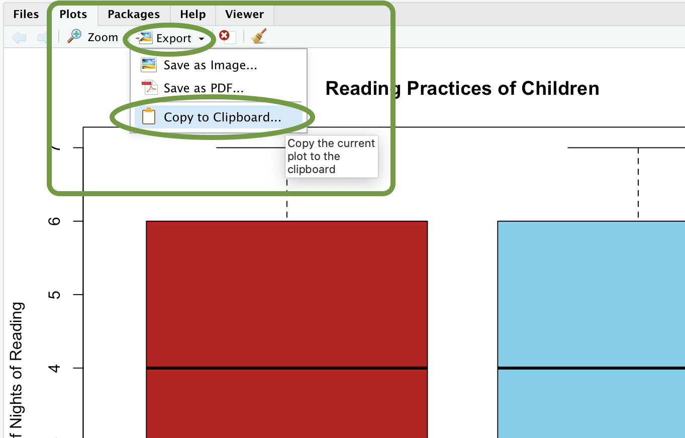

<script type = "text/javascript">
 function showhide(id) {
    var e = document.getElementById(id);
    e.style.display = (e.style.display == 'block') ? 'none' : 'block';
 }
</script>

<!-- VIDEO NEEDS TO BE UPDATED
<div style = "float:right;width = 40%;">
<br/>
<div style = "padding-left:10%;">**Optional Lesson Video**</div>
<iframe width = "90%" align = "right" src = "https://www.youtube.com/embed/videoseries?list = PLaZryQtbPQC8q6v33gWLuWgiwoHSKRslw" frameborder = "1" allow = "autoplay; encrypted-media" allowfullscreen></iframe>
</div>
-->

## Lesson Outcomes

<a href = "javascript:showhide('outcome')"><span style = "font-size:8pt;">Show/Hide Outcomes</span></a>
<div id = "outcome" style = "display:none;">
By the end of this lesson, you should be able to do the following.

* Apply a confidence interval for the difference of means (two independent samples) using the following steps:
  + Determine the level of confidence
  + Create numerical and graphical summaries of the data
  + Create a confidence interval using software
  + Check the requirements of the confidence interval
  + Interpret a confidence interval for the difference of means (two independent samples)
* Perform a hypothesis test for the difference of means (two independent samples) using the following steps:
  + State the null and alternative hypotheses
  + State the level of significance (α)
  + Create numerical and graphical summaries of the data
  + Calculate the test-statistic, degrees of freedom and P-value of the test using software
  + Assess statistical significance by comparing the P-value to the level of significance (α)
  + State the appropriate conclusion for the hypothesis test
  + Check the requirements for the hypothesis test

</div>
<br>


## Independent Samples Versus Paired Data

In [Lesson 12](Lesson12.html), we studied hypothesis tests and confidence intervals for the true mean of the differences $\mu_d$, where the data are paired.  One example of paired data is pre- and post-test scores, such as Mahon's weight loss study. <!--<cite>Mahon07</cite>-->  Another example is matched-pairs comparisons, like the nosocomial infection study. <!--<cite>Vegas93</cite>-->  How can you tell if data are paired?  The key characteristic of dependent samples (or matched pairs, or paired data) is that knowing which subjects will be in Group 1 determines which subjects will be in Group 2.  The data for each subject in Group 1 is *paired* with the data for a corresponding subject in Group 2.  In the case of the weight loss study, the same subject provided weight data for both groups: once in the pre-test (group 1) and once in the post-test (group 2).

In contrast to dependent samples, two samples are independent if knowing (precisely) which subjects are in Group 1 does not tell you (precisely) which subjects will be in Group 2.  With **independent samples**, there is no pairing between the groups.  Suppose you want to compare the incomes of men and women in the general population.  A random sample of men would be collected, and each would be asked to report their income.  Similarly, a random sample of women would be drawn, and they would also be asked to report their income.  Notice that the groups are independent.  Knowing the names of the men who are selected tells you nothing about which women would be selected.  This is an example of independent samples.

Some students make the association that samples are independent if they do not affect each other.  This is a false notion.  Instead, remember that *samples are independent if knowing exactly who was selected for Group A does not tell you exactly who will be selected for group B.*


## "Long" Vs. "Wide" Data

There are two ways our data can be organized when conducting inference for the difference of means with two independent samples. We refer to these as wide or long data. A wide data set has a column for every group. Long data format has a column that indicates the value of the variables and another column to indicate the group to which each value belongs.


### Long Data Format

A ward Primary president recorded the gender and age of each child in her Primary. The data are given below in a long format.

```{r, include = FALSE}
library(knitr)
library(tidyverse)
library(kableExtra)
set.seed(1)
Male <- sort(sample(3:11, 5, replace = TRUE))
Female <- sort(sample(3:11, 7, replace = TRUE))
length(Male) <- length(Female)
kids <- data.frame(cbind(Female, Male))
```

```{r, echo = FALSE}
kids %>%
  pivot_longer(c(Male,Female),names_to = "Gender", values_to = "Age") %>% 
  arrange(Gender, Age) %>% 
  na.omit() %>% 
  kable() %>% 
  kable_styling(full_width = F)
```
 
Notice that there is a column indicating the group (gender) and another column giving the data (age). 


### Wide Data Format

The data can also be organized in a "wide" format. 

```{r, echo = FALSE}
opts <- options(knitr.kable.NA = "") # replace NA with empty strings
kids %>%
  kable() %>% 
  kable_styling(full_width = F)
```
 
Notice that there is a column for each of the groups (gender) and the values in each column are the ages of the children with the given gender.

There is no difference in the information presented by these two formats. Each clearly presents the ages and gender of the Primary children. 
In this lesson, we will learn how to conduct a hypothesis to compare the means of two independent groups. We will do this for data in both wide and long formats.


<!--
------------------------------------------------------------------
START LONG DATA
------------------------------------------------------------------
-->


## Inference for Long Data


## Hypothesis Tests for Long Data
<a name = "Sec20:HypTestTwoMeansIndep"></a>


### Case Study: Reading Practices of Children with Developmental or Behavioral Problems

Is there a difference in the amount of reading done by children with problematic behavior compared to other children?


**Summarize the relevant background information**

Researchers led by Arlene Butz published a study on the reading practices of children <!--<cite>Butz09</cite>-->.  They wanted to know if there was a difference in the reading practices of children with developmental or behavioral problems (the DEV group or Group 1) compared to children in the general population who do not have developmental problems (the GEN group or Group 2.) One of the factors they considered was the number of nights each week that the children participated in reading in the home.  Data representative of their results are given in the file `reading`. Download these data from https://byuistats.github.io/M221R/data/reading.xlsx.
You can [click here](https://byuistats.github.io/M221R/RHelp.html#Reading_in_Data) for instructions on how to import the dataset into R.

```{r, include = FALSE}
library(openxlsx)
reading <- read.xlsx("https://byuistats.github.io/M221R/data/reading.xlsx")
```


**State the null and alternative hypotheses and the level of significance**

The null hypothesis is that there is no difference in the mean number of nights each week in which the two groups of children participate in reading in the home (the means of both GEN and DEV groups are equal).  The alternative hypothesis is that there is a difference in the mean number of nights that the children in the two groups participate in reading in the home.  If we let $\mu_1$ represent the mean number of nights each week that children in the GEN Group spent reading in the home, and $\mu_2$ represent mean nights children read in the home for the DEV Group, then these hypotheses are expressed mathematically as:
$$
\begin{align}
H_0: &~~ \mu_1 = \mu_2 \\
H_a: &~~  \mu_1  \neq \mu_2 
\end{align}
$$

We will use the $\alpha = 0.05$ level of significance.


**Describe the data collection procedures**

A group of children were enrolled in the study.  Children who were identified to have developmental or behavioral problems were labeled as Group 1 (the DEV group).  Children who did not display developmental or behavioral problems were labeled as Group 2 (the GEN group).  A survey was administered to a parent of each of the children.  One of the questions on the survey asked the number of nights that either their child read or that they read to their child during the week. This data is found in the data frame `reading`.

<div class = "QuestionsHeading">Answer the following questions:</div>
<div class = "Questions">
1. For which group do you think the mean number of nights of reading will be higher?

<a href = "javascript:showhide('Q1')"><span style = "font-size:8pt;">Show/Hide Solution</span></a>
<div id = "Q1" style = "display:none;">
* Answers will vary. 
* Many students indicate they expect the group without behavioral problems will have a higher mean number of nights that they read in the home.
</div>
<br>

2. Do the data published by Arlene Butz and her colleagues represent paired data or independent samples?  How can you tell?

<a href = "javascript:showhide('Q2')"><span style = "font-size:8pt;">Show/Hide Solution</span></a>
<div id = "Q2" style = "display:none;">
* The data represent independent samples.  Knowing which children are in Group 1 tells you nothing about which children will be in Group 2.
</div>
&nbsp;
</div>
<br>


### R Instructions for Numerical Summaries of Two Groups (Long Data)

**Give the relevant summary statistics**

We will use $\bar x_1$ to denote the mean of Group 1. Similarly, we use $s_1$ and $n_1$ for the standard deviation and sample size of Group 1.  For Group 2, we indicate the mean, standard deviation and sample size with the symbols: $\bar x_2$, $s_2$, and $n_2$, respectively.


<div class = "SoftwareHeading">R Instructions</div>
<div class = "Software">
**To compute numerical summaries for two groups (long data):**

* First, load the `reading` data into RStudio.

We next compute our "favorite" summary statistics for each of the two groups in the data file: DEV (children with developmental problems) and GEN (children without developmental problems). We want the summary statistics for these groups separately. 

We will use the tilde symbol (`~`) for this next command. This character is located on the top-left key on your keyboard. Using this symbol, we can run the `favstats` command separately for the two groups. The basic form of the command is `favstats(quantitative_data_variable ~ group_variable)`. The quantitative (numerical) data values are in the column `reading$nights` and the grouping variable is in the column `reading$group`. We enter the command in R as:

```{r, message = FALSE, warning = FALSE, comment = NA}
library(mosaic)
favstats(reading$nights ~ reading$group)
```

<div class = "note">
If you get the error message <span style = "color:red;">Error in favstats(Nights ~ Group, data = reading) : could not find function "favstats"</span> then you will need to run the code: `library(mosaic)` first, then try the `favstats(...)` code again.
</div>


<br>
</div>


<br>


<div class = "QuestionsHeading">Answer the following questions:</div>
<div class = "Questions">
3. Find the mean, standard deviation and sample size for the two groups, separately.  In other words, find $\bar x_1$, $s_1$, $n_1$, $\bar x_2$, $s_2$, and $n_2$.

<a href = "javascript:showhide('Q3')"><span style = "font-size:8pt;">Show/Hide Solution</span></a>
<div id = "Q3" style = "display:none;">

<center>
**Summary Statistics:**
</center>

                        DEV Group          GEN Group
  --------------------- ------------------ ------------------
  Mean:                 $\bar x_1 = 4.1$   $\bar x_2 = 3.7$
  Standard Deviation:   $s_1 = 2.4$        $s_2 = 2.5$
  Sample Size:          $n_1 = 204$        $n_2 = 117$


Were you surprised that the sample mean $\bar x$ was higher for the group with behavioral problems?  Why might this be the case?
</div>
<br>

</div>
<br>

**Make an appropriate graph to illustrate the data**

There are two populations, and it is important to illustrate both of them separately. It is not sufficient to combine the groups and to produce a single graph.  This would obscure the differences in the groups.

### R Instructions for Side-by-Side Boxplots (Long Data)

<div class = "SoftwareHeading">R Instructions</div>
<div class = "Software">
**To visualize the distributions of the two samples simultaneously:**

Load the `reading` data frame into RStudio.

Use the `boxplot(...)` function and the tilde `~` (top-left key on your keyboard) to produce a side-by-side boxplot. When using the `~` you put the quantitative variable first, followed by the `~`, then the categorical variable second, like this:

```{r}
boxplot(reading$nights ~ reading$group)
```

<br/>

**To Make a Fancier Graph**

To make the graph look a little nicer we could use the following options.

* the `col = ...` statement provide colors, either one color for both boxes in the plot `col = "steelblue3"`, or colors for each box in the plot, `col = c("brown3","steelblue3")`.
* the `main = "a nice title"`, allows you to specify a main title for your graph,  
* the `ylab = "a nice y-axis label"` allows you to specify a y-axis label for your graph,
* the `xlab = "a nice x-axis label"` allows you to label the x-axis of your graph,
* the `names = c("label 1", "label 2")` statement can be used to give each box a label along the x-axis.

```{r}
boxplot(reading$nights ~ reading$group,
        col = c("brown3","steelblue3"), 
        main = "Reading Practices of Children", 
        ylab = "Number of Nights of Reading",
        xlab = "Group",
        names = c("Behavioral Problems", "No Problems"))
```

**Tip**

To copy and paste a graph from R into a document, do the following:

- Create the graph in R
- Click the little "Export" button at the top of the "Plots" window
- Choose either the "Copy" or "Save" options.
- Then, either paste in the plot to your document, or insert the image (if you saved it).



<br/>
</div>


<br>


<div class = "QuestionsHeading">Answer the following questions:</div>
<div class = "Questions">
4. Based on the summary statistics (means, standard deviations, and sample sizes) and the graph created above for the two groups, what would you guess for the true difference in the mean number of nights each week that the children engage in reading between the DEV and GEN groups?

<a href = "javascript:showhide('Q4')"><span style = "font-size:8pt;">Show/Hide Solution</span></a>
<div id = "Q4" style = "display:none;">
* Answers will vary.  We will conduct a hypothesis test to formally determine the answer to this question. But based on the data, it seems that the DEV group is spending more time, on average, reading in the home than the GEN group. This seems surprising because the "DEV" group is the one with "developmental or behavioral problems."
</div>
&nbsp;
</div>
<br>


**Verify the requirements have been met**

There are two requirements that need to be checked when conducting a hypothesis test for two means with independent samples:

-  A simple random sample was drawn from each of the populations
-  $\bar{x}_1$ and $\bar{x}_2$ are both normally distributed.

Remember, the second requirement will be satisfied if (a) the original populations are normally distributed or (b) if the sample sizes are large. If either of these options are true, then the sample mean will be normally distributed for that group. In this example, both groups have a large sample size ($n_1 = 204$ and $n_2 = 117$), so both sample means can be assumed to be normally distributed.

We will assume the data from the study is a representative sample from each of the populations.

**Give the test statistic and its value**

The test statistic for a hypothesis test comparing two means with independent samples is a $t$.  We will use software tools to conduct the hypothesis test for two means with independent samples:


### R Instructions for an Independent Samples t Test for the Difference of Two Means (Long Data)

<div class = "SoftwareHeading">R Instructions</div>
<div class = "Software">
**The following instructions will help you conduct a hypothesis test for two means with independent samples in R.**

* Load the `reading` data frame into RStudio. Download these data from https://byuistats.github.io/M221R/data/reading.xlsx.
You can [click here](https://byuistats.github.io/M221R/RHelp.html#Reading_in_Data) for instructions on how to import the dataset into R.

```{r, include = FALSE}
library(openxlsx)
reading <- read.xlsx("https://byuistats.github.io/M221R/data/reading.xlsx")
```


* Take note of your null and alternative hypotheses, in this case $H_0: \mu_1 = \mu_2$ implies $\mu_1 - \mu_2 = 0$ and $H_a: \mu_1 \neq \mu_2$ implies $\mu_1 - \mu_2 \neq 0$.
* Use the `t.test(...)` function along with the tilde `~` (top-left key on your keyboard) to test a quantitative variable that is "divided into two groups" with the `~` sign like this:

```{r, comment = NA}
t.test(reading$nights ~ reading$group, 
       mu = 0, 
       alternative = "two.sided", 
       conf.level = 0.95)
```

Notice the quantitative variable "nights" was first, followed by the `~`, followed by the categorical variable "group" containing the two groups. It is important that the categorical variable contain *exactly* two groups or the `t.test` will not work.

A few other things to note:

* `mu = 0` is really implying "0 difference" in the mu's: $\mu_1 - \mu_2 = 0$, which is identical to stating that the two means are equal, $\mu_1 = \mu_2$.
* `alternative = "two.sided"` could also have used `alternative = "greater"` or `alternative = "less"` depending on the actual alternative hypothesis.

<br>
</div>
<br>

Now, we will apply these steps to the data from the study on the reading practices of children with developmental and behavioral problems.

If you assign the DEV group to be Group 1, and the GEN group as Group 2, then the test statistic will be:

$$
t = 1.455
$$

If the group labels are switched, then the $t$ statistic will have the opposite sign.

**State the degrees of freedom**

The degrees of freedom are given as:
$$df = 228.427$$

You will notice that this is not a whole number.  This is called the Satterthwaite approximation for the degrees of freedom.  Do not worry that this is not an whole number.  Just record the value as it is given to you in the software.

**Find the $P$-value and compare it to the level of significance**

From the output, we find that the $P$-value is 0.147.  

$$
P\text{-value} = 0.147 > 0.05 = \alpha
$$

**State your decision**

Since the $P$-value is greater than the level of significance, we fail to reject the null hypothesis. 


**Present your conclusion in an English sentence, relating the result to the context of the problem**

There is insufficient evidence to suggest that there is a difference in the mean number of nights children with developmental / behavioral disabilities read compared to children in the general population. The average amount of time spent reading in the home appears to be equal for both groups.

<!---
#### Pooled

Let the DEV group be called Group 1, and GEN group will be called Group 2.  So, $\mu_1$ is the true population mean of the DEV group, $\bar x_1$ is the sample mean for the DEV group, $n_1$ is the sample size for the DEV group, etc.  Similarly, $\mu_2$ is the true population mean of the GEN group, and so on.

We will do the hypothesis test by following these steps:
\begin{enumerate}
- State the null and alternative hypotheses.
$$
\begin{align}
H_0: & \mu_1 = \mu_2
H_a: & \mu_1 \ne \mu_2
\end{align}
$$
- Give the relevant summary statistics.

We will use the variable, *GroupCode*, that was described above.
The output from the command the command \Menuuu{Analyze}{Compare Means}{Independent-Samples T Test} is summarized below:
<center>

</center>
Our summary statistics are:
$$
\begin{array}{|rl|c|rl|}

colspan = "2" | \textrm{Group 1} && colspan = "2" | \textrm{Group 2} \\
colspan = "2" | \textrm{DEV} && colspan = "2" | \textrm{GEN} \\

\bar x_1 & = 4.10    && \bar x_2 & = 3.68 \\
s_1 & = 2.377        && s_2 & = 2.545 \\
n_1 & = 204          && n_2 & = 117 \\

\end{array}
$$
Since the larger standard deviation is not double the smaller standard deviation, we can assume equal variances.
- Present a graph illustrating the data.
<center>

</center>
- Report the test statistic.
Since the larger standard deviation is not double the smaller standard deviation, we conclude that the variances can be treated as being equal.  So, our test statistic, $t$, is:
$$
t = 1.482$$
Note that if you reverse the assignment of the group names, then you would get a $t$ value of $-1.482$.
- Give the degrees of freedom.
$$
df = 319$$
- Sketch the sampling distribution, showing the test statistic and shading the $P$-value.
<center>

</center>
- State the $P$-value.
$$
P\textrm{-value} = 0.139$$
- Give the decision rule for the test.
Since $P$-value$ = 0.139 > 0.05 = \alpha$, we fail to reject the null hypothesis.
- Summarize your conclusion in an English sentence.
There is insufficient evidence to suggest that there is a difference in the mean number of nights children with developmental / behavioral disabilities read compared to children in the general population.
\end{enumerate}
$$
-->


### Case Study: FIFA World Cup Heart Attacks

Do intense sporting events increase the probability of a person having a heart attack?  We will consider this question in the next example.


**Summarize the relevant background information**

The FIFA Football (Soccer) World Cup is held every four years and is one of the biggest sporting events in the world.  In 2006, Germany hosted the World Cup.  A study was conducted by Dr. Wilbert-Lampen, et. al. to determine if the stress of viewing a soccer match would increase the risk of a heart attack or another cardiovascular event. <!--<cite>WilbertLampen08</cite>-->

We will use the data on cardiovascular problems during the World Cup to test the hypothesis that the mean number of cardiovascular events is greater during the World Cup than during the control period.

**State the null and alternative hypotheses and the level of significance**

Let Group 1 be days in the Control Period and let Group 2 represent days during the 2006 World Cup.  We are testing whether the mean number of cardiovascular events is greater during the World Cup than during the control period.  Since we let Group 1 be the "Control Period", the alternative hypothesis will be one-sided with a less-than symbol because "Control less than during the 2006 World Cup" is the proper way to state that Group 2 is greater than Group 1.

$$
\begin{align}
H_0: & ~~ \mu_1 = \mu_2 \\
H_a: & ~~ \mu_1 < \mu_2
\end{align}
$$

We will use the $\alpha = 0.01$ level of significance. Remember, we are always free to choose our significance level, but since it controls the probability of a Type I Error occurring, we need to consider how problematic a Type I Error would be for our study. In this case, it isn't terribly detrimental to commit a Type I Error (rejecting the null when the null was actually true), so we go with $\alpha = 0.1$.


**Describe the data collection procedures**

The 2006 World Cup was held from June 9 to July 9, 2006.  The number of patients suffering cardiovascular events (e.g. heart attacks) was obtained from medical records of patients in the Greater Munich (Germany) area during this time period.  To provide a control group, counts of patients suffering cardiovascular events was recorded from May 1 to June 8 and July 10 to July 30, 2006, as well as May 1 to July 30 in 2003 and 2005.  The year 2004 was avoided, due to the European Soccer Championships held in Portugal.  These data were extracted from Figure 1 in the article by Wilbert-Lampen, <!--<cite>WilbertLampen08</cite>--> and are given in the file `fifa_heart_attacks`. Download these data from https://byuistats.github.io/M221R/data/fifa_heart_attacks.xlsx.
You can [click here](https://byuistats.github.io/M221R/RHelp.html#Reading_in_Data) for instructions on how to import the dataset into R.

```{r, include = FALSE}
library(openxlsx)
fifa_heart_attacks <- read.xlsx("https://byuistats.github.io/M221R/data/fifa_heart_attacks.xlsx")
```


<div class = "QuestionsHeading">Answer the following questions:</div>
<div class = "Questions">

5. **Give the relevant summary statistics**

<a href = "javascript:showhide('Q5')"><span style = "font-size:8pt;">Show/Hide Solution</span></a>
<div id = "Q5" style = "display:none;">
* We need to find the the following: $\bar x_1$, $s_1$, $n_1$, $\bar x_2$, $s_2$, and $n_2$. So we load the `fifa_heart_attacks` data frame into RStudio.  
* Ensure `library(mosaic)` is loaded, and then use the `favstats(...)` function.


```{r, message = FALSE, warning = FALSE, comment = NA}
library(mosaic)
favstats(fifa_heart_attacks$heart_attacks ~ fifa_heart_attacks$time_period)
```

<center>
**Summary Statistics:**
</center>

  Time Period   Mean              Std. Deviation   Sample Size
  ------------- ----------------- ---------------- -------------
  Control       $\bar x_1 = 14$   $s_1 = 4.2$      $n_1 = 182$
  World Cup     $\bar x_2 = 19$   $s_2 = 9.8$      $n_2 = 91$

</div>
<br>

6. **Make an appropriate graph to illustrate the data**

<a href = "javascript:showhide('Q6')"><span style = "font-size:8pt;">Show/Hide Solution</span></a>
<div id = "Q6" style = "display:none;">
Side-by-side boxplots are a great way to summarize the data. 

```{r}
boxplot(fifa_heart_attacks$heart_attacks ~ fifa_heart_attacks$time_period, 
        col = c("darkolivegreen4", "tan3"),
        xlab = "Time Period",
        ylab = "Number of Heart Attacks per Day",
        main = "2006 World Cup")
```

</div>
&nbsp;
</div>
<br>


<div class = "QuestionsHeading">Answer the following questions:</div>
<div class = "Questions">

7. **Verify the requirements have been met**

<a href = "javascript:showhide('Q7')"><span style = "font-size:8pt;">Show/Hide Solution</span></a>
<div id = "Q7" style = "display:none;">
* Even though a simple random sample of days was not taken, we can assume that the number of heart attacks on one day do not affect the number of heart attacks on other days.  
* The sample size is large for both groups ($n_1 = 182$ and $n_2 = 91$), so we conclude that the sample means for each group, $\bar{x}_1$ and $\bar{x}_2$ are normally distributed.
</div>
<br>

8. **Give the test statistic and its value**

<a href = "javascript:showhide('Q8')"><span style = "font-size:8pt;">Show/Hide Solution</span></a>
<div id = "Q8" style = "display:none;">

```{r, comment = NA}
t.test(fifa_heart_attacks$heart_attacks ~ fifa_heart_attacks$time_period, 
       mu = 0,
       alternative = "two.sided",
       conf.level = 0.95)
```

* The test statistic is a $t$ and its value is

$$t = -4.617$$
</div>
<br>

9. **State the degrees of freedom**

<a href = "javascript:showhide('Q9')"><span style = "font-size:8pt;">Show/Hide Solution</span></a>
<div id = "Q9" style = "display:none;">
* The degrees of freedom are: 

$$df = 106.43$$
</div>
<br>

10. **Mark the test statistic and $P$-value on a graph of the sampling distribution**

<a href = "javascript:showhide('Q10')"><span style = "font-size:8pt;">Show/Hide Solution</span></a>
<div id = "Q10" style = "display:none;">
Note that the p-value is automatically computed in R for you when you run `t.test`. However, it is useful to remember that this p-value comes from using a t-distribution with the given number of degrees of freedom, marking the observed t-value from the t-test on the graph, and shading the area "more extreme" than the observed value. Recall the definition of the p-value is "the probability of observing a test statistic as extreme or more extreme than the one observed, assuming the null hypothesis is true." This is what it would look like:


<center>

</center>
</div>
<br>

11. **Find the $P$-value and compare it to the level of significance**

<a href = "javascript:showhide('Q11')"><span style = "font-size:8pt;">Show/Hide Solution</span></a>
<div id = "Q11" style = "display:none;">
<center>
The p-value is much smaller than the significance level of $\alpha = 0.1$.

$$
P\textrm{-value} = 5.4636 \times 10^{-06}
$$
</center>
</div>
<br>

12. **State your decision**

<a href = "javascript:showhide('Q12')"><span style = "font-size:8pt;">Show/Hide Solution</span></a>
<div id = "Q12" style = "display:none;">
* Since $P\textrm{-value} = 5.4636 \times 10^{-06} < 0.01 = \alpha$, we reject the null hypothesis.  
</div>
&nbsp;
</div>
<br>


<div class = "QuestionsHeading">Answer the following question:</div>
<div class = "Questions">

13. **Present your conclusion in an English sentence, relating the result to the context of the problem**

<a href = "javascript:showhide('Q13')"><span style = "font-size:8pt;">Show/Hide Solution</span></a>
<div id = "Q13" style = "display:none;">
* There is sufficient evidence to suggest that the mean number of heart attacks per day is greater during intense sporting events, such as the World Cup.
</div>
&nbsp;
</div>
<br>

#### Statistics Theory: Independent Samples t Test for the Difference of Two Means

In this course, we do not go very deep into statistical theory.  For those students who are interested, there is a lot of theory undergirding statistical practice that you will be able to study in other BYU-Idaho statistics courses.

For now, know that an important theoretical issue relates to this independent samples hypothesis test.  If the variances of the two groups are equal, then traditional statistical theory suggests that you combine or *pool* the information about the variance in the two groups.  If the variances are not equal, you do not combine the information about the spread.  These two techniques usually lead to slightly different values for the $t$-statistic, degrees of freedom, and $P$-value.

If the variances observed in the sample data are very different from each other, you assume unequal variances and do not pool the data.  However, if the variances are very similar to each other, the results of the two procedures will be nearly identical.  In this case, it does not really matter which you choose.  

So, if the variances differ significantly, we should not assume equal variances.  If the variances do not differ significantly, it doesn't really matter if you assume equal variances or not.  So, for this course, we will never assume the variances are equal.  Stated, differently, we always assume unequal variances in this course.  This provides a consistent framework for your learning.

<br>


## Confidence Intervals for Long Data
<a name = "Sec19:CITwoMeansIndep"></a>


### Case Study: Reading Practices of Children with Developmental or Behavioral Problems (Revisited)


**Summarize the relevant background information**

As we stated previously in this lesson, researchers led by Arlene Butz published a study on the reading practices of children. They wanted to know if there was a difference in the reading practices of children with developmental or behavioral problems (the DEV group) compared to children in the general population who do not have developmental problems (the GEN group.) One of the factors they considered was the number of nights each week that the children participated in reading in the home. 

We can use a 95% confidence interval to compare the difference between the true mean number of nights children in the DEV group participated in reading compared to children in the GEN group.  We are trying to find an estimate for the difference in the true means of the two groups.  Using math symbols, we want to estimate the value of $\mu_1 - \mu_2$. The confidence interval gives a range of plausible values for the unknown parameter $\mu_1 - \mu_2$. 

Notice that if $\mu_1 - \mu_2 = 0$, if we add $\mu_2$ to both sides of the equation, we get: $\mu_1 = \mu_2$. Extending that idea, if zero is in the confidence interval, then it is plausible that $\mu_1 = \mu_2$.  If zero is in the confidence interval, we conclude that there is no significant difference between the mean number of nights the children in the two groups read at home.

Software can be used to compute the confidence interval for a difference of two means with independent samples.


**Describe the data collection procedures**

In the study by Arlene Butz, et.al., on the reading practices of children, the researchers wanted to determine if there was a difference in the mean number of nights children read in the two groups (DEV and GEN)<!--<cite>Butz09</cite>-->. A survey was given to the child's caretaker (usually a parent).  This survey included questions about the child's development and behavior. The survey also asked the number of nights each week that the child participated in reading in the home. Data representative of their results are given in the data frame `reading`. Download these data from https://byuistats.github.io/M221R/data/reading.xlsx.
You can [click here](https://byuistats.github.io/M221R/RHelp.html#Reading_in_Data) for instructions on how to import the dataset into R.

```{r, include = FALSE}
library(openxlsx)
reading <- read.xlsx("https://byuistats.github.io/M221R/data/reading.xlsx")
```


**Give the relevant summary statistics**

Using R, we compute the following:

```{r, comment = NA}
favstats(reading$nights ~ reading$group)
```

+---------------------+------------------+------------------+
|                     | DEV Group        | GEN Group        |
|                     | Group 1          | Group 2          |
+=====================+==================+==================+
| Mean:               | $\bar x_1 = 4.1$ | $\bar x_2 = 3.7$ |
+---------------------+------------------+------------------+
| Standard Deviation: | $s_1 = 2.4$      | $s_2 = 2.5$      |
+---------------------+------------------+------------------+
| Sample Size:        | $n_1 = 204$      | $n_2 = 117$      |
+---------------------+------------------+------------------+

: **Summary Statistics**


**Make an appropriate graph to illustrate the data**

```{r}
boxplot(reading$nights ~ reading$group,
        main = "Reading Practices of Children",
        col = c("brown3","steelblue3"), 
        ylab = "Nights Spent Reading", 
        xlab = "Group",
        names = c("Behavioral Problems", "No Problems"))
```


**Verify the requirements have been met**

The sample size is large enough in both groups respectively, so we can be assured the sampling distribution of the mean for each group is normal.

**Find the confidence interval**

### R Instructions for a Confidence Interval of the Difference of Two Means (Long Data)

In this example, we compute the 95% confidence interval for the difference in the mean number of nights the children in the DEV and GEN groups are reading.  To obtain a confidence interval for the difference in two means with independent samples, follow these steps:

<div class = "SoftwareHeading">R Instructions</div>
<div class = "Software">
**To compute a 95% confidence interval for the difference of two means from two independent samples:**

- Load the data frame: `reading`.
- Perform t test for the difference of two means using the `t.test(..., conf.level = 0.95)` function.

```{r, comment = NA}
t.test(reading$nights ~ reading$group, conf.level = 0.95)
```

The lower bound and upper bound of the 95% confidence interval for the *difference between the two means* ($\mu_1 - \mu_2$) is given in the output above as (-0.149, 0.987). 

<br>
</div>
<br>


**Present your observations in an English sentence, relating the result to the context of the problem**

We are 95% confident that the true difference in the means is between $-0.149$ and $0.987$ days.
Note that this confidence interval contains zero, so it is plausible that there is no difference in the mean number of nights the children in the two groups participate in reading. It is only when both values in the confidence interval are positive, or both values are negative, that we can conclude that one mean is different from the other.


<!--

### Reversing the Order of Groups

When creating the confidence interval in R, it is important to remember that R splits the data into two groups alphabetically. So the "DEV" group is the first group and the "GEN" group is the second group. If this order were reversed, it would result in a confidence interval with the opposite sign. If we assign the GEN group as the first group and the DEV group as the second, we would get a confidence interval of $(-0.987, 0.149)$. We could do this with the code:

```{r, comment = NA}
reading$groupReversed <- factor(reading$group, levels = c("GEN", "DEV"), ordered = TRUE)
t.test(reading$nights ~ reading$groupReversed)
```

-->


<!--
------------------------------------------------------------------
START WIDE DATA
------------------------------------------------------------------
-->


<!--
------------------------------------------------------------------
START WIDE DATA
------------------------------------------------------------------
-->


<!--
------------------------------------------------------------------
START WIDE DATA
------------------------------------------------------------------
-->


## Inference for Wide Data

<a name = "Sec20:HypTestTwoMeansIndep:Wide"></a>


### Case Study: Chronic Obstructive Pulmonary Disease (COPD)


    
**Summarize the relevant background information**
    
The National Heart Lung and Blood Institute gives the following explanation of COPD <!--<cite>NHLBI09</cite>-->:
    
COPD, or chronic obstructive pulmonary (PULL-mun-ary) disease, is a progressive disease that makes it hard to breathe. "Progressive" means the disease gets worse over time.
  
COPD can cause coughing that produces large amounts of mucus (a slimy substance), wheezing, shortness of breath, chest tightness, and other symptoms.
  
Cigarette smoking is the leading cause of COPD. Most people who have COPD smoke or used to smoke. Long-term exposure to other lung irritants, such as air pollution, chemical fumes, or dust, also may contribute to COPD.
  
**State the null and alternative hypotheses and the level of significance**

To assess the health of COPD patients, they were asked to walk as far as they could at a particular pace. 
The question is whether the mean distance these patients can walk is different for those who receive treatment in a 
hospital compared to those who receive care in a community program.

The null hypothesis is that there is no difference in the mean distance that patients can walk between groups receiving the two treatment programs.  The alternative hypothesis is that there is a difference in the mean distance the patients in the two programs can walk.  If we let $\mu_1$ represent the mean distance for those in the community group, and $\mu_2$ represent mean distance for those in the hospital group, then these hypotheses are expressed mathematically as:
$$
\begin{align}
H_0: &~~ \mu_1 = \mu_2 \\
H_a: &~~  \mu_1  \neq \mu_2 
\end{align}
$$

We will use the $\alpha = 0.05$ level of significance.
  
  

    
**Describe the data collection procedures**
    
A study was conducted in the United Kingdom to determine if there is a difference in the effectiveness of community-based rehabilitation program compared to hospital-based rehabilitation <!--<cite>Waterhouse10</cite>-->. Patients suffering from COPD were randomly assigned to either the community or hospital group. Twice a week for six weeks, they participated in two-hour educational and exercise sessions.  Patients were also encouraged to exercise between sessions.
  
The effectiveness of the program was measured based on the total distance patients could walk at one time at a particular pace. This is called the endurance shuttle walking test (ESWT).  This was measured at the beginning of the study and again at the end of the six week rehabilitation period.  Data representing the improvement of the patients in each group is given in the file `copd_rehab`. Download these data from https://byuistats.github.io/M221R/data/copd_rehab.xlsx.
You can [click here](https://byuistats.github.io/M221R/RHelp.html#Reading_in_Data) for instructions on how to import the dataset into R.

```{r, include = FALSE}
library(openxlsx)
copd_rehab <- read.xlsx("https://byuistats.github.io/M221R/data/copd_rehab.xlsx")
```

The data represent the increased distance (in meters) that each patient could walk.  Negative values indicate that the patient was not able to walk as far at the end of the rehabilitation treatment as at the beginning.
  
Because hospital-based rehabilitation tends to be more expensive, the researchers wanted to assess if there is a significant difference in the patients' improvement under the two programs.  If not, then it makes sense to refer patients to the less expensive treatment option.  The purpose of this study was to determine if pulmonary rehabilitation in a community setting is as effective as rehabilitation in a hospital setting.


<div class = "QuestionsHeading">Answer the following questions:</div>
<div class = "Questions">
1. Do you think patients who receive a hospital-based treatment will be able to walk a greater or lesser distance than those who recieve a community-based treatment?

<a href = "javascript:showhide('Q1')"><span style = "font-size:8pt;">Show/Hide Solution</span></a>
<div id = "Q1" style = "display:none;">
* Answers will vary. 
* Many people suggest that the hospital-based treatment program, which is more expensive, will provide better outcomes.
</div>
<br>

2. Do these data represent paired data or independent samples?  How can you tell?

<a href = "javascript:showhide('Q2')"><span style = "font-size:8pt;">Show/Hide Solution</span></a>
<div id = "Q2" style = "display:none;">
* The data represent independent samples.  Knowing which COPD patients are in Group 1 tells you nothing about which patients will be in Group 2.
</div>
&nbsp;
</div>
<br>


### R Instructions for Converting "Wide" Data to "Long" Format {#convert_wide_to_long}

After reading in the data, examine the format in which they are presented.

```{r, include = FALSE}
library(knitr)
library(tidyverse)
library(kableExtra)
```

Here are the first eight rows:

```{r, echo = FALSE}
copd_rehab %>% 
    head(5) %>%  
    kable(align = c("c", "c", "l")) %>% 
    kable_styling(full_width = F)
```

There are three columns of data, where each column gives the additional distance the patients were able to walk after the treatment. Note that this is "wide" data, since every column gives the data for one group. The last column presents information about the study and the reference for the article summarizing this research.

In order to conduct inference for the difference of two means (independent samples), it will be convenient to convert the data into "long" format.  We will do this in three steps:

  1. Examine the data. We can either do this with either the `View(copd_rehab)` or `head(copd_rehab)` commands.
  
  2. Remove columns that do not contain data. In this case, we want to eliminate the column titled `comments`. One way to do this is by running the command:
```{r}
copd_rehab$comments <- NULL
```
This command removes the column `comments` from the data set. The only way to restore the column is to start over by reading in the data again.

  3. We will use the `stack()` command to create a new data set called `copd` that is in "long" format:
```{r}
copd <- stack(copd_rehab)
```

Use `View(copd)` to explore these data. Notice that R has transformed the data, so that it is now in "long" format, where the additional distance measurements are in a column called `values` and the label indicating ("ind") the type of treatment facility is in a second column called `ind`.

After making this change, the techniques for performing ANOVA on long data can be applied to the data set `copd`.


<!-- ################# END of converstion to LONG #################### -->


### R Instructions for Numerical Summaries of Two Groups (Wide Data Converted to Long Data)

**Give the relevant summary statistics**

We will use $\bar x_1$ to denote the mean of Group 1. Similarly, we use $s_1$ and $n_1$ for the standard deviation and sample size of Group 1.  For Group 2, we indicate the mean, standard deviation and sample size with the symbols: $\bar x_2$, $s_2$, and $n_2$, respectively.


<div class = "SoftwareHeading">R Instructions</div>
<div class = "Software">
**To compute numerical summaries for two groups:**

Load the `copd_rehab` data into RStudio. Then, follow the directions to [convert the data into long format](#convert_wide_to_long). Save the results in a data frame called `copd`.

We next compute our "favorite" summary statistics for each of the two columns. 

Load the `mosaic` library in RStudio that makes calculating the numerical summaries really quick, even for just one set of data.
Use the `favstats(...)` function to produce numerical summaries for each group.

```{r, message = FALSE, warning = FALSE, comment = NA}
library(mosaic)
favstats(values ~ ind, data = copd)
```

<div class = "note">
If you get the error message <span style = "color:red;">Error in favstats(values ~ ind, data = copd) : could not find function "favstats"</span> then you will need to run the code: `library(mosaic)` first, then try the `favstats(...)` code again.
</div>


<br>
</div>
<br>

<div class = "QuestionsHeading">Answer the following questions:</div>
<div class = "Questions">
3. Find the mean, standard deviation and sample size for the two groups, separately.  In other words, find $\bar x_1$, $s_1$, $n_1$, $\bar x_2$, $s_2$, and $n_2$.

<a href = "javascript:showhide('Q3')"><span style = "font-size:8pt;">Show/Hide Solution</span></a>
<div id = "Q3" style = "display:none;">


<center>
**Summary Statistics:**
</center>
  
+------------------+--------------------+
| Community        | Hospital           |
| Group 1          | Group 2            |
+==================+====================+
| $\bar x = 216.1$ | $\bar x_2 = 283.4$ |
+------------------+--------------------+
| $s = 339.9$      | $s = 359.9$        |
+------------------+--------------------+
| $n = 76$         | $n = 85$           |
+------------------+--------------------+

<br>
</div>
<br>
</div>


**Make an appropriate graph to illustrate the data**

There are two populations, and it is important to illustrate both of them separately. It is not sufficient to combine the groups and to produce a single graph.  This would obscure the differences in the groups.

### R Instructions for Side-by-Side Boxplots (Wide Data Converted to Long Data)

<div class = "SoftwareHeading">R Instructions</div>
<div class = "Software">
**To visualize the distributions of the two samples simultaneously:**

Load the `copd_rehab` data into RStudio. Then, follow the directions to [convert the data into long format](#convert_wide_to_long). Save the results in a data frame called `copd`.

Use the `boxplot(...)` function and the tilde `~` (top-left key on your keyboard) to produce a side-by-side boxplot. When using the `~` you put the quantitative variable first, followed by the `~`, then the categorical variable second, like this:

```{r}
boxplot(values ~ ind, data = copd)
```

<br/>

**To Make a Fancier Graph**

To make the graph look a little nicer we could use the following options.

* the `col = ...` statement provide colors, either one color for both boxes in the plot `col = "steelblue3"`, or colors for each box in the plot, `col = c("brown3","steelblue3")`.
* the `main = "a nice title"`, allows you to specify a main title for your graph,  
* the `ylab = "a nice y-axis label"` allows you to specify a y-axis label for your graph,
* the `xlab = "a nice x-axis label"` allows you to label the x-axis of your graph,
* the `names = c("label 1", "label 2")` statement can be used to give each box a label along the x-axis.

```{r}
boxplot(values ~ ind, data = copd,
        names = c("Community", "Hospital"), 
        main = "Chronic Obstructive Pulmonary Disease", 
        xlab = "Treatment Group",
        ylab = "Increased Distance Patients Could Walk (meters)",
        col = c("brown3","steelblue3"))
```

 * Notice that a descriptive title has been added to the plot. Adding more descriptive titles and axes labels is always a good idea. Furthermore, some changes to the formatting were made to make the chart more attractive. Feel free to experiment with labeling and formatting the graph when using a graph for your own presentation.
<br>

**Tip**

To copy and paste a graph from R into a document, do the following:

- Create the graph in R
- Click the little "Export" button at the top of the "Plots" window
- Choose either the "Copy" or "Save" options.
- Then, either paste in the plot to your document, or insert the image (if you saved it).


<br/>
</div>


<br>


<div class = "QuestionsHeading">Answer the following questions:</div>
<div class = "Questions">
  17. **What do you observe in the graph you made in the previous question?  Does there appear to be a difference in the mean responses of the two groups?**
  
  <a href = "javascript:showhide('Q17')"><span style = "font-size:8pt;">Show/Hide Solution</span></a>
  <div id = "Q17" style = "display:none;">
  * The two boxplots look similar, although based on the graphs it looks like the mean of the Hospital Group may be slightly higher than the Community Group.  This is just a visual observation.  We need to conduct a hypothesis test or create a confidence interval to verify it.
</div>
<br>
</div>
<br>


## Hypothesis Tests for Wide Data (Converted to Long Data)

### R Instructions for an Independent Samples t Test (Wide Data Converted to Long Data)

<div class = "SoftwareHeading">R Instructions</div>
<div class = "Software">


* First, read the `copd_rehab` data into RStudio. Then, follow the directions to [convert the data into long format](#convert_wide_to_long). Save the results in a data frame called `copd`.

* Second, run the `t.test(...)` with the first column of data, followed by a comma `,`, and then the second column of data.

**When the data for each group is in a separate column** the t test for the difference of two means is performed by separating the two vectors of data with a comma (`,`).

```{r}
t.test(values ~ ind, data = copd,
       mu = 0, 
       alternative = "two.sided")
```

<br>
</div>

<div class = "QuestionsHeading">Answer the following questions:</div>
<div class = "Questions">
18. **Verify the requirements have been met**

<a href = "javascript:showhide('Q18')"><span style = "font-size:8pt;">Show/Hide Solution</span></a>
<div id = "Q18" style = "display:none;">
* The sample sizes are large, so the distribution of sample means from both groups are normal. Therefore, we can conclude the requirements are met.
</div>
&nbsp;
</div>

## Confidence Intervals

### R Instructions for a Confidence Interval of the Difference of Two Means (Wide Data Converted to Long Data)

<div class = "SoftwareHeading">R Instructions</div>
<div class = "Software">

19. **Find the confidence interval**

Use the following command to create a 95% confidence interval for the difference in the mean distance walked by patients treated in the community and hospital programs.

```{r, comment = NA}
t.test(values ~ ind, data = copd, conf.level = 0.95)
```

<a href = "javascript:showhide('Q19')"><span style = "font-size:8pt;">Show/Hide Solution</span></a>
<div id = "Q19" style = "display:none;">
<!--
* Remember, we will never assume equal variances in this course. 
-->

* Two different confidence intervals are possible, depending on how you defined the groups.  The order in which we subtract the means determines the sign of the results. Compare the results of the following two commands:
`t.test(copd_rehab$community, copd_rehab$hospital, conf.level = 0.95)` 
and
`t.test(copd_rehab$hospital, copd_rehab$community, conf.level = 0.95)`.

  + If we subtract **Community** - **Hospital**, we get:
<center>$(-176.2,~41.7)$</center>

  + If we subtract **Hospital** - **Community**, we get:
<center>$(-41.7,~176.2)$</center>

* If the problem does not specify the order in which we should subtract, either of these is acceptable.
</div>
&nbsp;
</div>
<br>


<div class = "QuestionsHeading">Answer the following questions:</div>
<div class = "Questions">
20. **Present your observations in an English sentence, relating the result to the context of the problem**

<a href = "javascript:showhide('Q20')"><span style = "font-size:8pt;">Show/Hide Solution</span></a>
<div id = "Q20" style = "display:none;">
* We are 95% confident that the true mean difference in the improvement for the two groups is between -176.2 and 41.7.  

<br>
<div class = "message Note">If we had subtracted in the order **Hospital** - **Community**, we would say, we are 95% confident that the true mean difference in the improvement for the two groups is between -41.7 and 176.2.</div>
<br>
<br>
</div>
<br>

21. **Does there appear to be a difference in the mean improvement observed between the two groups?  What does this suggest?**

<a href = "javascript:showhide('Q21')"><span style = "font-size:8pt;">Show/Hide Solution</span></a>
<div id = "Q21" style = "display:none;">
* Zero is contained in the confidence interval, so zero is a plausible value for the difference in the means.  In other words, we cannot conclude that there is a difference in the mean improvement of the two groups.  

* These results suggest that health care administrators should encourage community rehabilitation options for COPD whenever possible.  It is generally less expensive than the hospital experience and does not lead to significantly different patient improvement.
</div>
<br>


22. **Create a 90% confidence interval for the difference in the mean responses of the two groups.**

<a href = "javascript:showhide('Q22')"><span style = "font-size:8pt;">Show/Hide Solution</span></a>
<div id = "Q22" style = "display:none;">
- If we subtract: $community - Hospital$, we get: $(-158.5,~24.0)$

- If we subtract: $hospital - Community$, we get: $(-24.0,~158.5)$
</div>
<br>

23. **Interpret the confidence interval you computed in Question 22.**

<a href = "javascript:showhide('Q23')"><span style = "font-size:8pt;">Show/Hide Solution</span></a>
<div id = "Q23" style = "display:none;">
* We are 90% confident that the true mean difference in the improvement for the two groups is between $-158.5$ and $24.0$.  A similar statement holds for $24.0$ and $-158.5$.
</div>
<br>

24. **Why is the 95% confidence interval wider than the 90% confidence interval?**

<a href = "javascript:showhide('Q24')"><span style = "font-size:8pt;">Show/Hide Solution</span></a>
<div id = "Q24" style = "display:none;">
* In order to be more confident that the true mean is between two values, we have to make the confidence interval wider.  
</div>
&nbsp;
</div>
<br>


## Summary

<div class = "SummaryHeading">Remember...</div>
<div class = "Summary">

- In contrast to dependent samples, two samples are independent if knowing which subjects are in group 1 tells you nothing about which subjects will be in group 2. With **independent samples**, there is no pairing between the groups.

- When conducting inference using independent samples we use $\bar x_1$, $s_1$, and $n_1$ for the mean, standard deviation, and sample size, respectively, of group 1. We use the symbols $\bar x_2$, $s_2$, and $n_2$ for group 2.

- When working with independent samples it is important to graphically illustrate each sample separately. Combining the groups to create a single graph is not appropriate.

- When conducting hypothesis tests using independent samples, the null hypothesis is always $\mu_1 = \mu_2$, indicating that there is no difference between the two populations. The alternative hypothesis can be left-tailed ($<$), right-tailed($>$), or two-tailed($\ne$).

- Whenever zero is contained in the confidence interval of the difference of the true means we conclude that there is no significant difference between the two populations.
<br>
</div>
<br>

## Navigation

<center>
| **Previous Reading** | **This Reading** | **Next Reading** |
| :------------------: | :--------------: | :--------------: |
| [Lesson 12: <br> Inference for Two Means: Paired Data](Lesson12.html) | Lesson 13: <br> Inference for Two Means: Independent Samples | [Lesson 14: <br> Inference for Several Means (ANOVA)](Lesson14.html) |
</center>

