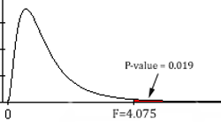
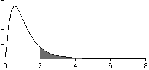

<script type = "text/javascript">
 function showhide(id) {
    var e = document.getElementById(id);
    e.style.display = (e.style.display == 'block') ? 'none' : 'block';
 }
</script>

<div style = "float:right;width = 40%;">
<br/>
<div style = "padding-left:10%;">**Optional Lesson Video**</div>
<iframe width = "90%" align = "right" src = "https://www.youtube.com/embed/videoseries?list = PLaZryQtbPQC8BeDBR9mQR2d8nnqK_iQ0j" frameborder = "1" allow = "autoplay; encrypted-media" allowfullscreen></iframe>
</div>

## Lesson Outcomes

<a href = "javascript:showhide('oc')"><span style = "font-size:8pt;">Show/Hide Outcomes</span></a>
<div id = "oc" style = "display:none;">
By the end of this lesson, you should be able to do the following for a hypothesis test for several means (ANOVA):

* State the null and alternative hypothesis. 
* Calculate the test-statistic, degrees of freedom and p-value of the hypothesis test.
* Assess the statistical significance by comparing the p-value to the $\alpha$-level.
* Check the requirements for the hypothesis test.
* Show the appropriate connections between the numerical and graphical summaries that support the hypothesis test. 
* Draw a correct conclusion for the hypothesis test. 
</div>
<br>

<div style = "clear:both;"></div>

<br/>
<br/>


## Case Study: The Effects of Gratitude

<br>
<table>
<tbody>
<tr class = "odd">
<td><p></p></td>
<td><p>$~ ~$</p></td>
<td><p>President Gordon B. Hinckley said, &quot;My plea is that we stop seeking out the storms and enjoy more fully the sunlight. I am suggesting that as we go through life, we 'accentuate the positive.' I am asking that we look a little deeper for the good, that we still our voices of insult and sarcasm, that we more generously compliment and endorse virtue and effort&quot; (*Standing for Something*, 2000, p.101).</p></td>
</tr>
<tr class = "even">
<td></td>
<td></td>
<td></td>
</tr>
</tbody>
</table>


<div style = "float:right; padding:10px;">

</div>

**Summarize the relevant background information**

Robert Emmons and Michael McCullough investigated the effects of gratitude on people's perception of life as a whole<!--<cite>Emmons03</cite>-->.  In a study of $n = 192$ undergraduates, the people were randomly assigned to one of three groups.

- Group 1 (Gratitude): The participants in this group were asked to record five things each week for which they were grateful or thankful.
- Group 2 (Hassles): The volunteers in this group recorded five irritants that had occurred to them in the previous week.
- Group 3 (Events): The people in the events group recorded five things that occurred in the past week that had an impact on them.

In addition to the weekly record of the five things they recorded their level of satisfaction with life in general.  (Higher values are more favorable.)  Reports were collected for nine weeks, and the overall level of satisfaction with life as a whole was recorded for each individual.
The researchers wanted to determine if there was a difference in the perception of life as a whole between the subjects assigned to each of the three groups.  Stated differently, they wanted to determine if expressing gratitude affects a person's view of life in general.

Here is an excerpt of data representing the results of this study:

| Person | Treatment Group | Happiness Score |
|:------:|:---------------:|:---------------:|
|  1     |  Grateful       |  6.1   |
|  2     |  Grateful       | 6.2 |
| $\vdots$ | $\vdots$  | $\vdots$ |
| 64 | Grateful | 4.9 |
| 65 | Hassles | 5.9 |
| $\vdots$ | $\vdots$ | $\vdots$ |
| 127 | Hassles | 3.8 |
| 128 | Events | 4.9 |
| $\vdots$ | $\vdots$ | $\vdots$ |
| 192 | Events | 3.7 |


Higher values indicate a greater level of satisfaction with life as a whole.


How might we analyze these data?  One possible method would be to conduct separate t-tests for all the possible pairs of groups in the study.  If we did this, we would need to conduct a separate t-test to compare groups 1 & 2, 1 & 3 and 2 & 3.  If the probability of committing a Type I error is $\alpha = .05$ on each of these tests, then the probability that we would commit a Type I error on at least one of the tests is much greater than 0.05.  We need a hypothesis test that we can use to compare all the groups at once.  The procedure that allows us to do this is called Analysis of Variance (ANOVA).


## Analysis of Variance (ANOVA)

ANOVA, an acronym for **An**alysis **o**f **Va**riance, is a test for equality of several means. It allows us to compare the means for several groups in a single hypothesis test.  It is based on a comparison of the spread (or variance) of the data *within* each of the groups compared to the spread (or variance) *between* the means of the groups.  

In an ANOVA test, the null hypothesis is typically expressed in words:
$$H_0: \text{All the population means are equal.}$$
The alternative hypothesis is also stated in words as:
$$H_a: \text{One or more of the population means differs from the others.}$$

If the sample means differ from each other enough, then we conclude that the true population means for each group are not all equal.  If the sample means do not differ by much (when compared to the spread of the data in each group) then we fail to reject the null hypothesis that all the populations means are equal.

We will use the level of significance, $\alpha$, and the $P$-value just as we have in the other hypothesis tests.


**State the null and alternative hypotheses and the level of significance**
$$
\begin{align}
H_0: & ~ \textrm{The population mean happiness scores are equal for each treatment} \\
H_a: & ~ \textrm{At least one of treatments has a different population mean happiness score}
\end{align}
$$

We will use the $\alpha = 0.05$ level of significance.


**Describe the data collection procedures**

The 192 students that volunteered to participate in the study were randomly assigned to one of the three treatment groups: Events, Hassles, or Gratitude.  They wrote in a weekly journal, according to their group assignment.  At the end of the semester, they completed a questionnaire that asked about their attitude toward life.  The responses on the survey were coded into a number, where higher numbers represent a more positive outlook on life.

 


**Give the relevant summary statistics**

### R Instructions for Describing ANOVA Data
Gratitude
<div class = "SoftwareHeading">R Instructions</div>
<div class = "Software">

**To compute numerical summaries for several groups:**

* Read in the data: [gratitude.xlsx](./data/gratitude.xlsx). (Review of [reading in data](RHelp.html#reading-in-the-data).)
* Load `library(mosaic)`. (If this fails for you, try running `install.packages("mosaic")` and then re-run the `library(mosaic)` command.)
* Use the `favstats(...)` function with the quantitative data column listed first, followed by a tilde, `~`, which is followed by the categorical data column.

```{r, include = FALSE}
library(readxl)
library(pander)
gratitude <- read_excel("./data/gratitude.xlsx")
```

```{r, message = FALSE, warning = FALSE, comment = NA}
library(mosaic) 
favstats(gratitude$happiness ~ gratitude$treatment)
```

**To make an appropriate graph to illustrate the data:**

* Use the `boxplot(...)` function with the quantitative data listed first, followed by a `~`, followed by the categorical data.
* Specify colors using either `col = "steelblue3"` to give all boxes the same color, or use `col = c("brown3","steelblue3","tan3")` to give each box a different color. Of course, use any color names you like.
* Specify axes labeling with `main = "A main title"`, `xlab = "An x-axis label"`, and `ylab = "A y-axis label"`.

```{r}
boxplot(gratitude$happiness ~ gratitude$treatment,
        col = c("brown3","steelblue3","tan3"),
        main = "The Effects of Gratitude",
        xlab = "Treatment Group",
        ylab = "Happiness Score (Higher is More Positive)")
```

<br>
</div>
<br>

Based on the numerical summaries and boxplot, the gratitude group had a higher life happiness mean score of 5.05 compared ot the other two groups of 4.66 (Events group) and 4.67 (Hassles group). This suggests that perhaps exercising a daily recognition of things one is grateful for can result in greater life satisfaction. However, it is important to first **make inference** before we decide if the data really warrants this conclusion.


**Make Inference**

### R Instructions to Conduct an ANOVA Test

<div class = "SoftwareHeading">R Instructions</div>
<div class = "Software">

To conduct a test for several means (ANOVA) in R, do the following: 

* Read in the data if you haven't already: [gratitude.xlsx](./data/gratitude.xlsx). (Review of [reading in data](RHelp.html#reading-in-the-data).)
* Use the `aov(...)` function and the assignment operator `<-` to perform and save the results of the test to any name you want to create for the test. Here we use the name `gratitude_aov`. 
* When using the `aov(...)` function, place the quantitative data first, followed by a `~`, followed by the categorical data.
* Use the `summary(...)` function to view the results of the ANOVA test.

```{r, comment = NA}
gratitude_aov <- aov(gratitude$happiness ~ gratitude$treatment)
summary(gratitude_aov)
```

In the ANOVA table output summary, you will find 

* the test statistic ($F$, see **The $F$-Distribution** section below for an explanation), 
* the $P$-value (Pr(>F)), 
* and the two separate degrees of freedoms (Df) for the $F$ statistic. 

Note that there are two numbers specifying the degrees of freedom.  These are given as the "Treatment Group" and "Residuals" degrees of freedom, respectively. The degrees of freedom for the "Treatment Group" are one less than the number of groups, in this case there are three groups (Events, Hassles, and Grateful) so there are 2 degrees of freedom. The "Residuals" degrees of freedom is equal to the total sample size ($n = 192$ in this study) minus 1, then minus the Df for the "Treatment Group", which is 2 in this case. That leaves us with $192 - 1 - 2 = 189$ "residual" degrees of freedom (or leftover degrees of freedom). 

More advanced statistics courses will go deeper into explaining these degrees of freedom and why they matter. For now, just recognize that the "Df" values are used to obtain the "Mean Sq" values by dividing the "Sum Sq" values by the "Df" values. Then, the "F value" is obtained by dividing the two "Mean Sq" values. These "Mean Sq" values are essentially *variances* and thus the name of the method is called "Analaysis of Variance" or ANOVA because the F-statistic is the ratio of two variances. When the F-statistic is large, that tells us that the means are farther apart than we would expect if all samples were from the same population of data.

</div>
<br/>


### The $F$-distribution

The test statistic in ANOVA follows an $F$-distribution.  This is the first time we have encountered this distribution.  In previous tests, we have used the test statistics $z$ and $t$.  For the ANOVA test, we use the $F$-statistic.

Here is a brief summary of the characteristics of the $F$-distribution:

- It is right skewed.
- The values of $F$ are never negative.
- The $P$-value for the ANOVA test is the area in the *right tail*.  We will never divide the area in the tail.


### Requirements of ANOVA

**Verify the requirements have been met.**


There are two requirements of ANOVA that must be checked:

- The data are normally distributed in each group.

    We can check this by looking at the boxplots we created previously. If each boxplot is relatively symmetric and there are no major outliers, it is reasonable to conclude that the data are sufficiently normal to proceed with the analysis. We can take this approach because ANOVA is robust to violations of requirements. In other words, results from ANOVA tests are reasonably good even if there are mild to moderate violations of the requirements. 
    
    In looking at the boxplot of the gratitude data above, we see the median is in the center of each box (it isn't pressed up against either end of the box) and that the whiskers of each box go out somewhat equally to either side of the box. While there are a couple of outliers in the Events group, and the top whisker for the "Grateful" group is longer than its bottom whisker, this would be considered a very "normally distributed" set of boxplots.


- The variances are equal for each group.

    This requirement is checked by examining the variances. To obtain the sample variances we will need to square each of the standard deviations. The rule we will use is: *if the largest variance is less than or equal to four times the smallest variance, then we will conclude that the variances are equal.* 
    
    For the gratitude study, the three standard deviations were $0.848$, $0.944$, and $0.832$ for the Events, Grateful, and Hassles groups, respectively. Squaring these gives the variances as $0.848^2 = 0.719$, $0.944^2 = 0.891$, and $0.832^2 = 0.692$. The largest of these variances is 0.891 and the smallest is 0.692. Dividing the largest by the smallest gives us the value of $0.891/0.692 \approx 1.288$, which is smaller than 4, so the requirement of equal variances is considered to be satisfied.


<br>
<div class = "message Tip">The variance is the square of the standard deviation.  The sample variance is denoted by the symbol $s^2$.</div>
<br>
<br>


**Give the test statistic and its value**

This can be found in the output.  Our test statistic, $F$, is:
$$F = 4.075$$

**State the degrees of freedom**

There are 2 and 189 degrees of freedom.  

The order in which these are stated is important.  For an F-test, it is not the same to have 2 and 189 degrees of freedom as it is to have 189 and 2 degrees of freedom.

**Mark the test statistic and $P$-value on a graph of the sampling distribution**

While this is not something that you have to do in this course, it is good to remember that the $P$-value provided to you in the output of the ANOVA test in R is the "probability of obtaining a test statistic as extreme or more extreme than the one observed, assuming the null hypothesis is true." That is why the notation for it in the summary output is `Pr(>F)`. If we drew a picture of the F-distribution we would see that it starts at zero, is strongly right-skewed, and goes to infinity. Marking the observed test statistic on the graph and shading the area to the right would give the p-value.


**Find the $P$-value and compare it to the level of significance**

The $P$-value of the ANOVA test can be found in the output summary of the test. $$P\textrm{-value} = 0.019 < 0.05 = \alpha$$

**State your decision**

Since $P$-value$ = 0.019 < 0.05 = \alpha$, we reject the null hypothesis.


**Present your conclusion in an English sentence, relating the result to the context of the problem**

There is sufficient evidence to suggest that at least one of the three groups has a mean level of satisfaction with life that differs from the others.  In short, the mean level of satisfaction with life in general is not the same for all three groups.

If we take a closer look, we see that the Hassles and Events groups had means that were fairly close together.  However, the Grateful group appears to have a significantly higher mean level of satisfaction than the other two groups.

## Worked Example: Soccer Shoes
<span id = '21:soccer_shoesExplanation'></span>


**Summarize the relevant background information**

Nike, a company that makes sporting goods including shoes, funded a study to compare five soccer shoe designs. <!--<cite>Hennig09,Hennig10</cite>-->  The objective of the research was to determine if there is a difference in the mean accuracy soccer players achieve using different Nike shoe designs.

**State the null and alternative hypotheses and the level of significance**
$$
\begin{align}
H_0: & \textrm{All the means are equal} \\
H_a: & \textrm{At least one of the means differs}
\end{align}
$$

We will use the $\alpha = 0.10$ level of significance.


**Describe the data collection procedures**

As part of the research, they asked trained soccer players to kick a ball at a target.  The target was placed 115 cm above the ground and at a distance of 10 m from the players. Using electronic equipment, the researchers recorded the distance from the center of the target to the point where the ball hit.  The objective of the research was to assess if footwear could affect the accuracy of a soccer player.  

The subjects wore five different soccer shoes and for one treatment they kicked the ball in stocking feet.  Due to the proprietary nature of the data, the shoes are only labeled "A," "B," "C," "D," and "E" in the article.
Data representing the results of this study are given in the file [soccer_shoes.xlsx](./data/soccer_shoes.xlsx).
Use these data to answer the following questions.


  
<div class = "QuestionsHeading">Answer the following questions:</div>
<div class = "Questions">

1. **Give the relevant summary statistics**

<a href = "javascript:showhide('Q1')"><span style = "font-size:8pt;">Show/Hide Solution</span></a>
<div id = "Q1" style = "display:none;">

```{r, include = FALSE}
soccer_shoes <- read_excel("./data/soccer_shoes.xlsx")
```

```{r, eval = FALSE}
library(mosaic)
favstats(soccer_shoes$accuracy ~ soccer_shoes$footwear)
```

Using the code above, we can pull out the important values.


  Group   N    Mean    Std. Deviation
  ------- ---- ------- ----------------
  A       20   33.10   5.230
  B       20   32.70   5.430
  C       20   29.45   5.216
  D       20   32.00   7.291
  E       20   32.20   5.569
  Socks   20   35.25   6.382


</div>
<br>

2. **Make an appropriate graph to illustrate the data**

<a href = "javascript:showhide('Q2')"><span style = "font-size:8pt;">Show/Hide Solution</span></a>
<div id = "Q2" style = "display:none;">


```{r}
boxplot(soccer_shoes$accuracy ~ soccer_shoes$footwear, 
        col = "tan3", 
        main = "Soccer Shoes vs. Socks and Shooting Accuracy")
````


</div>
<br>

3. Based on what you have seen so far, does it appear that there is a significant difference between the mean accuracy of the kicks using the six types of footwear?

<a href = "javascript:showhide('Q3')"><span style = "font-size:8pt;">Show/Hide Solution</span></a>
<div id = "Q3" style = "display:none;">
* Just by looking at the boxplots we can see that there is a difference, but we do not know if there is a statistically significant difference between the mean accuracy of the kicks using the six different types of footwear until we perform an hypothesis test for several means.  
</div>
<br>

4. Which types of footwear seem to be giving the greatest accuracy?

<a href = "javascript:showhide('Q4')"><span style = "font-size:8pt;">Show/Hide Solution</span></a>
<div id = "Q4" style = "display:none;">
* Based on the boxplot, it appears that Footware "A" and "Socks" seem to give the greatest accuracy. This is also the case when looking at the sample means in the numerical summary where "A" has a mean accuracy of 33.10 and "Socks" has a mean accuracy of 35.25.
</div>
&nbsp;
</div>
<br>


<div class = "QuestionsHeading">Answer the following questions:</div>
<div class = "Questions">

5. **Verify the requirements have been met**

<a href = "javascript:showhide('Q5')"><span style = "font-size:8pt;">Show/Hide Solution</span></a>
<div id = "Q5" style = "display:none;">
* The boxplots all look fairly symmetric in the graph above. The median line isn't exactly in the middle of each box, but there are not any outliers and there isn't any overly skewed box in the graph, so it seems okay to consider this data as normally distributed.  
* The largest variance (53.159) is not four times the smallest (27.207)
</div>
<br>

6. **Give the test statistic and its value**

<a href = "javascript:showhide('Q6')"><span style = "font-size:8pt;">Show/Hide Solution</span></a>
<div id = "Q6" style = "display:none;">

```{r}
soccer_aov <- aov(soccer_shoes$accuracy ~ soccer_shoes$footwear)
summary(soccer_aov)
```

* $F$ statistic = 2.02
</div>
<br>

7. **State the degrees of freedom**

<a href = "javascript:showhide('Q7')"><span style = "font-size:8pt;">Show/Hide Solution</span></a>
<div id = "Q7" style = "display:none;">
* There are 5 and 114 degrees of freedom
</div>
<br>

8. **Mark the test statistic and $P$-value on a graph of the sampling distribution**

<a href = "javascript:showhide('Q8')"><span style = "font-size:8pt;">Show/Hide Solution</span></a>
<div id = "Q8" style = "display:none;">
This is included just to remind you that the p-value is the area to the right of the F-statistic in the F-distribution.



<!--
If you are curious, this could be done in R using the code

```{r}
curve(df(x, 5, 114), from = 0, to = 10)
abline(v = 2.02, h = 0)
```
-->

</div>
<br>

9. **Find the $P$-value and compare it to the level of significance**

<a href = "javascript:showhide('Q9')"><span style = "font-size:8pt;">Show/Hide Solution</span></a>
<div id = "Q9" style = "display:none;">
* $P\text{-value} = 0.0809 < 0.1 = \alpha$
</div>
<br>

10. **State your decision**

<a href = "javascript:showhide('Q10')"><span style = "font-size:8pt;">Show/Hide Solution</span></a>
<div id = "Q10" style = "display:none;">
* Since $P$-value$ = 0.0809 < 0.1 = \alpha$ we reject the null hypothesis.
</div>
&nbsp;
</div>
<br>


<div class = "QuestionsHeading">Answer the following questions:</div>
<div class = "Questions">

11. **Present your conclusion in an English sentence, relating the result to the context of the problem**

<a href = "javascript:showhide('Q11')"><span style = "font-size:8pt;">Show/Hide Solution</span></a>
<div id = "Q11" style = "display:none;">
* There is sufficient evidence to suggest that there is a difference in the mean accuracy of the kicks for the various types of footwear.  
</div>
&nbsp;
</div>
<br>

## Summary

<div class = "SummaryHeading">Remember...</div>
<div class = "Summary">

- **ANOVA** is used to compare the means for several groups. The hypotheses for the test are always:
$$
\begin{align}
H_0: & ~ \textrm{All the means are equal} \\
H_a: & ~ \textrm{At least one of the means differs}
\end{align}
$$

- For ANOVA testing we use an **$F$-distribution**, which is right-skewed. The $P$-value of an ANOVA test is always the area to the right of the $F$-statistic.

- We can conduct ANOVA testing when the following three requirements are satisfied:
    1. The data come from a simple random sample.
    2. The data are normally distributed within each group.
        - This is considered met unless one or more of the groups has a *strongly* skewed distribution.
    3. The variance is constant.
        - This is satisfied when the largest variance is not more than four times the smallest variance.
        
- To perform an ANOVA in R, use the code `myaov <- aov(...)` to run the test, then the code `summary(myaov)` to view the results.
<br>
</div>
<br>


## Navigation

<center>
| **Previous Reading** | **This Reading** | **Next Reading** |
| :------------------: | :--------------: | :--------------: |
| [Lesson 13: <br> Inference for Two Means: Independent Samples](Lesson13.html) | Lesson 14: <br> Inference for Several Means (ANOVA) | [Lesson 15: <br> Review for Exam 2](Lesson15.html) |
</center>
