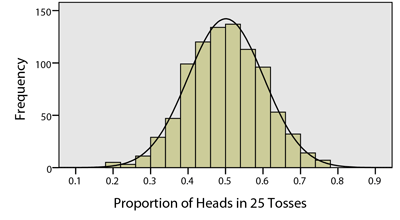
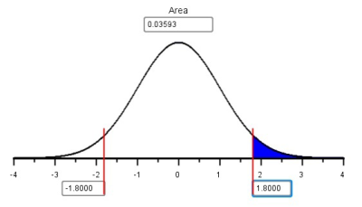

<script type="text/javascript">
 function showhide(id) {
    var e = document.getElementById(id);
    e.style.display = (e.style.display == 'block') ? 'none' : 'block';
 }
</script>

<div style="float:right;width=40%;">
<br/>
<div style="padding-left:10%;">**Optional Lesson Video**</div>
<iframe width="90%" align="right" src="https://www.youtube.com/embed/videoseries?list=PLaZryQtbPQC_379i2-P7s9yhiqN2Vt6zD" frameborder="1" allow="autoplay; encrypted-media" allowfullscreen></iframe>
</div>

## Lesson Outcomes

<a href="javascript:showhide('oc')"><span style="font-size:8pt;">Show/Hide Outcomes</span></a>
<div id="oc" style="display:none;">
By the end of this lesson, you should be able to:

- Calculate and interpret a sample proportion.
- Summarize categorical data with a bar or pie chart.
- Determine the mean, standard deviation and shape of a distribution of sample proportions.
- Calculate probabilities using a distribution of sample proportions.
</div>
<br>

## Numerical and Graphical Summaries of Categorical Data
<span id='21:Proportions'></span>

### Proportions

#### Political Polls

During political elections in the United States, residents are inundated with polls.  Many people conduct polls to estimate the proportion of the population that will vote for each candidate.  The pollsters report the number of people who were contacted and the proportion who said they would favor a particular candidate.  The poll results are a prediction of the future election results.

In these polls, individuals are asked the question, "If the election were held today, which candidate would you most likely support?"  In one survey, $n=1024$ people were polled, and $x=565$ of the respondents said that they would vote for the Republican candidate. In this case, the "proportion" of people who favored the Republican candidate was:
$$
\widehat p = \frac{x}{n} = \frac{565}{1024} = 0.552
$$
That suggests that 55.2% of the people polled plan to vote for the Republican.  This does not mean that this candidate will win the election.  However, it looks like they might be in the lead at this point.

#### Grades of BYU-Idaho Students

Grades of students in a general education course at BYU-Idaho were recorded. These values are given in the data file [grades_gender.xlsx](./Data/grades_gender.xlsx). R can be used to tally (count) these responses. The counts of the number of respondents who claimed each religion is given in the file
[grades_tally.xlsx](./Data/grades_tally.xlsx). Notice that each row in the "tally" data file represents responses from several individuals.  The *count* column tells how many times each response was given. We will used this summarized data for our analysis.

Read the data in the file [grades_tally.xlsx](./Data/grades_tally.xlsx) into R. These data are summarized in the table below.

```{r, include = FALSE}
library(readxl)
library(kableExtra)
library(tidyverse)
grades_tally <- read_excel("./data/grades_tally.xlsx")
```

```{r, echo = FALSE}
n_grades <- grades_tally %>% 
  summarize(n = sum(count)) %>% 
  pull()

grades_tally %>% 
  select(-comments) %>% 
  bind_rows(data.frame(grade = "Total", count = n_grades)) %>%
  kable(align=c("c", "c")) %>% 
  kable_styling(full_width = F)
```

For example, of the 272 students, 79 earned an A in the course.

We can compute the sample proportion for each group by taking the number of responses in each group and dividing this value by the total number of responses, 272. The proportion of who earned an A is
$$ \frac{79}{272} = 0.145$$
We can compute the sample proportions for all religions:

```{r, echo = FALSE}
grades_tally %>% 
  select(-comments) %>% 
  mutate(total = sum(count)) %>% 
  mutate(
    temp = round(count / total * 1000)/1000,
    prop = if_else(
      round(temp,2) == round(temp,3), 
      paste0(temp,"0"), 
      as.character(temp))
    ) %>% 
  select(-temp) %>% 
  mutate(proportion = paste(count,"/",total,"=",prop)) %>% 
  select(-total, -prop) %>% 
  kable(align=c("c", "c", "c")) %>% 
  kable_styling(full_width = F)
```


#### Comparison of Quantitative and Categorical Data

It will be increasingly important for you to distinguish between quantitative and categorical variables. One of the first things you will want to do when you encounter a question in statistics is to determine whether the data are quantitative or categorical. Up to this point in the course, we have discussed methods that are appropriate when we have quantitative data. In this unit, we will learn how to describe categorical data and make inferences from them. Here are some tips to help you distinguish between quantitative and categorical data.

We can do arithmetic on quantitative data. For example, it makes sense to talk about one person being one centimeter taller than another person. It also makes sense to say that a child doubled in height over four years.

Categorical data represent labels or categories, rather than quantitative responses. It does not make sense to do arithmetic on categorical data. For example, colors and phone numbers are categorical. We would not say that "red" is double "blue". A phone number is a categorical variable. It is a label for the phone that rings when that number is dialed. It does not make sense to talk about doubling phone numbers or adding to phone numbers together.

Note that the students' final letter grades are categorical. For example, it does not make sense to add two "F" grades together or to multiply a grade of "B" by 2. Each of the individuals' responses is a categorization of their performance in the class. Even though we summarize the data by counting the number of each type of grade, the individual grades are categorical, not quantitative.

As a caution, every problem in this course will deal with numbers in some way. It is not sufficient to use the presence of numbers to determine if a situation involves quantitative or categorical data. To determine whether data are quantitative or categorical, think about one subject (participant) in the study. What was measured on that one person? Is it quantitative, like their height, income, or age? Or, is it something categorical like a final letter grade, their favorite color, or whether they are an adult (yes or no)?


### Pie charts

Pie charts are a popular way to display categorical data.  These are used extensively in practice, but they can be deceptive. For this reason, we will not use pie charts in this course. Typically, people use pie charts when they want to represent the observations as part of a whole, where each slice (sector) of the pie chart represents a proportion or percentage of the whole. Larger slices represent larger proportions of the whole.

```{r, echo = FALSE}
pie_tally <- grades_tally %>% 
  group_by(grade) %>% 
  summarize(count = sum(count)) %>% 
  ungroup %>% 
  mutate(
    temp = round(count/sum(count)*100,1),
    percent = if_else(temp == round(temp), paste0(temp,".0"), as.character(temp))
    ) %>% 
  select(-temp) %>% 
  arrange(grade)

pie(
  pie_tally$count, 
  label = paste0(pie_tally$grade, " (",pie_tally$percent,"%)"),
  clockwise = TRUE,
  main = "Final Letter Grade",
  col = c("darkolivegreen4", "steelblue3", "darkorchid", "tan3" , "brown3")
  )
```


The grades earned by the students are summarized in this pie chart. The most common grade was a "B," which corresponds to the largest slice. 

In this course, you will never create a pie chart. However, it is good to be aware of them, as you are likely to see several in your lifetime.


### R Instructions for Bar Charts

It is important for you to know how to create a bar chart. These are heavily used in industry to illustrate the frequency of categorical values.

<div class = "SoftwareHeading">R Instructions</div>
<div class = "Software">

**To make a bar chart in R:**

We will use the students' grades to create a bar chart.

Read in the data: [grades_tally.xlsx](./Data/grades_tally.xlsx) into R. 
(Review of [reading in data](RHelp.html#reading-in-the-data).)

Then, use the `barplot(...)` function to create a bar chart of the values.

<div style = "padding-left:40px;">

```{r, comment = NA}
#Create a plot of the counts:
barplot(count ~ grade, data = grades_tally)
```

- The argument `count ~ grade` tells R to define the groups by the `grade` values and to set the heights of the bars using the value in the variable `count`. These refer to variable names in the data frame specified in `data = grades_tally`.
- Specify colors for the bar chart using one color like `col = "steelblue3"` to give all bars the same color, or use the option `col = c("darkolivegreen4", "steelblue3", "darkorchid", "tan3" , "brown3"),` to give each bar a different color. Of course, use any color names you like: [R Color Options](http://www.stat.columbia.edu/~tzheng/files/Rcolor.pdf)
- Specify axes labeling with `main = "A main title"`, `xlab = "An x-axis label"`, and `ylab = "A y-axis label"`.


```{r, comment = NA}
#Make a fancier graph using the options:
barplot(
  count ~ grade, data = grades_tally, 
  col = "steelblue3", 
  main = "Final Letter Grades",
  xlab = "Grade", 
  ylab = "Number of Students"
  )
```


</div>
<br>
</div>
<br/>

Bar charts can be considered a companion plot to the pie chart. They present the same basic information but the two plots are not interchangeable. We typically use bar charts if our data represent counts. In contrast, pie charts are used to represent parts of a whole or percentages.

### Pareto Charts

A Pareto chart (named for Wilfredo Pareto) is a bar chart where the bars are given either in descending or ascending order. 

```{r, include = FALSE}
library(readxl)
library(kableExtra)
library(tidyverse)
religion_tally <- read_excel("./data/religion_tally.xlsx") %>% 
  arrange(desc(count))
```

A study was conducted by the Pew Research Center on the religious affiliation of residents of the United States. A total of 
`r religion_tally %>% summarize(n = sum(count)) %>% pull()` 
people were surveyed. Among other things, each person was asked to report their religious affiliation. These values are given in the data file [religion_tally.xlsx](./Data/religion_tally.xlsx). 

```{r, echo = FALSE}
par(mar=c(8,4,1,4))
barplot(
  height = religion_tally$count, 
  names.arg = religion_tally$religion_code, 
  col = "steelblue3", 
  las=2, 
  cex.names = 0.75, 
  main = "Religious Affiliation", 
  xlab = ""
  )
par(mar = c(5.1, 4.1, 4.1, 2.1))
```


We conclude that Protestants comprise the largest religious category among the United States residents surveyed.

Pareto charts are often used to display causes of problems in an industry.  For example, in health care administration, it may be causes of patient deaths.  In business, it may be used to display common reasons employees are terminated. This can give you an idea of where you should focus your energy in your business or organization.

There is an idea, called the Pareto Principle, which states that 80% of your problems come from 20% of the causes.  Many Pareto charts display a few very tall columns with several much shorter ones. This is exactly what we observed in our Pareto chart.


## Sampling Distribution of the Sample Proportion

### Example: Tossing a Coin

Answer the following questions. For this exercise, you will need a coin.

<div class="QuestionsHeading">Answer the following questions:</div>
<div class="Questions">
1. Toss a coin $n=25$ times.  Keep track of the proportion of heads you observe. Please complete this before continuing.

<a href="javascript:showhide('Q1')"><span style="font-size:8pt;">Show/Hide Solution</span></a>
<div id="Q1" style="display:none;">
* In this example, we tossed heads 12/25 times, which is equivalent to a $\widehat{p} = 0.48$ proportion. Your proportion may vary.
</div>
<br>

2. The data file [CoinTossHeads.xlsx](./Data/CoinTossHeads.xlsx) contains data representing a collection of 900 students' results, where each tossed a coin $n=25$ times and calculated the proportion of heads.  The following histogram illustrates these data.  How would you describe the shape of the distribution of the observed proportions?

<a href="javascript:showhide('Q2')"><span style="font-size:8pt;">Show/Hide Solution</span></a>
<div id="Q2" style="display:none;">
* Judging just from the histogram it shows that the observed sample proportions are normally distributed.
</div>
&nbsp;
</div>
<br>



<div class="QuestionsHeading">Answer the following questions:</div>
<div class="Questions">

3. Find the spot on the horizontal axis of the histogram indicating the proportion of heads ($\widehat{p}$) that *you* observed in Question 1.  Based on your visual observation, would you say your proportion of heads is unusual?

<a href="javascript:showhide('Q3')"><span style="font-size:8pt;">Show/Hide Solution</span></a>
<div id="Q3" style="display:none;">
* Answers will vary.  This depends on your proportion of heads.  If the observed value is far to the right or left, then you would say that it was unusual.  Most students will observe values in the middle of the distribution.
</div>
<br>

4. Visually, estimate the mean and standard deviation of the observed sample proportions. Please write your answer to this question before continuing.

<a href="javascript:showhide('Q4')"><span style="font-size:8pt;">Show/Hide Solution</span></a>
<div id="Q4" style="display:none;">
* We estimate the mean of the sample proportions at 0.5 and the standard deviation of all of these sample proportions at 0.1. Almost all the sample proportions are found between .2 and .8, which represents the mean plus or minus three standard deviations of the mean.  Your answers may vary.
</div>
<br>

5. The proportion of heads that you will observe in $n=25$ tosses of a fair coin, $\widehat p$, is a random variable.  The true theoretical mean for this random variable is $p=0.5$.  Explain why this value would make sense.

<a href="javascript:showhide('Q5')"><span style="font-size:8pt;">Show/Hide Solution</span></a>
<div id="Q5" style="display:none;">
* Since getting a "heads" is just as likely as getting a "tails", you should end up with half your flips landing as "tails". The theoretical proportion of $p=0.5$ is logical.
</div>
<br>

6. The true theoretical standard deviation of $\widehat p$ in this case is $\sigma_{\widehat{p}} = 0.1$.  This can be obtained using the formula
<center>
$$
\displaystyle{\text{Standard deviation of}~\widehat{p} = \sigma_{\widehat{p}} = \sqrt{ \frac{p(1-p)}{n} } }
$$
</center>
where $p$ is the true population proportion, which is also the mean of the distribution of $\widehat{p}$.

<a href="javascript:showhide('Q6')"><span style="font-size:8pt;">Show/Hide Solution</span></a>
<div id="Q6" style="display:none;">
<center>
$$
\text{Standard deviation of}~\widehat{p} = \sqrt{ \frac{p(1-p)}{n} } = \sqrt{ \frac{0.5(1-0.5)}{25} } = 0.1
$$
</center>
</div>
<br>

7. Remember that the $z$-score for an observed data value can be computed as:


<center>
$$
\displaystyle { z = \frac{\textrm{value} - \textrm{mean}}{\textrm{standard deviation}} }
$$
</center>
* Use the mean and standard deviation given in question 6, to find the $z$-score corresponding to *your* sample proportion.

<a href="javascript:showhide('Q7')"><span style="font-size:8pt;">Show/Hide Solution</span></a>

<div id="Q7" style="display:none;">
<center>
$$
\displaystyle { z = \frac{\text{_____} - 0.5}{0.1} = \text{_____} }
$$
</center>
</div>
<br>

8. Based on the $z$-score you computed in question 7, is your observed proportion considered unusual?

<a href="javascript:showhide('Q8')"><span style="font-size:8pt;">Show/Hide Solution</span></a>
<div id="Q8" style="display:none;">
* Answers will vary.  $z$-scores between -2 and 2 are not unusual.  If your $z$-score is less than -2 or greater than 2, then it is considered unusual.
</div>
&nbsp;
</div>

<br>
<br>
<div class="message Tip">You may want to refresh your memory on our definition of "unusual events" in the [Normal Distributions](Lesson05.html){target="_blank"} lesson</div>
<br>
<br>

### Sampling Distribution of the Sample Proportion

If the sample size is large, the sample proportion, $\widehat p$, will be approximately normally distributed.  This is a direct consequence of the Central Limit Theorem.

#### How Large is Large Enough?

We can apply the Central Limit Theorem to a sample proportion (and conclude that $\widehat p$ follows a normal distribution) if both of the following conditions are satisfied:

- $np \ge 10$
- $n(1-p) \ge 10$

It is important to check both conditions.  If one of them is not satisfied, we cannot conclude that $\widehat p$ follows a normal distribution. Observe that the effect of these two conditions is that if $p$ is very close to 0 or 1, then $\widehat{p}$ isn't close to normal unless $n$ is very large.

#### Mean and Standard Deviation

The sample proportion, $\widehat p$, is normally distributed if $n$ is large.  The true population mean of the random variable $\widehat p$ is:
$$
\underbrace{\mu_\widehat{p}}_{\textrm{Mean of}~\widehat{p}} = p
$$
and the true population standard deviation is:
$$
\underbrace{\sigma_\widehat{p}}_{\textrm{Standard Deviation of}~\widehat p} = \sqrt{\frac{p \cdot (1-p)}{n}}
$$

Answer the following questions.  Consider exercise 1, in which you tossed a coin $n=25$ times and recorded the proportion of heads.

<div class="QuestionsHeading">Answer the following questions:</div>
<div class="Questions">
9. What is the true proportion of heads that would be expected to occur if a coin was tossed many, many times?  (This is the mean, $p$.)

<a href="javascript:showhide('Q9')"><span style="font-size:8pt;">Show/Hide Solution</span></a>
<div id="Q9" style="display:none;">
* If we tossed a coin many, many times, we would expect to see 0.5 as the proportion of heads. We can convince ourselvses of this by thinking about the mean of the sample proportion $\mu_\widehat{p}$, which is given by $\mu_{\widehat p} = p$, and $p$ was shown earlier to be 0.5.
</div>
<br>

10. Use the equation for the standard deviation (given above) to verify that the true population standard deviation for the proportion of heads that will occur when a coin is tossed $n=25$ times is 0.1.

<a href="javascript:showhide('Q10')"><span style="font-size:8pt;">Show/Hide Solution</span></a>
<div id="Q10" style="display:none;">
* The standard deviation of the sample proportion ($\sigma_\widehat{p}$) is given by $\displaystyle { \sigma_{ \widehat p } = \sqrt{\frac{0.5 \cdot (0.5)}{25}} = \sqrt{\frac{.25}{25}} = \sqrt{.01} =.1}$
</div>
&nbsp;
</div
<br>
<br>

### Probability Calculations for a Sample Proportion

<br>
<div class="message Note">**Remember:**  We can use the Normal Probability Applet to find probabilities associated with any normally distributed random variable with known mean and standard deviation.</div>
<br>
<br>

If the sample size is sufficiently large, we can use the Normal Probability Applet to make probability calculations for proportions, just as we did for means.  First, we need to find the $z$-score.  This can be done with the equation:

$$
z = \frac{\textrm{value} - \textrm{mean}}{\textrm{standard deviation}}
= \frac{\widehat p - p}{\sqrt{\frac{p \cdot (1-p)}{n}}}
$$

Then, we can enter this $z$-score in the Normal Probability Applet to find the area more extreme than the $z$-score.

#### Worked Example

If a coin is tossed $n=25$ times, and heads is observed 17 times, the sample proportion of heads is
$\displaystyle{\widehat p = \frac{x}{n} = \frac{17}{25} = 0.68}$
The proportion of heads tossed by the first student in the file [CoinTossHeads.xlsx](./Data/CoinTossHeads.xlsx) is $\widehat p = 0.68$.
We will find the probability that a sample proportion will exceed 0.68.

First, we compute the $z$-score corresponding to $\widehat p = 0.68$.  We can use the mean and standard deviation, which were given in questions 9 and 10, or simply substitute the values of $p=0.5$ and $n=25$ in the equation for the $z$-score.

$$
z = \frac{\textrm{value} - \textrm{mean}}{\textrm{standard deviation}}
= \frac{\widehat p - p}{\sqrt{\frac{p \cdot (1-p)}{n}}}
= \frac{0.68 - 0.5}{\sqrt{\frac{0.5 (1-0.5)}{25}}}
= \frac{0.18}{0.1}
= 1.800
$$

Next, we enter the $z$-score (1.800) in the Normal Probability Applet and shade the area to the right of this value.



The area to the right of $z=1.800$ is $0.0359$.

<div class="QuestionsHeading">Answer the following questions:</div>
<div class="Questions">
11. The second student with data listed in the file [CoinTossHeads.xlsx](./Data/CoinTossHeads.xlsx) had $\widehat p = 0.44$, or 44% of their coin tosses resulted in heads.  Find the $z$-score corresponding to this value.

<a href="javascript:showhide('Q11')"><span style="font-size:8pt;">Show/Hide Solution</span></a>
<div id="Q11" style="display:none;">
* $z$-score = $-0.60$
</div>
<br>

12. Use the $z$-score you computed in question 11 to find the probability that the proportion of successes, $\widehat p$, will be greater than 0.44 if a coin is tossed $n=25$ times.  In other words, find $P(\widehat p > 0.44)$.

<a href="javascript:showhide('Q12')"><span style="font-size:8pt;">Show/Hide Solution</span></a>
<div id="Q12" style="display:none;">
* $P(\widehat p > 0.44)= 0.7257$
</div>
<br>

13. For $n=25$ coin tosses, find the probability that $P(0.44 < \widehat p < 0.68)$.

<a href="javascript:showhide('Q13')"><span style="font-size:8pt;">Show/Hide Solution</span></a>
<div id="Q13" style="display:none;">
* $0.7257 - 0.0359 = 0.6898$
</div>
&nbsp;
</div>
<br>


#### Example: Political Elections

Consider the following question:

"If the true proportion of people who support a particular political candidate is $p=0.48$, and if $n=1041$ people are surveyed, what is the probability that the results of the survey will suggest that the candidate will win the election?"

To address this question, we first note that the survey will suggest that the candidate will win if more than 50% of the people surveyed favor the candidate. So, we need to find the following probability: $P(\widehat p > 0.5)$.  First we find the $z$ score:

$$
z = \frac{\widehat p - p}{\sqrt{\frac{p(1-p)}{n}}} = \frac{0.5-0.48}{\sqrt{\frac{0.48(1-0.48)}{1041}}} = 1.292
$$

Now, we look up this value using the Normal Probability Applet and find the area to the right. Using the Normal Probability Applet, we find that $P(\widehat p > 0.5)=0.0982$.  So, even though this candidate is actually behind in the popular vote, there is a chance of 0.0982 that they will appear to be winning!

This calculation was done in the same way we have done normal calculations in the past.  The only difference is that instead of using $\bar x$ and its mean and standard deviation, we used $\widehat p$ and its mean and standard deviation.  Otherwise, they are the same.

<br>

## Summary

<div class="SummaryHeading">Remember...</div>
<div class="Summary">

- **Pie charts** are used when you want to represent the observations as part of a whole, where each slice (sector) of the pie chart represents a proportion or percentage of the whole.

- **Bar charts** present the same information as pie charts and are used when our data represent counts. A **Pareto chart** is a bar chart where the height of the bars is presented in descending order.

- $\widehat p$ is a point estimator for true proportion $p$. We compute $\widehat p$ as: 
$$\displaystyle{\widehat p = \frac{x}{n} = \frac{\text{Number of successes}}{\text{Number of trials}} }$$

- The sampling distribution of $\widehat p$ has a mean of $\mu_{\widehat{p}} = p$ and a standard deviation of $\sigma_{\widehat{p}} = \displaystyle{\sqrt{\frac{p\cdot(1-p)}{n}}}$

- If $np \ge 10$ and $n(1-p) \ge 10$, you can conduct **probability calculations** using the Normal Probability Applet.
$$
\displaystyle {z = \frac{\textrm{value} - \textrm{mean}}{\textrm{standard deviation}}
= \frac{\widehat p - p}{\sqrt{\frac{p \cdot (1-p)}{n}}}}
$$
<br>
</div>
<br>

## Navigation

<center>
| **Previous Reading** | **This Reading** | **Next Reading** |
| :------------------: | :--------------: | :--------------: |
| [Lesson 15: <br> Review for Exam 2](Lesson15.html) | Lesson 16: <br> Describing Categorical Data: Proportions; <br> Sampling Distribution of a Sample Proportion | [Lesson 17: <br> Inference for One Proportion](Lesson17.html) |
</center>
