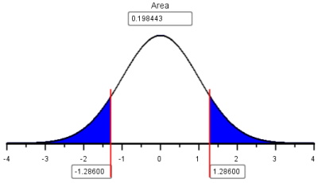

<script type = "text/javascript">
 function showhide(id) {
    var e = document.getElementById(id);
    e.style.display = (e.style.display == 'block') ? 'none' : 'block';
 }
</script>

<!--
<div style = "float:right;width = 40%;">
<br/>
<div style = "padding-left:10%;">**Optional Lesson Video**</div>
<iframe width = "90%" align = "right" src = "https://www.youtube.com/embed/videoseries?list = PLaZryQtbPQC99-0c9nxhmZPIyT7Fy594V" frameborder = "1" allow = "autoplay; encrypted-media" allowfullscreen></iframe>
</div>
-->

## Lesson Outcomes

<a href = "javascript:showhide('oc')"><span style = "font-size:8pt;">Show/Hide Outcomes</span></a>
<div id = "oc" style = "display:none;">
By the end of this lesson you should be able to do the following.

* Apply a confidence interval for one proportion using the following steps:
  + Determine the level of confidence
  + Create numerical and graphical summaries of the data
  + Create a confidence interval using software
  + Check the requirements of the confidence interval
  + Interpret a confidence interval for one proportion
* Perform a hypothesis test for one proportion using the following steps:
  + State the null and alternative hypotheses
  + State the level of significance (α)
  + Create numerical and graphical summaries of the data
  + Calculate the test-statistic, degrees of freedom and P-value of the test using software
  + Assess statistical significance by comparing the P-value to the level of significance (α)
  + State the appropriate conclusion for the hypothesis test
  + Check the requirements for the hypothesis test
* Calculate the sample size required to achieve a specified margin of error and level of confidence

</div>
<br>

<div style = "clear:both;"></div>

<br/>


## Hypotheses Test for One Proportion

### Case Study: Can You Taste PTC?


<div style = "float:right;padding:10px;">

</div>


The ability to taste the chemical Phenylthiocarbamide (PTC) is hereditary.  Some people can taste it, while others cannot.  The ability to taste PTC is typically assessed using paper test strips. When a PTC test strip is placed on the tongue, it will either taste like regular paper or else have a bitter taste. It is believed that 70% of all people are able to taste PTC.


Data were collected by a student, Elise Johnson, to investigate this claim. Volunteers were provided with PTC test strips and asked if they could taste anything besides paper. A total of $n = 118$ individuals participated in the study.


Out of the 118 people who participated in the research, 89 indicated that they can taste PTC.  The proportion of people in the sample who could taste PTC is
$$
\widehat p = \frac{89}{118} = 0.754
$$

In other words, 75.4% of the people surveyed could taste the chemical.

<a href = "javascript:showhide('ptcbarplot')"><span style = "color:white;background-color:darkgray;border-radius:5px;padding:2px;">Show Code</span></a>
<div id = "ptcbarplot" style = "display:none;">

```{r, eval = FALSE}
mytable <- c(`Tasted PTC` = 89, `No Taste` = 29)

barplot(mytable, 
        col = c("steelblue3", "brown3"),
        main = "PTC Strip Taste Testing",
        xlab = "Reported Result",
        ylab = "Number of Participants",
        ylim = c(0,100))
```

</div>


```{r, echo = FALSE}
mytable <- c(`Tasted PTC` = 89, `No Taste` = 29)

barplot(mytable, 
        col = c("steelblue3", "brown3"),
        main = "PTC Strip Taste Testing",
        xlab = "Reported Result",
        ylab = "Number of Participants",
        ylim = c(0,100))
```

<br>
<div class = "message Tip">**Review:**  For a review of how to bar charts in R, see [Lesson 16](Lesson16.html). When making graphs, consider altering the labels in the graph to be more descriptive of your particular study.</div>
<br>
<br>


This particular research study suggested that the proportion of people who can taste PTC is $\frac{89}{118} = 0.754$, or 75.4%.
Is this significantly different from the assumed value of 0.70 (i.e., 70%)?  We can test this question using a hypothesis test.

### R Instructions for a Hypothesis Test for One Proportion

<div class = "SoftwareHeading">R Instructions</div>
<div class = "Software">
Here are the instructions for conducting a hypothesis test for one proportion in R:

**Step 1.** Use RStudio to run the code in the file [functions.R](./scripts/functions.R). This will load a function that will allow you to compute the confidence interval for one proportion. You can do this by running the command <br>
`source("https://byuistats.github.io/M221R/scripts/functions.R")` <br>
in the RStudio console.

**Step 2.** Ensure you know both the null hypothesis and alternative hypothesis of your test. In this case, the null hypothesis is $H_0: p = 0.70$ and the alternative was $H_a: p \neq 0.70$.

**Step 3.** Use the function `one.prop.test(...)` to conduct the hypothesis test for one proportion in R.

A few notes about using this function:

* The number of successes is entered using the parameter `x`
* The total number of trials is specified using the parameter `n`
* The null hypothesis is established by the parameter `p`. The default value is `p = 0.5`. 
* The alternative hypothesis is established by `alternative = "two.sided"`. Other options for the alternative hypothesis are `alternative = "less"` and `alternative = "greater"`.
<!--
* Note, by default the `one.prop.test(...)` function uses a 95% Confidence Level in creating the confidence interval that is provided in the summary output of the test. However, if you wanted to use a different confidence level, you would use `one.prop.test(..., conf.level = 0.99)` or `one.prop.test(..., conf.level = 0.90)`.
-->

When, the above `one.prop.test(...)` code is run in RStudio, it produces the following results. The output is formatted similar to R output you have seen in the past.

```{r, eval = FALSE}
source("https://byuistats.github.io/M221R/scripts/functions.R")
one.prop.test(x = 89, n = 118, p = 0.70, alternative = "two.sided")
```

```{r, echo = FALSE}
source("https://byuistats.github.io/M221R/scripts/functions.R")
one.prop.test(x = 89, n = 118, p = 0.70, alternative = "two.sided", display = "test")
```

This function also generates a bar chart and a pie chart of the data.

```{r, echo = FALSE}
# source("https://byuistats.github.io/M221R/scripts/functions.R")
one.prop.test(x = 89, n = 118, p = 0.70, alternative = "two.sided", display = "plot")
```

Notice that these plot illustrate that there were `x = 89` successes in the `n = 118` trials, or $\hat p = \frac{89}{118} = 0.754$, which is equivalent to $75.4$%.
<br>
</div>
<br>

For a hypothesis test for one proportion, we need to make sure the following conditions are satisfied:

- $np \ge 10$
- $n(1-p) \ge 10$

When these are met, the sample size is large enough that the Central Limit Theorem suggests the sample proportion, $\widehat p$, is approximately normal.
<!-- Also, the true mean of $\widehat p$ is $p$, and the standard deviation is $\sqrt{\frac{p \cdot (1-p)}{n}}$. -->

As you can see from the output above, the requirements for conducting a hypothesis test for one proportion are satisfied for the PTC data:
$$
\begin{array}{rcl}
np = 118 \cdot 0.70 = 82.6 \ge 10 				&&\surd \\
n(1-p) = 118 \cdot (1-0.70) = 35.4 \ge 10 && \surd
\end{array}
$$

We can use a procedure that mimics the test for a single mean with $\sigma$ known from [Lesson 9](Lesson09.html) to conduct a test for a single proportion.

It is assumed that the true proportion of people who can taste PTC is 0.70.  This is the null hypothesis.  The alternative hypothesis is that the true proportion is different from 0.70.
$$
H_0:  p = 0.70 \\
H_a:  p \ne 0.70
$$

We will use the $\alpha = 0.05$ level of significance in this test.

<br>

**Optional Reading: Computation of $z$ for One Proportion (Hidden)**
  
<a href = "javascript:showhide('propZ')"><span style = "font-size:8pt;">Click here if you love math</span></a>
<div id = "propZ" style = "display:none;">

If the requirements are satisfied, then $\widehat p$ is approximately normal with mean $p$ and standard deviation $\sqrt{\frac{p \cdot (1-p)}{n}}$.  The test can be based on the standard normal ($z$) distribution. 

<div class = "myemphasis">

The test statistic for the test of one proportion is:

$$
z = \frac{\hat{p} - p}{\sqrt{\frac{p(1-p)}{n}}}
$$

The p-value is obtained by putting the z-score into the [Normal Probability Applet](https://byuimath.com/apps/normprob.html) and shading according to the symbol specified in the alternative hypothesis.

</div>

For the current PTC study, the test statistic is computed as follows.

$$
z = \frac{\textrm{value}-\textrm{mean}}{\textrm{standard deviation}} = \frac{\widehat p - p}{\sqrt{\frac{p(1-p)}{n}}} = \frac{\frac{89}{118} - 0.70}{\sqrt{\frac{0.70(1-0.70)}{118}}} = 1.286
$$

Remember, we assume that the null hypothesis is true, so we use the value given in the null hypothesis for $p$, which was $p = 0.7$ for this study.
Using the [Normal Probability Applet](https://byuimath.com/apps/normprob.html), you can find the $P$-value of the test.  This is a two-tailed test, since the alternative hypothesis used "not equals to", specifying that values either above 0.70 or below 0.70 ($H_0: p \neq 0.7$) were possible if the null hypothesis is rejected.  In the applet, make sure both tails are shaded, then enter the $z$-score of 1.286.



The combined area in the two tails is approximately $0.198$. This is the $P$-value.
</div>
<br>


The output above indicates that $z = 1.2857$, and the $P$-value is 0.1986. 
Since the $P$-value is greater than $\alpha = 0.05$, we fail to reject the null hypothesis.


We conclude that there is insufficient evidence to suggest that the true proportion of the population that can taste PTC is different from 0.70.
There is no reason to revise existing perspectives on the prevalence of the ability to taste PTC.

<div class = "QuestionsHeading">Answer the following question:</div>
<div class = "Questions">
14. Compare and contrast the test for one mean with $\sigma$ known and the test for one proportion. What similarities and differences do you observe?

<a href = "javascript:showhide('Q14')"><span style = "font-size:8pt;">Show/Hide Solution</span></a>
<div id = "Q14" style = "display:none;">
* Similarities: There is one population. Both test are based on the $z$ statistic. Both tests require the use of the normal probability applet.

* Differences: The test for means involves quantitative data, the test for a proportion involves categorical data. The formulas for the $z$-score differ.
</div>
&nbsp;
</div>
<br>

### Case Study: Water Quality


<div style = "float:right;padding:10px;">

</div>


Macroinvertibrates are small insects (without an internal skeleton) that live on the bottom of a stream. These insects are ideal for monitoring changes in water quality, because they (1) live nearly all their life in the water, (2) are easy to collect and identify, (3) often live for several years, (4) have a limited ability to migrate, and (5) they are influenced by environmental conditions.

In any population of macroinvertibrates, there will be indicators of good health and indicators of poor health. Data are collected by capturing macroinvertibrates and recording whether they indicate good health or poor health for the river.  In particular sections of a small river near Bozeman, Montana, about 60% of the indicators observed have historically been associated with good health.


Researchers suspect that the water quality in the area has decreased, suggesting that less than 60% of the indicators will show good health.  A random sample of macroinvertibrates were captured from the river.


Among the `n = 40` macroinvertibrates observed, `x = 19` demonstrated indicators of good health.
We enter this information into the `one.prop.test(...)` function:

```{r}
source("https://byuistats.github.io/M221R/scripts/functions.R")
one.prop.test(x = 19, n = 40, p = 0.60, alternative = "less")
```

Use this information to answer the following question.

<div class = "QuestionsHeading">Answer the following question:</div>
<div class = "Questions">
15. What is the proportion of the observed indicators that suggested good health?  Express your answer as a decimal and a percentage.

<a href = "javascript:showhide('Q15')"><span style = "font-size:8pt;">Show/Hide Solution</span></a>
<div id = "Q15" style = "display:none;">
$$
\widehat p = \frac{x}{n} = \frac{19}{40} = 0.475~~\text{or}~~47.5\%
$$

This value is given in the output of the function `one.prop.test` above.

<!--
```{r}
mytable <- c(`Good Health` = 19, `Poor Health` = 21)
barplot(mytable, 
        col = c("steelblue3","darkolivegreen4"),
        main = "Health of Macroinvertibrates near Bozeman, MT",
        ylab = "Number of Macroinvertibrates")
```
-->
</div>
&nbsp;
</div>
<br>


The following questions will guide you through the process of conducting a hypothesis test to determine if the water quality has decreased.  Use $\alpha = 0.05$ for this test.

<div class = "QuestionsHeading">Answer the following questions:</div>
<div class = "Questions">
16.  Are the requirements for conducting a hypothesis test for one proportion satisfied?

<a href = "javascript:showhide('Q16')"><span style = "font-size:8pt;">Show/Hide Solution</span></a>
<div id = "Q16" style = "display:none;">
<center>
$$
\begin{array}{rcl}
np = 40 \cdot 0.6 = 24 \ge 10 && \surd  \\
n(1-p) = 40 \cdot (1-0.6) = 16  \ge 10  && \surd
\end{array}
$$
</center>

* Yes, the requirements are satisfied.

</div>
<br>

17. State the null and alternative hypotheses.

<a href = "javascript:showhide('Q17')"><span style = "font-size:8pt;">Show/Hide Solution</span></a>
<div id = "Q17" style = "display:none;">
<center>
$H_0: p = 0.6$

$H_a: p < 0.6$
</center>
</div>
<br>

18. Find the $z$-score.<br />

<a href = "javascript:showhide('Q18')"><span style = "font-size:8pt;">Show/Hide Solution</span></a>
<div id = "Q18" style = "display:none;">
You could compute this by hand, as you did in [Lesson 16](Lesson16.html):
<center>
$$
z = \frac{\hat p-p}{\sqrt{\frac{p(1-p)}{n}}} = \frac{\frac{19}{40}-0.6}{\sqrt{\frac{0.6(1-0.6)}{40}}} = -1.6137
$$
</center>
However, this is not necessary, since the $z$-score is given in the output:
<center>
$$
z = -1.6137
$$
</center>
</div>
<br>

19. What is the $P$-value?

<a href = "javascript:showhide('Q19')"><span style = "font-size:8pt;">Show/Hide Solution</span></a>
<div id = "Q19" style = "display:none;">
<center>
$$
P\text{-value} = 0.0533
$$
</center>
</div>
<br>

20. What is the conclusion of this test? How would you state the conclusion in an English sentence?

<a href = "javascript:showhide('Q20')"><span style = "font-size:8pt;">Show/Hide Solution</span></a>
<div id = "Q20" style = "display:none;">
* $P\textrm{-value} = 0.053 > 0.05 = \alpha$.
* We fail to reject the null hypothesis.
* There is insufficient evidence to suggest that the true proportion of indicators that suggest good health is less than 0.6.
</div>
&nbsp;
</div>
<br>


Even though the proportion of indicators that suggested good health was less that 60%, it was not statistically significantly less than 60%.  We cannot conclude that the water quality in this river has decreased.

<br>


## Confidence Interval for One Proportion

### Case Study: Honesty at Medical School


<div style = "float:right;padding:15px;">

</div>

Frederick Sierles and his colleagues were interested in studying the honesty of students in medical school.


They distributed an anonymous survey to students at two American medical schools.  The questionnaire was given during class without any prior announcement to students.  The authors of the study personally supervised the distribution and collection of the surveys.  95% of the students completed the survey, and students from all four years of medical school training were represented.  A total of 428 individuals participated in the survey.  


The survey results showed that 58.2% (249 people out of the 428 total that completed the survey) indicated that they had cheated in some way during medical school. The results were published in a journal article in 1980.

<a href = "javascript:showhide('medbarplot')"><span style = "color:white;background-color:darkgray;border-radius:5px;padding:2px;">Show Code</span></a>
<div id = "medbarplot" style = "display:none;">

```{r, eval = FALSE}
barplot(c(249, 428-249), 
        names = c("Cheated at Some Point", "Always Honest"),
        col = c("tan3","steelblue3"), 
        ylab = "Number of Students",
        main = "Honesty of Medical Students")
```

</div>

```{r, echo = FALSE}
barplot(c(249, 428-249), 
        names = c("Cheated at Some Point", "Always Honest"),
        col = c("tan3","steelblue3"), 
        ylab = "Number of Students",
        main = "Honesty of Medical Students")
```


This study only studied two medical schools in the U.S. However, we would really like to use the data from this study to generalize to the larger population of *all medical students who are like these*.  While it is interesting to know that 58.2% of students at *these two medical schools that were sampled* had cheated at some point in their education, the reason the study was conducted is to provide an estimate of the true proportion of medical students that had cheated at some point, $p$. 

The sample statistic $\hat p$ is called a **point estimate** of the population parameter $p$.  The sample proportion, $\hat p$, is a single *point* on the number line that estimates the value of the true proportion, $p$.

A point estimate like $\hat p$ is helpful, but it does not give us direct information on *how close* it is to the true parameter, $p$.  We use a confidence interval to find a range of plausible values for the parameter.

<br>

### Confidence Interval for the True Proportion

To find a confidence interval for the population proportion, $p$, we follow the same pattern as was done in the estimates for $\mu$ in the lesson titled [Inference for One Mean: Sigma Known (Confidence Interval)](Lesson10.html).  We start with the point estimate of $p$ and we add and subtract the margin of error (a certain number of standard deviations) from this value.

The point estimate for $p$ is $\widehat p$.  You might want to review the mean and standard deviation of the random variable $\widehat p$ in the lesson on [Describing Categorical Data: Proportions; Sampling Distribution of a Sample Proportion](Lesson16.html). We use the equations for the mean and standard deviation of the sample proportion to create a confidence interval for the true population proportion, $p$.


<br>


**Optional Reading: Computation of a Confidence Interval for One Proportion (Hidden)**
  
<a href = "javascript:showhide('propZci')"><span style = "font-size:8pt;">Click here if you love math</span></a>
<div id = "propZci" style = "display:none;">


<div class = "myemphasis">

The formula for the confidence interval for one proportion is:
$$
\underbrace{\widehat p}_\text{point estimate} \pm \ \ \  \underbrace{z^* \sqrt{\frac{\widehat p (1-\widehat p)}{n}}}_\text{margin of error}
$$

$$\text{where }\displaystyle{ \widehat p = \frac{x}{n} }$$.

</div>


You can use the normal probability applet to compute $z^*$.  Please see the lesson on [Inference for One Mean: Sigma Known (Confidence Interval)](Lesson10.html) if you need to review this procedure.

Be sure that you do not round any values until the very last step. Perform this entire computation without rounding.

Remember that for a 95% confidence interval, $z^* = 1.96$.
So, the lower bound for the 95% confidence interval for the true proportion $p$ is:
$$
\displaystyle {
\widehat p - z^* \sqrt{\frac{\widehat p (1-\widehat p)}{n}}
 = \frac{249}{428} - 1.96 \sqrt{\frac{\frac{249}{428} \left(1-\frac{249}{428}\right)}{428}}
 = 0.535 }
$$
The upper bound for the 95% confidence interval for the true proportion $p$ is:
$$
\displaystyle {
\widehat p + z^* \sqrt{\frac{\widehat p (1-\widehat p)}{n}}
 = \frac{249}{428} + 1.96 \sqrt{\frac{\frac{249}{428} \left(1-\frac{249}{428}\right)}{428}}
 = 0.629 }
$$
     
The 95% confidence interval for $p$ is $(0.535, ~ 0.629)$.

<br>
</div>
<br>


### R Instructions for Computing a Confidence Interval for One Proportion

<div class = "SoftwareHeading">R Instructions</div>
<div class = "Software">
Here are the instructions for finding a confidence interval for one proportion in R:

**Step 1.** Use RStudio to run the code in the file [functions.R](./scripts/functions.R). This will load a function that will allow you to compute the confidence interval for one proportion. You can do this by running the command <br>
`source("https://byuistats.github.io/M221R/scripts/functions.R")` <br>
in the RStudio console.

**Step 2.** Use the function `one.prop.test(...)` to compute the confidence interval for one proportion in R.

A few notes about using this function:

* The number of successes is entered using the parameter **x**
* The total number of trials is specified using the parameter **n**
* By default the `one.prop.test(...)` function uses a 95% confidence level. If you wanted to use a different confidence level, you can specify your level of significance using the argument `conf.level = ` as follows:
`one.prop.test(..., conf.level = 0.99)` or `one.prop.test(..., conf.level = 0.90)`.

When, the `one.prop.test(...)` code is run in RStudio, it produces the following results. The output is formatted similar to R output you have seen in the past.

```{r}
source("https://byuistats.github.io/M221R/scripts/functions.R")
one.prop.test(x = 249, n = 428, conf.level = 0.95)
```

<br>
</div>
<br>


The 95% confidence interval for the true proportion of medical students who cheat is: $(0.535, 0.629)$.

To interpret this interval, we say that we are 95% confident that the true proportion of people who cheat in medical school is between 0.535 and 0.629.  This represents the range of plausible values for the true proportion of students who cheat at these medical schools.


#### Requirement

Like other procedures, there are requirements that must be checked in order for this confidence interval to be valid.
The confidence intervals are valid whenever $n \widehat p \ge 10$ and $n(1-\widehat p) \ge 10$. Notice that for the data on cheating in medical school, we have $428 \cdot 0.582 = 249$ and $428 \cdot (1-0.582) = 179$ which are both greater than 10, so this requirement is satisfied.


### Case Study: Another Study on Honesty at Medical School

DeWitt C. Baldwin, Jr. and others conducted a larger study to assess how widespread cheating is in medical schools.  Elected class officers at 40 schools were invited to distribute a survey to their second-year classmates.  Surveys were completed by students from 31 of the 40 schools.  Among all students attending the 31 schools, 62% participated in the survey, yielding a total of $n = 2426$ surveys.  Out of this group, $x = 114$ admitted to cheating in medical school.  These results were published in *Academic Medicine* in 1996.

<div class = "QuestionsHeading">Answer the following questions:</div>
<div class = "Questions">
1. Use R to compute a 99% confidence interval for the true proportion of medical students who cheat, based on this study.

<a href = "javascript:showhide('Q0')"><span style = "font-size:8pt;">Show/Hide Solution</span></a>
<div id = "Q0" style = "display:none;">

```{r}
source("https://byuistats.github.io/M221R/scripts/functions.R")
one.prop.test(x = 114, n = 2426, conf.level = 0.99)
```

The 99% confidence interval for the true proportion of medical school students who cheat is
<center>
$$
(0.036, ~ 0.058)
$$
</center>
</div>
<br>

2. What is the value of $\widehat p$ in this study?

<a href = "javascript:showhide('Q2')"><span style = "font-size:8pt;">Show/Hide Solution</span></a>
<div id = "Q2" style = "display:none;">
<center>
$$
\displaystyle{\widehat p = \frac{114}{2426} = 0.047}
$$
</center>
</div>
<br>

3. Are the requirements for creating a confidence interval satisfied?

<a href = "javascript:showhide('Q1')"><span style = "font-size:8pt;">Show/Hide Solution</span></a>
<div id = "Q1" style = "display:none;">
<center>
$$
\begin{array}{rcl}
n \hat p = 12426 \cdot 0.047 = 114 \ge 10 				&& \surd \\
n (1-\hat p) = 2426 \cdot (1-0.047) = 2312 \ge 10 && \surd
\end{array}
$$
</center>
* Yes, so it is appropriate to compute a confidence interval to estimate the true proportion of students who cheat in medical school.
</div>
<br>


4. Compare the confidence intervals obtained from the Sierles study to the confidence interval from Baldwin's study.  How do the results compare to each other?

<a href = "javascript:showhide('Q5')"><span style = "font-size:8pt;">Show/Hide Solution</span></a>
<div id = "Q5" style = "display:none;">
* The first study concluded that the true proportion of cheaters in medical school is in the range $(0.535, ~ 0.629)$, while the second study concluded a much lower range of possible proportions of cheaters $(0.036, ~ 0.058)$.  
</div>
<br>

5. What are some possible factors that might explain the discrepancy in these two studies?

<a href = "javascript:showhide('Q6')"><span style = "font-size:8pt;">Show/Hide Solution</span></a>
<div id = "Q6" style = "display:none;">
* Some possible factors might include:  There may have been differences in the way the questions were worded that affected the results. Elected class officers giving the surveys may have skewed results. Perhaps cheating is less prevalent in the 31 schools compared with the original 2.  Perhaps cheating is more prevalent in the later years of medical school, since the second study only examined second-year students.
</div>
<br>

6. How would you feel if you knew that your doctor cheated in medical school?

<a href = "javascript:showhide('Q7')"><span style = "font-size:8pt;">Show/Hide Solution</span></a>
<div id = "Q7" style = "display:none;">
* Any thoughtful answer is sufficient, but you would probably not be happy about it!
</div>
<br>

Why it is important to you to be honest in all your dealings with your fellow men--including your academic pursuits?

&nbsp;
</div>
<br>

## Sample Size Calculations

<br>
<div class = "message Note">**Think about it:** What happens to the margin of error in a confidence interval if the sample size is increased?</div>
<br>
<br>

If you can reduce the margin of error by increasing the sample size, then you can achieve a specific margin of error by choosing a large enough sample.  So, if you are planning a future study, you can estimate the sample size you need to obtain a desired margin of error, $m$.

The formula for the margin of error is:
$$
m = z^* \sqrt{\frac{\widehat{p} (1- \widehat{p})}{n}}
$$
If we solve this equation for $n$, we get:
$$
n = \left( \frac{z^*}{m} \right)^2 \widehat{p} (1-\widehat{p})
$$
Note that this equation requires us to know the value of $\widehat{p}$.  Unless we do a study, we do not know the value of $\widehat{p}$.
Sometimes we have a prior estimate of the true proportion of successes, denoted $p^*$.

**If we have a prior estimate for $\widehat{p}$,** (let's called it $p^*$,) we can plug this value into the equation above to compute the sample size required to obtain our desired margin of error:
$$
n = \left( \frac{z^*}{m} \right)^2 p^* (1-p^*)
$$
where $z^*$ is determined by your confidence level, $m$ is your desired margin of error, and $p^*$ is an estimate of the true proportion of successes.
**If no prior estimate for $p$ is available**, we can use the following formula to compute our sample size:
$$
n = \left( \frac{z^*}{2m} \right)^2
$$
The latter formula (where no prior estimate for $p$ is available) will result in excessively large sample sizes if $p$ is small (say, less than 0.3) or large (say, greater than 0.7.)  Otherwise, the results for the two equations will be fairly similar.

No matter what value you obtain for the sample size, if it is not a whole number **round it up** to the nearest whole number. It doesn't matter if the decimal part of the number of very small. Round it up anyway. 

For example, if you compute $n = 96.11$, then the sample size required is $97$.

<br>
<div class = "message Tip">**Tip:**  When performing sample size calculations, if the value you compute for $n$ is not a whole number, round your $n$ up to the next highest whole number. 
</div>
<br>
<br>


### Example: Prior Estimate of $p$ is Available

If you want to find the sample size required to get a margin of error of $m = 0.03$ with 95% confidence, and previous studies have shown that the true proportion is approximately equal to $p^* = 0.82$, then the sample size required would be:
$$
\displaystyle {
n = \left( \frac{z^*}{m} \right)^2 p^* (1-p^*) = \left( \frac{1.96}{0.03} \right)^2 (0.82) (1-0.82) = 630.02
}
$$
We need to round this answer up to the next larger whole number. You would need to collect $n = 631$ observations to obtain the desired margin of error. Notice that even though the decimal part of $n$ was small ($0.02$,) we rounded $n$ up to the next largest integer.

<br>


### Example: No Prior Estimate of $p$ is Available

If you want to find the sample size required to get a margin of error of $m = 0.03$ with 95% confidence, but you have no way to estimate the value of $p$, then the sample size required would be:
$$
\displaystyle {
n = \left( \frac{z^*}{2m} \right)^2 = \left( \frac{1.96}{2 \cdot 0.03} \right)^2  = 1067.111
}
$$
We need to round this answer up to the next larger whole number. You would need to collect $n = 1068$ observations to obtain the desired margin of error.

The sample size required to provide the desired margin of error of $m=0.03$ can be much larger when we do not have an estimate of the true proportion. This is exactly what we observe in this case. If we estimate the value of $p$ to be $p^* = 0.82$, we need $n=631$ observations to obtain a margin of error of $0.03$ with 95% confidence. However, if we have no prior estimate for $p$, the sample size required to guarantee that we a margin of error of $0.03$ or less is $1068$. This is a huge increase.

<br>


## Summary

<div class = "SummaryHeading">Remember...</div>
<div class = "Summary">

<br>

- The **estimator** of $p$ is $\displaystyle{ \widehat p = \frac {x}{n}}$.

- The test statistic for a hypothesis test of one proportion is $z$. You can use the function `one.prop.test()` to perform the hypothesis test in R.

- The requirements for a hypothesis test involving one proportion are $np\ge10$ and $n(1-p)\ge10$, where $p$ is the value given in the null hypothesis.

- A confidence interval for the true proportion $p$ can be computed in R using the function `one.prop.test()`.

- The requirements for a confidence interval are $n \widehat p \ge 10$ and $n(1-\widehat p) \ge 10$. 

- We can determine the sample size we need to obtain a desired margin of error using the following formulas:

  + If a **prior estimate** of $p$ (called $p^*$) is available:
    $$\displaystyle{ n = \left(\frac{z^*}{m}\right)^2 p^*(1-p^*) }$$
    
  + If no prior estimate is available, we use the formula 
    $$\displaystyle{ n = \left(\frac{z^*}{2m}\right)^2 \phantom{p^*(1-p^*)} }$$
    
  + In either case, if the value you get for $n$ is not a whole number, *round up* to the next highest whole number.

<br>

</div>
<br>

## Navigation

<center>
| **Previous Reading** | **This Reading** | **Next Reading** |
| :------------------: | :--------------: | :--------------: |
| [Lesson 16: <br> Describing Categorical Data: Proportions; Sampling Distribution of a Sample Proportion](Lesson16.html) | Lesson 17: <br> Inference for One Proportion | [Lesson 18: <br> Inference for Two Proportions](Lesson18.html) |
</center>
