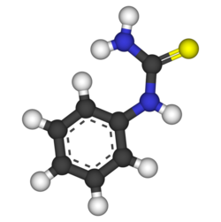
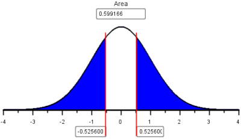
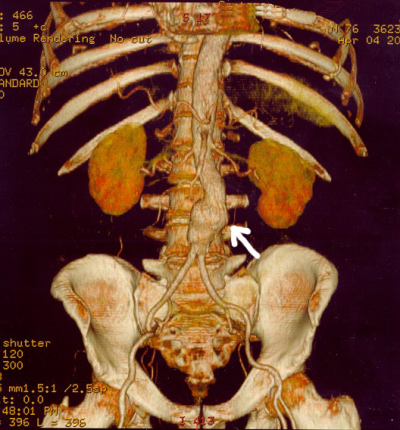
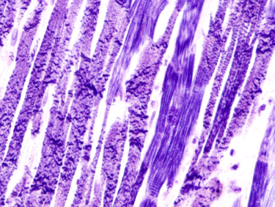

<script type = "text/javascript">
 function showhide(id) {
    var e = document.getElementById(id);
    e.style.display = (e.style.display == 'block') ? 'none' : 'block';
 }
</script>

<!--
<div style = "float:right;width = 40%;">
<br/>
<div style = "padding-left:10%;">**Optional Lesson Video**</div>
<iframe width = "90%" align = "right" src = "https://www.youtube.com/embed/videoseries?list = PLaZryQtbPQC-_0HG1XNei5qVvNogVs95k" frameborder = "1" allow = "autoplay; encrypted-media" allowfullscreen></iframe>
</div>
-->

## Lesson Outcomes

<a href = "javascript:showhide('oc')"><span style = "font-size:8pt;">Show/Hide Outcomes</span></a>
<div id = "oc" style = "display:none;">
By the end of this lesson, you should be able to do the following.

* Apply a confidence interval for the difference of two proportions using the following steps:
  + Determine the level of confidence
  + Create numerical and graphical summaries of the data
  + Create a confidence interval using software
  + Check the requirements of a confidence interval
  + Interpret a confidence interval for the difference of two proportions
* Perform a hypothesis test for the difference of two proportions using the following steps:
  + State the null and alternative hypotheses
  + State the level of significance ($\alpha$)
  + Create numerical and graphical summaries of the data
  + Calculate the test-statistic, degrees of freedom and P-value of the test using software
  + Assess statistical significance by comparing the P-value to the level of significance ($\alpha$)
  + State the appropriate conclusion for the hypothesis test
  + Check the requirements for the hypothesis test

</div>
<br>

<div style = "clear:both;"></div>

## Hypothesis Tests


### Case Study: Another Taste of PTC

<div style = "float:right;padding:10px;">

</div>


The ability to taste the chemical Phenylthiocarbamide (PTC) is hereditary.  Some people can taste it, while others cannot.
Even though the ability to taste PTC was observed in all age, race, and sex groups, this does not address the issue about whether men or women are more likely to be able taste PTC.

Further exploration of the PTC data allows us to investigate if there is a difference in the proportion of men and women who can taste PTC. The following table of counts summarizes Elise Johnson's results:
 
  Can Taste PTC?   Female   Male   Total
  ---------------- -------- ------ -------
  No               15       14     29
  Yes              51       38     89
  Total            66       52     118
                                   

  : **PTC Taste Test Results Table**


These data are available in the file [ptc_tasting](./data/ptc_tasting.xlsx).  Note the way the data are organized in the file.  One column gives the gender, another column indicates if the individual can taste PTC, and a third column gives counts for each group.

Researchers want to know if the ability to taste PTC is a sex-linked trait. This can be summarized in the following research question: Is there a difference in the proportion of males and the proportion of females who can taste PTC?  The hypothesis is that there is no difference in the the true proportion of males who can taste PTC compared to the true proportion of females who can taste PTC. This is written mathematically as:

$$
\begin{array}{rl}
H_0: ~& p_\text{females} = p_\text{males} \\
H_a: ~& p_\text{females} \ne p_\text{males} \\
\end{array}
$$


A sample of 66 females and 52 males were provided PTC strips and asked to indicate if they could taste the chemical or not.  (This research was approved by the BYU-Idaho Institutional Review Board.)


When working with categorical data, it is natural to summarize the data by computing proportions. If someone has the ability to taste PTC, we will call this a success.  The sample proportion is defined as the number of successes observed divided by the total number of observations.  

** Group 1: **
For the females, the proportion of the sample who could taste the PTC was:
$$
\hat p_\text{females} = \frac{x_1}{n_1} = \frac{51}{66} \approx 0.773
$$
This is approximately 77.3% of the people who were surveyed.  

** Group 2: **
For the males, the proportion who could taste PTC was:
$$
\hat p_\text{males} = \frac{x_2}{n_2} = \frac{38}{52} \approx 0.731
$$
This works out to be about 73.1%.

When working with data for two proportions, graphically displaying the data can help us compare each proportion. Bar charts are essential tools for describing our data. This stacked bar chart illustrates how close the two proportions are to each other.

<center>
```{r, echo = FALSE}
source("https://byuistats.github.io/M221R/scripts/functions.R")
two.prop.test(x1 = 51, n1 = 66, x2 = 38, n2 = 52, alternative = "two.sided", display = "plot")
```
</center>


The null and alternative hypotheses for a test of equality of two proportions is:
$$
\begin{array}{rl}
H_0: ~& p_1 = p_2 \\
H_a: ~& p_1 \ne p_2 \\
\end{array}
$$

In this PTC study, we let $p_1$ be the true proportion of females that could taste PTC, $p_\text{females}$. We let $p_2$ be the true proportion of males that could taste PTC, $p_\text{males}$. If the null hypothesis is true, then the proportion of females who can taste PTC is the same as the proportion of males who can taste PTC.

<span id = "Equation"></span>
The test statistic for a two-proportion test is a $z$. Click on the button below if you want to see the equation.

<a href = "javascript:showhide('handcalculations1')"><span style = "color:white;background-color:darkgray;border-radius:5px;padding:2px;"> Show Formula (Optional) </span></a>
<div id = "handcalculations1" style = "display:none;">

The equation for the $z$-statistic in a test for the difference of two proportions is:

$$
z = \frac{ \left( \hat p_1 - \hat p_2 \right) - \left( p_1 - p_2 \right) }{ \sqrt{\hat p \left( 1-\hat p \right) \left( \frac{1}{n_1} + \frac{1}{n_2} \right) } }
$$
where
$$
\begin{array}{lll}
n_1 = \text{sample size for group 1:} 	& n_1 = 66 	& \text{(number of females)} \\
n_2 = \text{sample size for group 2:}	& n_2 = 52	& \text{(number of males)} \\
\hat p_1 = \text{sample proportion for group 1:} & \hat p_1 = \frac{x_1}{n_1} = \frac{51}{66} & \text{(proportion of females who can taste PTC)}\\
\hat p_2 = \text{sample proportion for group 2:} ~ & \hat p_2 = \frac{x_2}{n_2} = \frac{38}{52} & \text{(proportion of males who can taste PTC)}\\
\hat p = \text{overall sample proportion:} 	& \hat p = \frac{x_1+x_2}{n_1+n_2} = \frac{89}{118} & \text{(overall proportion who can taste PTC)}\\
\end{array}
$$

Computing this test statistic by hand is not necessary.  R will report it for you.

</div>
<br>

### R Instructions for a Hypothesis Test for a Difference of Two Proportions

<div class = "SoftwareHeading">R Instructions</div>
<div class = "Software">
Here are the instructions for conducting a hypothesis test for a difference of two proportions in R:

**Step 1.** Use RStudio to run the code in the file [functions.R](./scripts/functions.R). This will load a function that will allow you to compute the hypothesis test. You can do this by running the command <br>
`source("https://byuistats.github.io/M221R/scripts/functions.R")` <br>
in the RStudio console.

**Step 2.** Ensure you know both the null hypothesis and alternative hypothesis of your test. In this case, the null hypothesis is $H_0: ~ p_1 = p_2$ and the alternative was $H_a: ~ p_1 \neq p_2$.

**Step 3.** Use the function `two.prop.test(...)` to conduct the hypothesis test for one proportion in R.

A few notes about using this function:

* The number of successes in group 1 is entered using the parameter `x1`
* The number of trials (observations) in group 1 is specified using the parameter `n1`
* The number of successes in group 2 is given by `x2`
* The number of trials (observations) in group 2 is given by `n2`
* The alternative hypothesis is established by the argument `alternative = "two.sided"`. Other options for the alternative hypothesis are `alternative = "less"` and `alternative = "greater"`.

When, the above `two.prop.test(...)` code is run in RStudio, it produces the following results. The output is formatted similar to R output you have seen in the past.

```{r, eval = FALSE}
source("https://byuistats.github.io/M221R/scripts/functions.R")
two.prop.test(x1 = 51, n1 = 66, x2 = 38, n2 = 52, alternative = "two.sided")
```

```{r, echo = FALSE}
source("https://byuistats.github.io/M221R/scripts/functions.R")
two.prop.test(x1 = 51, n1 = 66, x2 = 38, n2 = 52, alternative = "two.sided", display = "test")
```

At the bottom of this output, we are given the sample proportions for the two groups. Since we entered the female values first, group 1 represents the females and group 2 is for the males. 

This function also generates side-by-side bar charts illustrating the data.

```{r, echo = FALSE}
# source("https://byuistats.github.io/M221R/scripts/functions.R")
two.prop.test(x1 = 51, n1 = 66, x2 = 38, n2 = 52, alternative = "two.sided", display = "plot")
```

We can see that the two proportions are fairly close to each other: $\hat p_1 = \frac{51}{66} = 0.773$ and $\hat p_2 = \frac{38}{52} = 0.731$.

The test statistic, $z$, is $z = 0.526$.

The $P$-value of this test is 0.599, which can be confirmed by putting the $Z$-value into the Normal Probability Applet and shading both tails.

<center>

</center>

You do not need to use the Normal Probability Applet to get the $P$-value, as R already did that for you. It can be useful to envision what R is doing to get the $P$-value.

</div>
<br>


<!-- ### R Instructions for Testing Two Proportions -->

<!-- <div class = "SoftwareHeading">R Instructions</div> -->
<!-- <div class = "Software"> -->
<!-- Use the `prop.test( )` function in R to perform a test of two proportions. The test requires typing in  -->

<!-- * `x = c(first value, second value)` -->
<!-- * `n = c(first value, second value)` -->
<!-- * `correct = FALSE` which turns off the Yate's Continuity Correction. This correction is only needed for small sample sizes. (Recall that if $np < 10$ or $n(1-p)<10$, then the sampling distribution of the sample proportion may not be normal. In that case, using `correct = TRUE` would be appropriate.) -->
<!-- * `alternative = "two.sided"` runs a two-tailed test, but `alternative = "greater"` or `alternative = "less"` could also be used if specified in the alternative hypothesis of the test. -->

<!-- ```{r, comment = NA} -->
<!-- prop.test(x = c(38,51), n = c(52,66), correct = FALSE, alternative = "two.sided") -->
<!-- ``` -->

<!-- At the bottom of the output above we are given the "prop 1" and "prop 2" sample proportions. Since we entered the male values first, "prop 1" is for the males and "prop 2" is for the females. -->

<!-- **Note**: `prop.test( )` gives the "Test Statistic" as the "X-squared" value. You will need to square root that value to get the $Z$-value of the test. As shown above, this test gave X-squared $ = 0.27623$, so the $Z$-value of the test statistic (which is required for quizzes and exams in Math 221) is $Z = \sqrt{0.27623} = 0.526$. -->

<!-- The $P$-value of this test is 0.599, which is confirmed by putting the $Z$-value into the Normal Probability Applet and shading both tails. -->

<!--  -->

<!-- (While you don't need to shade the Normal Distribution yourself to get the $P$-value, as R already did that for you, it is useful to recognize that is what R is doing to get the $P$-value.) -->

<!-- <br/> -->
<!-- </div> -->

<!-- <br/> -->

If you are interested in seeing how these same calculations could be done by hand, click the button below. These calculations are optional reading, and are only included for the curious student. 

<a href = "javascript:showhide('handcalculations1')"><span style = "color:white;background-color:darkgray;border-radius:5px;padding:2px;"> Show Calculations (Optional) </span></a>
<div id = "handcalculations1" style = "display:none;">

<br>

Substituting these values into the equation for the test statistic, $z$, we get:
$$
\begin{align}
z & = \frac{ \left( \hat p_1 - \hat p_2 \right) - \left( p_1 - p_2 \right) }{ \sqrt{\hat p \left( 1-\hat p \right) \left( \frac{1}{n_1} + \frac{1}{n_2} \right) } }
\\
& = \frac{ \left( \hat p_1 - \hat p_2 \right) - \left( 0 \right) }{ \sqrt{\hat p \left( 1-\hat p \right) \left( \frac{1}{n_1} + \frac{1}{n_2} \right) } } \\
& ~ ~ ~ ~ ~ \textrm{In the null hypothesis, we assumed that} ~ p_1 = p_2. \\
& ~ ~ ~ ~ ~ \textrm{Or after subtracting,} ~ p_1-p_2 = 0 \\
& ~ ~ ~ ~ ~ \textrm{So, we substituted} ~ 0 ~ \textrm{for} ~ p_1-p_2 ~ \text{in the previous step.} \\
& = \frac{ \left( \frac{51}{66} - \frac{38}{52} \right) - (0) }{ \sqrt{\frac{89}{118} \left( 1-\frac{89}{118} \right) \left( \frac{1}{66} + \frac{1}{52} \right) } } \\
& = 0.526 \\
\end{align}
$$

The test statistic is $z = 0.526$. Under the null hypothesis, this follows a standard normal distribution.  So, we can use the Normal Probability applet to compute the $P$-value. We are conducting a two-sided test, so we will shade both tails in the applet.
<center>

</center>
Since $P\textrm{-value} = 0.599 > 0.05 = \alpha$, we fail to reject the null hypothesis.  In English we say, there is insufficient evidence to suggest that the true proportion of males who can taste PTC is different from the true proportion of females who can taste PTC.

<br/>

<hr>

</div>

<br/>


Men and women appear to be able to taste PTC in equal proportions.  There is not enough evidence to say that one gender is able to taste PTC more than the other.
We cannot conclude that the ability to taste PTC is a sex-linked trait.


<br/>


### Case Study: Mortality Rates and Day of Admission--Aortic Aneurysms

<div style = "float:right;padding:10px;">

</div>

Some people have claimed that mortality (death) rates are higher for patients admitted to a hospital on a weekend compared to patients admitted on a weekday.  Researchers Chaim Bell and Donald Redelmeier analyzed admission data from hospital emergency rooms in Ontario, Canada <!--<cite>Bell01</cite>-->.


The aorta is a major artery that takes oxygen-rich blood from the heart to the entire body.  In some patients, this artery can swell like a balloon and burst.  If this occurs in the abdomen, the technical term for the event is a ruptured abdominal aortic aneurysm.  Although this condition is treatable, it requires immediate action, or the patient will die rapidly.


The problem is that the quality of care in an emergency care facility may differ at different times of the week.  Doctors Bell and Redelmeier hypothesized that the probability that a patient with an aortic aneurysm will die is greater if they are admitted to a hospital on a weekend compared to a weekday.


**Hypothesis:**
The proportion of patients with a ruptured abdominal aortic aneurysm who will die is greater on the weekends than on weekdays.

$$
 H_0: ~ p_\text{weekday death} = p_\text{weekend death}
$$
$$
 H_a: ~ p_\text{weekday death} < p_\text{weekend death}
$$


To test this claim, the researchers accessed medical records for several patients admitted to the emergency department of the hospitals in Ontario, Canada.  They recorded the number of patients admitted with an aortic aneurysm on weekdays compared to weekends.

Data representative of their results are given below <!--<cite>Bell01</cite>-->.

  Outcome     Weekday Admission     Weekend Admission
  ----------- -------------------   -------------------
  Died (x)    $x_1 = 1476$          $x_2 = 553$
  Survived    $\phantom{x_1=~}2669$ $\phantom{x_2=~}756$
  Total (n)   $n_1 = 4145$          $n_2 = 1309$
                                  

  : **Aortic Aneurysm Outcomes**


<div class = "QuestionsHeading">Answer the following questions:</div>
<div class = "Questions">
1. Use the data above to find the estimated proportion of patients admitted with an aortic aneurysm on a weekday who will die, $\hat p_1$.

<a href = "javascript:showhide('Q1')"><span style = "font-size:8pt;">Show/Hide Solution</span></a>
<div id = "Q1" style = "display:none;">
$$
 \hat p_1 = \hat{p}_\text{weekday} = \frac{1476}{4145} \approx 0.3561
$$
</div>
<br>

2. Use the data to compute the estimated proportion of the patients admitted on a weekend that will die, $\hat p_2$.

<a href = "javascript:showhide('Q2')"><span style = "font-size:8pt;">Show/Hide Solution</span></a>
<div id = "Q2" style = "display:none;">
$$
  \hat p_2 = \hat{p}_\text{weekend} = \frac{553}{1309} \approx 0.4225
$$
</div>
<br>

3. What do you notice about $\hat p_1$ and $\hat p_2$?

<a href = "javascript:showhide('Q3')"><span style = "font-size:8pt;">Show/Hide Solution</span></a>
<div id = "Q3" style = "display:none;">
<center>$\hat p_\text{weekend}~>~\hat p_\text{weekday}$ </center>
</div>
<br>

4. Create a bar chart showing the two sample proportions side-by-side. This is generated by the `two.prop.test()` command.

<a href = "javascript:showhide('Q4')"><span style = "font-size:8pt;">Show/Hide Solution</span></a>
<div id = "Q4" style = "display:none;">

```{r, eval = FALSE}
source("https://byuistats.github.io/M221R/scripts/functions.R")
two.prop.test(x1 = 1476, n1 = 4145, x2 = 553, n2 = 1309, alternative = "two.sided")
```

```{r, echo = FALSE}
source("https://byuistats.github.io/M221R/scripts/functions.R")
two.prop.test(x1 = 1476, n1 = 4145, x2 = 553, n2 = 1309, alternative = "two.sided", display = "plot")
```

</div>
&nbsp;
</div>
<br>


<br>
<div class = "message Tip">$p_1$ is the true proportion of deaths in group 1, the weekday group.  $p_2$ is the true proportion of deaths in the weekend group.</div>
<br>
<br>

We now conduct a formal hypothesis test to determine if the mortality (death) rate is greater on a weekend compared to a weekday.  First, we state the null and alternative hypotheses:
$$
\begin{align}
H_0: ~&  p_1 = p_2 \\
H_a: ~&  p_1 < p_2
\end{align}
$$
where group 1 represents the patients admitted on a weekday and group 2 represents patients admitted on a weekend.  Note that if $p_1 < p_2$, then the risk of death is greater in group 2 than in group 1. We will use the 0.05 level of significance.

#### Checking Requirements for the Hypothesis Test

We perform the test using `two.prop.test( )` in R.

```{r, eval = FALSE}
source("https://byuistats.github.io/M221R/scripts/functions.R")
two.prop.test(x1 = 1476, n1 = 4145, x2 = 553, n2 = 1309, alternative = "less")
```

```{r, echo = FALSE}
source("https://byuistats.github.io/M221R/scripts/functions.R")
two.prop.test(x1 = 1476, n1 = 4145, x2 = 553, n2 = 1309, alternative = "less", display = "test")
```

The check for the requirements is given in the output.

If the sample size is large in both groups, then we can use the normal distribution to compute the $P$-value.  To check if the sample size is large enough, we need to check the following requirements:
$$
\begin{array}{rrr}
n_1 \cdot \hat p_1 \ge 10                 && n_2 \cdot \hat p_2 \ge 10 \\
n_1 \cdot \left(1-\hat p_1\right) \ge 10  && n_2 \cdot \left(1-\hat p_2\right) \ge 10
\end{array}
$$
If all of these requirements are satisfied, the two proportion test can be used to assess whether the true population proportions are equal or if the risk of death is greater on weekends.

Note that the requirements are all satisfied:
$$
\begin{array}{rr}
n_1 \cdot \hat p_1 = 4145 \cdot 0.3561 = 1476 \ge 10  			&\surd && n_2 \cdot \hat p_2 = 1309 \cdot 0.4225 = 553 \ge 10 & \surd \\
n_1 \cdot \left(1-\hat p_1\right) = 4145 \cdot 0.6439 = 2669 \ge 10  	&\surd && n_2 \cdot \left(1-\hat p_2\right) = 1309 \cdot 0.5775 = 756 \ge 10 & \surd
\end{array}
$$

**Reminder:** $~ x_1 = 1476,~x_2 = 553$, $n_1 = 4145,~n_2 = 1309$, $\hat p_1 = \frac{x_1}{n_1},~\hat p_2 = \frac{x_2}{n_2}$.


<!--These calculations don't match prop.test...

If you wanted to see the computations required to compute this test statistic by hand, click the button below.

<a href = "javascript:showhide('handcalculations2')"><span style = "color:white;background-color:darkgray;border-radius:5px;padding:2px;">Show Math Calculations</span></a>
<div id = "handcalculations2" style = "display:none;">

<hr>

The test statistic, $z$, can be computed by following these steps:

- First, find the combined proportion of "successes."  This is computed as:
$$
\hat p = \frac{x_1+x_2}{n_1+n_2} = \frac{1476+553}{4145+1309} = \frac{2029}{5454}
$$
- Next, enter the appropriate values into the equation for the $z$-score.
$$
\begin{array}{rcll}
z & = & \frac{ \left( \hat p_1 - \hat p_2 \right) - \left( p_1 - p_2 \right) }{ \sqrt{\hat p \left( 1-\hat p \right) \left( \frac{1}{n_1} + \frac{1}{n_2} \right) } } \\
& = & \frac{ \left( \hat p_1 - \hat p_2 \right) - \left( 0 \right) }{ \sqrt{\hat p \left( 1-\hat p \right) \left( \frac{1}{n_1} + \frac{1}{n_2} \right) } } & \text{We assumed } p_1 = p_2. \\
& = & \frac{ \left( \hat p_1 - \hat p_2 \right) }{ \sqrt{\hat p \left( 1-\hat p \right) \left( \frac{1}{n_1} + \frac{1}{n_2} \right) } } \\
& = & \frac{ \left( \frac{1476}{4145} - \frac{553}{1309} \right) }{ \sqrt{\frac{2029}{5454} \left( 1-\frac{2029}{5454} \right) \left( \frac{1}{4145} + \frac{1}{1309} \right) } } \\
& = & -4.331
\end{array}
$$


<div class = "Emphasis">
- **Remember...**

The alternative hypothesis determines which area in the tails of the $z$-distribution will be shaded as you calculated the $P$-value.

If the alternative hypothesis is $\ldots$

- $p_1 \ne p_2$, shade both tails.

- $p_1 < p_2$, shade the left tail.

- $p_1 > p_2$, shade the right tail.
<br>
</div>
<br>

This $z$-score can be substituted into the Normal Probability applet to find the $P$-value.  Since the alternative hypothesis is that $p_1 < p_2$, we consider only the area to the left of $z = -4.331$.  The applet gives this area (our $P$-value) as $7.42 \times 10^{-6} = 0.00000742$.
<center>

</center>

</div>

-->

<br/>

The $z$-score is z = -3.34.
The $P$-value$ = 0.000418 < 0.05 = \alpha$, so we reject the null hypothesis.


There is sufficient evidence to suggest that the true proportion of patients who die from an aortic aneurysm is greater on the weekends than on the weekdays.  It appears that there are substantial differences in the quality of care available to patients on the weekends compared to patients on weekdays.

<br/>


<!--


### Case Study: Mortality Rates and Day of Admission: Heart Attacks

<div style = "float:right;padding:10px;">

</div>

Here is another study illustrating the challenges of being admitted to a hospital on a weekend.

Heart attacks are a leading cause of death in many areas of the world.
The study by Doctors Bell and Redelmeier included an analysis of the risk of dying of a heart attack after admission to a hospital.  The researchers reported the following death rates, depending on whether the heart attack occurred on a weekday or a weekend 
```{r, include = FALSE, eval = FALSE}
<cite>Bell01</cite>
```

  Outcome     Weekday Admission   Weekend Admission
  ----------- ------------------- -------------------
  Died (x)    17,113              6,289
  Survived    100,596             36,222
  Total (n)   117,709             42,511
                                  

  : **Heart Attack Outcomes**


In this section, you will conduct a hypothesis test to determine if the proportion of patients who die of a heart attack is greater on weekends than on weekdays. Use the 0.05 level of significance.


<div class = "QuestionsHeading">Answer the following questions:</div>
<div class = "Questions">


5. Summarize the relevant background information

<a href = "javascript:showhide('Q5')"><span style = "font-size:8pt;">Show/Hide Solution</span></a>
<div id = "Q5" style = "display:none;">
- This was a study conducted by Doctors Bell and Redelmeier in which they analyzed the death rates depending on which day (weekday or weekend) the heart attack occurred and when the patients were admitted into the hospital.
</div>
<br>


6.  Describe the data collection process.


<a href = "javascript:showhide('Q6')"><span style = "font-size:8pt;">Show/Hide Solution</span></a>
<div id = "Q6" style = "display:none;">
- The researchers collected data on patients admitted to hospitals for heart attacks and whether or not they died.  Separate data was kept for weekday hospital admissions and weekend hospital admissions.
</div>
<br>


7. The value of $\hat p_1$, the sample proportion of patients who died of a heart attack on a weekday, is $\hat p_1 = \frac{17113}{117709} = 0.14538$.  Find the value of $\hat p_2$.

<a href = "javascript:showhide('Q7')"><span style = "font-size:8pt;">Show/Hide Solution</span></a>
<div id = "Q7" style = "display:none;">
<center>$\displaystyle{\hat p_2 = \frac{6289}{42511} = 0.14794}$</center>
</div>
<br>

8. Create a chart illustrating the data.

<a href = "javascript:showhide('Q8')"><span style = "font-size:8pt;">Show/Hide Solution</span></a>
<div id = "Q8" style = "display:none;">

```{r}
hattack.table <- c(Weekday = 17113/117709, Weekend = 6289/42511)
barplot(hattack.table, ylim = c(0,1))
```


</div>
<br>

9. Based on your answers to questions 7 and 8, does it appear that the risk of dying is greater if a heart attack occurs on a weekend than on a weekday?

<a href = "javascript:showhide('Q9')"><span style = "font-size:8pt;">Show/Hide Solution</span></a>
<div id = "Q9" style = "display:none;">
- The sample proportions, $\hat p_1$ and $\hat p_2$ are very close.  Visually, there does not appear to be a difference.
</div>
<br>

10. If the proportion of patients who die of a heart attack is greater on weekends than on weekdays, which of the following would best describe the relationship?
- A. $p_1 = p_2$
- B. $p_1 > p_2$
- C. $p_1 < p_2$
- D. $p_1 \ne p_2$

<a href = "javascript:showhide('Q10')"><span style = "font-size:8pt;">Show/Hide Solution</span></a>
<div id = "Q10" style = "display:none;">
- $p_1 < p_2$ is correct.  Note that group 1 is the weekday group and group 2 is the weekend group.
</div>
<br>


11. Replace the circles ($\bigcirc$) in the following null and alternative hypotheses with two of the following symbols: $ = ><\ne$.

$$
\begin{array}{rl}
H_0: ~&  p_1 \bigcirc p_2 \\
H_a: ~&  p_1 \bigcirc p_2
\end{array}
$$

<a href = "javascript:showhide('Q11')"><span style = "font-size:8pt;">Show/Hide Solution</span></a>
<div id = "Q11" style = "display:none;">
<center>
$$
\begin{array}{rl}
H_0: ~&  p_1 = p_2 \\
H_a: ~&  p_1 < p_2
\end{array}
$$
</center>
</div>
<br>

12. What are the requirements for this test?

<a href = "javascript:showhide('Q12')"><span style = "font-size:8pt;">Show/Hide Solution</span></a>
<div id = "Q12" style = "display:none;">
<center>
$$
\begin{array}{rrr}
n_1 \cdot \hat p_1 \ge 10 && n_2 \cdot \hat p_2 \ge 10 \\
n_1 \cdot \left(1-\hat p_1\right) \ge 10 && n_2 \cdot \left(1-\hat p_2\right) \ge 10
\end{array}
$$
</center>
</div>
<br>

13. Are the requirements for this hypothesis test satisfied?  Justify your answer.

<a href = "javascript:showhide('Q13')"><span style = "font-size:8pt;">Show/Hide Solution</span></a>
<div id = "Q13" style = "display:none;">
<center>
$$
\begin{array}{rrr}
n_1 \cdot \hat p_1 = 17113 \ge 10 && n_2 \cdot \hat p_2 = 6289 \ge 10 \\
n_1 \cdot \left(1-\hat p_1\right) = 100596 \ge 10 && n_2 \cdot \left(1-\hat p_2\right) = 36222 \ge 10
\end{array}
$$
</center>
- Yes, all of the calculated quantities from the previous question are at least 10.
</div>
<br>

14. What type of test statistic does the two proportion test use? How do you obtain this test statistic using R?

<a href = "javascript:showhide('Q14')"><span style = "font-size:8pt;">Show/Hide Solution</span></a>
<div id = "Q14" style = "display:none;">

The test statistic is a $Z$ statistic that you obtain from the `test( )` function in R by taking the square root of the "X-squared" statistic.

</div>
<br>

15. Perform a two-proportion test in R for these data, report the test statistic, $Z$. (Remember to take the square root of "X-squared" to get the test statistic.)

<a href = "javascript:showhide('Q15')"><span style = "font-size:8pt;">Show/Hide Solution</span></a>
<div id = "Q15" style = "display:none;">

```{r, comment = NA}
prop.test(x = c(17113, 6289), n = c(117709,42511), correct = FALSE, alternative = "less")

sqrt(1.6336)
```

We get $Z = sqrt(1.6336) = 1.278$. Note however, that since "prop 1" is 0.145 and "prop 2" is 0.148, then "prop 1" is less than "prop 2" so the $Z$-score should be made negative. 

<center>$z = -1.278$</center>
</div>
<br>

16. Present a sketch of the sampling distribution, showing the test statistic and the $P$-value.

<a href = "javascript:showhide('Q16')"><span style = "font-size:8pt;">Show/Hide Solution</span></a>
<div id = "Q16" style = "display:none;">

</div>
<br>

17. Find the $P$-value.

<a href = "javascript:showhide('Q17')"><span style = "font-size:8pt;">Show/Hide Solution</span></a>
<div id = "Q17" style = "display:none;">
<center>$P\textrm{-value} = 0.1006$</center>
</div>
<br>

18. Compare the $P$-value to the level of significance.  Which is smaller?  Will you reject, or fail to reject, the null hypothesis?

<a href = "javascript:showhide('Q18')"><span style = "font-size:8pt;">Show/Hide Solution</span></a>
<div id = "Q18" style = "display:none;">
<center>$P\textrm{-value} = 0.1006 > 0.05 = \alpha$</center>
</div>
<br>

19. What is your decision?

<a href = "javascript:showhide('Q19')"><span style = "font-size:8pt;">Show/Hide Solution</span></a>
<div id = "Q19" style = "display:none;">
- Since the $P$-value is greater than $\alpha$, we fail to reject the null hypothesis.
</div>
<br>

20. Fill in the blanks in the following sentence:

- There is $\text{____________}$ evidence to suggest that the true proportion of patients who die of a heart attack is $\text{__________}$ on weekends than on weekdays.*

<a href = "javascript:showhide('Q20')"><span style = "font-size:8pt;">Show/Hide Solution</span></a>
<div id = "Q20" style = "display:none;">
- There is **insufficient** evidence to suggest that the true proportion of patients who die of a heart attack is **greater** on weekends than on weekdays.
</div>
<br>


21. If you were to have a heart attack, would you be more concerned if it occurred on a weekend than on a weekday?

<a href = "javascript:showhide('Q21')"><span style = "font-size:8pt;">Show/Hide Solution</span></a>
<div id = "Q21" style = "display:none;">
- No, the evidence suggests that the probability of dying of a heart attack is not greater on the weekends.
</div>
&nbsp;
</div>
<br>


<br>
################# END HEART ATTACK CASE STUDY
-->

## Confidence Intervals


### Case Study: Managing Fox Populations

<div style = "float:right;padding:10px;">
</div>

During the mid 1800's, European foxes were introduced to the Australian mainland.  These predators have been responsible for the reduction or extinction of several species of native wildlife. <!--(Coates08)--> 

The Royal Botanic Gardens Cranbourne is a 914 acre (370 ha) conservation reserve outside Melbourne, Australia.  Predation by foxes has been an ongoing problem in the gardens.  To reduce the risk to native species, a systematic program of killing foxes was implemented.

One way to monitor the presence of foxes is to look for fox tracks in specific sandy areas, called sand-pads.  Before beginning a systematic effort to reduce the fox population, ecologists observed fox tracks in the sand-pads 576 out of the 950 times the sand-pads were observed.  After eliminating some of the foxes, the ecologists observed fox tracks in the sand-pads 268 times out of the 1359 times they checked the sand-pads <!--<cite>Coates08</cite>-->.  The ecologists want to know if there is a difference in the proportion of times fox tracks are observed before versus after the intervention to reduce the fox population.

One way to compare two proportions is to make a confidence interval for the difference in the proportions.

<!--
The equation for the confidence interval for the difference of two proportions may look a little daunting at first, but with some practice, it is not too difficult.
-->

We divide the data into two groups: after foxes were targeted (Group 1) and before the intervention (Group 2). For each group, let $x_1$ and $x_2$ represent the number of times fox prints were observed in the sand-pads before and after the ecologists began systematically eliminating the foxes, respectively.  Similarly, Let $n_1$ and $n_2$ be the number of times the ecologists checked the sand-pads in the "after" and "before" periods, respectively.

<center>

**Fox Tracks Data**

| &nbsp; | After Intervention | Before Intervention |
|--------|---------------------|--------------------|
| **Fox Tracks Observed** | $x_1 = 268$  | $x_2 = 576$ |
| **Total Observations**  | $n_1 = 1359$ | $n_2 = 950$ |

</center>

<!--
We compute $\hat p$ for each group.

For group 1:
$$
\hat p_1 = \frac{x_2}{n_2} = \frac{268}{1359}\approx 0.197
$$

For group 2:
$$
\hat p_2 = \frac{x_1}{n_1} = \frac{576}{950} \approx 0.606
$$

-->

When working with two proportions, we are mainly interested in the *difference between the proportions.* 
In this case, subtracting the two proportions gives us an estimate of how different the true proportions $p_1$ and $p_2$ might be.

$$
\hat p_1 -\hat p_2 = 0.197 - 0.606 = -0.409
$$

This tells us that it appears the first proportion, $p_1$ is somewhere around 40.9 percentage points lower than $p_2$. This is quite a bit! It seems the intervention lowered the prevalence of foxes in the sand-pads. However, our conclusions are based on sample proportions instead of the true proportions. We cannot be sure exactly how much the true proportions actually differ, but a confidence interval to estimate the true difference in proportions can give us greater insight.

### R Instructions for Finding a Confidence Interval of the Difference of Two Proportions

<div class = "SoftwareHeading">R Instructions</div>
<div class = "Software">
Use the `two.prop.test( )` function in R to obtain a confidence interval for the difference of two proportions.

```{r, eval = FALSE}
source("https://byuistats.github.io/M221R/scripts/functions.R")
two.prop.test(x1 = 268, n1 = 1359, x2 = 576, n2 = 950, conf.level = 0.95)
```

```{r, echo = FALSE}
source("https://byuistats.github.io/M221R/scripts/functions.R")
two.prop.test(x1 = 268, n1 = 1359, x2 = 576, n2 = 950, conf.level = 0.95, display = "test")
```

We can see the distinct difference in the proportion of fox tracks after the intervention in the side-by-side bar charts.

```{r, echo = FALSE}
source("https://byuistats.github.io/M221R/scripts/functions.R")
two.prop.test(x1 = 268, n1 = 1359, x2 = 576, n2 = 950, conf.level = 0.95, display = "plot")
```

Recall that group 1 represents the observations *after* the intervention and Group 2 represents observations *before* the intervention.

</div>
<br/>

The lower bound for a 95% confidence interval for the difference of the proportions of times fox prints are observed in the sand-pads is $-0.447$ and the upper-bound is $-0.372$.

So, the 95% confidence interval for the difference in the proportions is:

$$
(-0.447, -0.372)
$$

To interpret this confidence interval, we say, "We are 95% confident that the true *difference* in the proportions of times fox prints will appear in the sand-pads is between $-0.447$ and $-0.372$."

<div class = "message Tip">
If we had swapped the way we label group 1 and group 2, then our confidence interval would have had the opposite signs: $(0.372, 0.447)$.
</div>

We conclude that the proportion of times foxes are observed in the sand-pads has been reduced by anywhere from 37.2 percentage points to 44.7 percentage points.  The work to reduce the number of foxes seems to have an effect on their presence in the reserve.


#### Checking Requirements for a Confidence Interval

The requirements for computing a confidence interval for two proportions are the same as the requirements for doing a hypothesis test.

$$
\begin{array}{rrr}
n_1 \cdot \hat p_1 \ge 10                 && n_2 \cdot \hat p_2 \ge 10 \\
n_1 \cdot \left(1-\hat p_1\right) \ge 10  && n_2 \cdot \left(1-\hat p_2\right) \ge 10
\end{array}
$$

These calculations are given in the output above. 
In this example, all of the requirements are satisfied:

$$
\begin{array}{rlrl}
 n_1 \cdot \hat p_1 = 1359 \cdot 0.197 = 268 \ge 10 &\surd ~~~~~~~~~& 
  n_2 \cdot \hat p_2 = 950 \cdot 0.606 = 576 \ge 10  &\surd \\
n_1 \cdot \left(1-\hat p_1\right) = 1359 \cdot (1-0.197) = 1091 \ge 10 &\surd& 
  n_2 \cdot \left(1-\hat p_2\right) = 950 \cdot (1-0.606) = 374 \ge 10 &\surd 
\end{array}
$$


<br>


## Summary

<div class = "SummaryHeading">Remember...</div>
<div class = "Summary">

- When conducting hypothesis tests using two proportions, the null hypothesis is always $p_1 = p_2$, indicating that there is no difference between the two proportions. The alternative hypothesis can be left-tailed ($<$), right-tailed($>$), or two-tailed($\ne$).

- For a hypothesis test and confidence interval of two proportions, we use the following symbols:
$$
\begin{array}{lll}
\text{Sample proportion for group 1:} &~& \hat p_1 = \displaystyle{\frac{x_1}{n_1}} \\
\text{Sample proportion for group 2:} &~& \hat p_2 = \displaystyle{\frac{x_2}{n_2}}
\end{array}
$$

- A test of two proportions (or confidence interval for two proportions) is appropriate to perform whenever all of the following requirements are satisfied:

$$
n_1\hat{p}_1 \geq 10 \quad\quad\quad\quad n_2 \hat{p}_2 \geq 10\\
n_1(1-\hat{p}_1) \geq 10 \quad\quad n_2 (1-\hat{p}_2) \geq 10
$$

- If zero is contained in the confidence interval of the difference of the true proportions, it is reasonable to conclude that there is no significant difference between the two proportions.

- Use [`two.prop.test(x1 = , n1= , x2 = , n2 = , alternative = )`](Lesson18.html#r-instructions-for-a-hypothesis-test-for-a-difference-of-two-proportions) to perform a hypothesis test of two proportions. Note that `alternative` could either be assigned a value of `"two.sided"`, `"less"`, or `"greater"`.

- Use [`two.prop.test(x1 = , n1= , x2 = , n2 = , conf.level = 0.95)`](Lesson18.html#r-instructions-for-finding-a-confidence-interval-of-the-difference-of-two-proportions) to obtain a confidence interval for the difference of two proportions.

<br>
</div>
<br>

## Navigation

<center>
| **Previous Reading** | **This Reading** | **Next Reading** |
| :------------------: | :--------------: | :--------------: |
| [Lesson 17: <br> Inference for One Proportion](Lesson17.html) | Lesson 18: <br> Inference for Two Proportion | [Lesson 19: <br> Inference for Independence of Categorical Data](Lesson19.html) |
</center>
