<script type = "text/javascript">
 function showhide(id) {
    var e = document.getElementById(id);
    e.style.display = (e.style.display == 'block') ? 'none' : 'block';
 }
</script>

<!--
<div style = "float:right;width = 40%;">
<br/>
<div style = "padding-left:10%;">**Optional Lesson Video**</div>
<iframe width = "90%" align = "right" src = "https://www.youtube.com/embed/videoseries?list = PLaZryQtbPQC-IBvd2b9pmQfpkNSphQ4Sl" frameborder = "1" allow = "autoplay; encrypted-media" allowfullscreen></iframe>
</div>
-->

## Lesson Outcomes

<a href = "javascript:showhide('oc')"><span style = "font-size:8pt;">Show/Hide Outcomes</span></a>
<div id = "oc" style = "display:none;">
By the end of this lesson, you should be able to:

* Create a scatterplot of bivariate data
* Interpret the overall pattern in a scatter plot to assess linearity and direction
* Calculate the correlation coefficient, r
* Interpret the correlation coefficient as a measure of the strength and direction of the linear relationship between two variables

</div>
<br>

<div style = "clear:both;"></div>
<br/>

## Case Study: How Confident are You?

<div style = "float:right;padding:10px;width = 80%;">

</div>

Think about a time when you walked into an exam, having prepared carefully, *knowing* that you would do well.  On the other hand, have you ever entered an exam feeling unprepared?  How have your exam scores compared to your confidence?


Shane Goodwin and other researchers examined this question.  They studied factors that affect a student's confidence on a multiple-choice mathematics exam<!--<cite>Goodwin09</cite>-->. A group of n = 139 students in an Intermediate Algebra course (MATH 101) at BYU-Idaho participated in the study. As students completed the exam, they were required to both answer each question on the exam as well as rate their confidence for each of their answers being correct on a scale of 1 to 6, where confidence ratings of 1 meant "No Clue" and confidence ratings of 6 meant the student was "Certain" they had entered the correct answer to that question. 

**Confidence Rating**

1. Random guess (no clue)	 

2. Very unsure	 

3. Somewhat unsure	 

4. Somewhat sure	 

5. Very sure	 

6. Certain (absolutely sure)

At the end of the exam, two values were recorded for each student. First, the final score was computed as a percentage of questions answered correctly for that student. Second, the final confidence rating was computed by taking the average confidence score from all of the confidence scores that the student had recorded for each question. Confidence ratings were not relayed to the instructor, and they did not affect the grade on the exam.  


The $n = 139$ students from the selected Math 101 course represented a convenience sample of students. They were the students of teachers who elected to have their students participate in this study.


##  Describing Bivariate Data 

Two values were computed for each student at the completion of their exam. The first value was the mean confidence rating (possible values ranging from 1 to 6) from each student's confidence scores they provided for each question. The second value was the actual score the student earned on the exam (out of 100 points possible). The confidence ratings and exam scores are given in the file [math_self_efficacy.xlsx](./data/math_self_efficacy.xlsx).

Read in the data from the file [math_self_efficacy.xlsx](./data/math_self_efficacy.xlsx). (Review of [reading in data](RHelp.html#reading-in-the-data).)

```{r, echo = FALSE, message = FALSE}
library(readxl)
library(knitr)
library(tidyverse)
library(kableExtra)
math_self_efficacy <- read_excel("./data/math_self_efficacy.xlsx") %>% data.frame()
```

After reading in the data, you may want to look at the first few rows to see how it is formatted.

```{r, comment = NA}
head(math_self_efficacy)
```


Notice that we have two quantitative measurements on each participant: *score* and *confidence_rating_mean*. We call these data **bivariate data**. The prefix "bi-" comes from the Latin *bi-* meaning "twice" or "double". When we are simultaneously working with two quantitative variables, we say we have bivariate data.

In the past, we have summarized quantitative data by computing summary statistics.  Here are a couple of statistics computed from these data:  

- The mean score on the test was 74.7 points. 
- The mean confidence rating was 4.4.  

While these statistics are useful, they do not provide information about the *connection* between the students' scores on the exam and their confidence. If a student feels very confident, what do the data tell us about their test score? Do they score higher on the exam than those that feel less confident? We need a new tool to help us relate the values of two quantitative observations.  When we have two quantitative measurements on each subject in the study, we have **bivariate data**.


###  Graphical Summary 

A scatterplot is an excellent way to present the bivariate relationship between two quantitative variables. The scatterplot has a y-axis (the vertical axis) that usually represents the variable we are most interested in studying. This is the variable we want to predict. The x-axis of the scatterplot displays the values of the variable that helps *explain* the values of the y-variable. In this case, we will let our x-variable be the confidence rating of each student, which helps explain that student's exam score. We expect that students who have higher levels of confidence will tend to have higher exam scores.

The variable on the x-axis of the scatter plot is called the **explanatory variable**, and the variable on the y-axis is called the **response variable**.


### R Instructions for Scatterplots

<div class = "SoftwareHeading">R Instructions</div>
<div class = "Software">
**To create a scatterplot in R** use the `plot(...)` function with the response variable (y) placed first, followed by a `~`, followed by the explanatory variable (x). Then, you indicate which data frame the variables are in using the `data = ` argument.

First, read in the data: [math_self_efficacy.xlsx](./data/math_self_efficacy.xlsx). ([Click here](RHelp.html#reading-in-data) for a reminder on how to read in data.) Then, run the code:

```{r, include = FALSE}
library(readxl)
math_self_efficacy <- read_excel("./data/math_self_efficacy.xlsx")
```

```{r}
plot(score ~ confidence_rating_mean, data = math_self_efficacy)
```

We can customize our plot with color and better labels using the options

* `col = ` a name of a color to specify the color of the points in the graph,
* `pch = ` a number 1 to 25 to specify the plotting character used for each point in the graph (16 gives a solid circle),
* `xlab = ` to specify (in quotation marks) the words to print below the x-axis, 
* `ylab = ` to specify (in quotation marks) the words to print next to the y-axis, and 
* `main = ` to specify (in quotation marks) the main title of the graph.

These options are demonstrated below.

```{r}
plot(score ~ confidence_rating_mean, data = math_self_efficacy,
     col = "steelblue3", # specify the color
     pch = 16, # choose a plotting symbol, options are 1, 2, ..., 25.
     xlab = "Mean Confidence Rating for Each Student",
     ylab = "Exam Score of Each Student (Out of 100 Pts.)",
     main = "Study on Student Exam Performance in Math 101")
```

<br/>

**Options for Plotting Characters** 

If you were curious, here are the `pch = ` options you can pick from by selecting the number corresponding to the symbol you want.

```{r, fig.height = .8, echo = FALSE}
par(mai = c(0,0,0,0))
plot(1:25, rep(1,25), pch = 1:25)
text(1:25, rep(1,25), 1:25, pos = 3, col = "steelblue3", cex = 0.5)
```


</div>

<br/>

Each point in the plot represents both the confidence and score of one student.  The points are plotted on the X-Y coordinate plane.  The position on the horizontal (X) axis represents the student's confidence rating. The height of the point or the value on the Y-axis, represents the student's score on the exam.  

<center>
```{r, echo = FALSE}
plot(score ~ confidence_rating_mean, data = math_self_efficacy,
     col = "steelblue3", #specify the color
     pch = 16, #choose a plotting symbol, options are 1, 2, ..., 25.
     xlab = "Mean Confidence Rating for Each Student",
     ylab = "Exam Score of Each Student (Out of 100 Pts.)",
     main = "Study on Student Exam Performance in Math 101")
lines(c(2.35, 2), c(53.3,80), col = "darkgray")
points(2.35, 53.3, pch = 16, cex = 1.3, col = "steelblue3")
lines(c(5.70, 5.75), c(86.7,60), col = "darkgray")
points(5.7, 86.7, pch = 16, cex = 1.3, col = "steelblue3")
text(2.15,80, "This student had \n a confidence score of 2.35 \n and earned a 53.3 on the exam", pos = 3, col = "darkgray", cex = 0.7)
text(5.50,60, "This student had \n a confidence score of 5.70 \n and earned a 86.7 on the exam", pos = 1, col = "darkgray", cex = 0.65)
```
</center>

The cloud of data illustrated in this scatterplot help us visualize the relationship between the student's confidence rating and their score on the exam. Notice that the points tend to be higher as you move to the right.  Students who have a high confidence rating (points further to the right) tend to have higher exam scores (higher vertical position).  Similarly, students with lower confidence typically have lower exam scores.  Notice that as a students' confidence increases, their exam score tends to increase.  We call this a *positive association* or a *positive correlation*.

Notice that there is variability in the responses.  Consider how the plot below emphasizes the many different exam scores students could earn even for students who all have a mean confidence rating of 5.0. While there is technically only one student in the data set that had a confidence score of exactly 5 (and they scored a 93.3 on the exam) we can picture in our mind's eye that if other Math 101 students were to also to report a confidence rating of 5, then we would see variability in their exam scores. In fact, in looking at the graph, we would expect students with a confidence rating of 5 to score from anywhere as low as a 60 on the exam to as high as a 100! That is quite a range of possibilities. So while knowing the confidence score of a student doesn't tell us their exact exam score, it can give us a general idea about how such a student would score on the exam. For example, if a student had a confidence rating of 3.0, then we would expect them to score anywhere between a 34 and a 79 on the exam, which is a lower range of possibilities than we would expect for the student with a confidence rating of 5.0.

<center>
```{r, echo = FALSE}
plot(score ~ confidence_rating_mean, data = math_self_efficacy,
     col = "steelblue3", # specify the color
     pch = 16, # choose a plotting symbol, options are 1, 2, ..., 25.
     xlab = "Mean Confidence Rating for Each Student",
     ylab = "Exam Score of Each Student (Out of 100 Pts.)",
     main = "Study on Student Exam Performance in Math 101")
lines(c(5, 5), c(60,100), col = rgb(0.1,0.1,0.1), lwd = 10)
lm1 <- lm(score ~ confidence_rating_mean, data = math_self_efficacy)
preds <- predict(lm1, data.frame(confidence_rating_mean = 5), interval = "prediction")
```
</center>

When the points in a scatterplot follow a straight pattern, we say that there is a *linear relationship* in the data.  Data are considered linearly related if the points in the scatterplot follow a straight line.  The points do not have to be aligned tightly to represent a linear relationship. Both broadly scattered and narrow clouds of data can be considered linear. Here are some examples that all would be considered linear relationships.

<center>
```{r, fig.height = 1.5, echo = FALSE, message = FALSE, warning = FALSE}
library(car)
par(mfrow = c(1,5), mai = c(.1,.1,.1,.1))
plot(Wind ~ Temp, data = airquality, yaxt = 'n', xaxt = 'n')
plot(dist ~ speed, data = cars, yaxt = 'n', xaxt = 'n')
plot(weight ~ repwt, data = Davis[-12,], yaxt = 'n', xaxt = 'n')
plot(circumference ~ age, data = Orange, yaxt = 'n', xaxt = 'n')
plot(height^1.3 ~ age, data = Loblolly, yaxt = 'n', xaxt = 'n')
```
</center>

In the examples above, even though each plot could be considered a *linear relationship*, they each differ in how much the dots are spread out along that linear relationship. We need to be able to describe the not only the **shape** of the relationship, but also the the **direction** and **strength** of a linear relationship in bivariate data.  We use the correlation coefficient to quantify the direction and strength of the relationship.  This idea is discussed below.

<br>

### Describing Direction: Scatterplots and the Correlation Coefficient

We say that the direction of data in a scatterplot is **positive**  or there is a **positive association** between two variables when an *increase* in one variable tends to lead to an *increase* in the other variable.  We observed a positive association in Goodwin's confidence data. 

The **correlation coefficient** is a number that is used to measure the direction and strength of the linear association between two variables.  The direction is either positive, negative, or neither.  The strength can be described as weak, moderate, or strong.

Correlation coefficients are always between $-1$ and $1$. A correlation of $0$ implies *no correlation* in the data. We use the letter $r$ to represent the correlation coefficient.

We will use software to compute the correlation coefficient.  

<br>

### R Instructions for Computing Correlation

<div class = "SoftwareHeading">R Instructions</div>
<div class = "Software">
**To compute correlation in R** use the `cor(...)` function where the x-axis variable is listed first, followed by a comma `,`, followed by the y-axis variable second. The `cor(...)` function also requires stating the name of the data set and using the `$` sign to access the desired columns of the dataset.

```{r, comment = NA}
cor(math_self_efficacy$confidence_rating_mean, math_self_efficacy$score)
```

Note that if there are missing values in the data, you would need to use the `use = "pairwise.complete.obs"` option to remove those missing `NA` values.

```{r, comment = NA}
cor(math_self_efficacy$confidence_rating_mean, math_self_efficacy$score,
    use = "pairwise.complete.obs")
```
</div>

<br/>

When a positive association exists in the data, the correlation coefficient $r$ will be positive. Recall that a positive association was observed in Goodwin's data, where $r = 0.728 > 0$.

There are many examples of positive associations.  It has been demonstrated that  a student's level of motivation is positively associated with academic success <!--<cite>Busato00</cite>-->.  Students who are highly motivated tend to do better academically.  As another example, there is a positive association between the height of a person and their weight.  If someone's height increases, we would expect that their weight would typically be greater as well.  

On the other hand, when an *increase* in one variable is associated with a *decrease* in the other variable, we say that there is a **negative** association between the two variables.  Several studies have demonstrated that there is a negative association between the amount of time spent playing video games and academic performance<!--<cite>Gentile04</cite>-->.  Students who spend a lot of time on video games tend to do worse in school than their peers who do not spend much time gaming.

#### Describing Strength: The Correlation Coefficient

We also describe the relationship between two variables as **weak**, **moderate**, or **strong**, depending on how close the relationship between the variables is.  The strength of the linear relationship is also described in the correlation coefficient.  

The correlation coefficient $r$ is always a value between $-1$ and $1$.  If there is a strong positive association, the correlation coefficient will be close to $1$.  If the correlation coefficient is positive but relatively small, we say there is a weak positive association in the data. If the correlation is zero (or really close to zero), then we say there is no correlation in the data.

Similarly, if the correlation coefficient is close to $-1$, we say there is a strong negative association.  A weak negative association results in a correlation coefficient that is negative but close to 0. But if the correlation is negative and really close to zero, then we say there is no correlation in the data.

It is difficult to establish definite cut-off values to determine when a correlation goes from being weak to moderate or from moderate to strong.  This depends a great deal upon the context of the data and how much is known about the situation already. In some contexts, a correlation of $r = 0.2$ could be considered strong. But typically in this class, we only consider correlations above $r = 0.7$ to be strong correlations (and similary for $r = -0.7$ and below). In this course, we also typically call anything between $r = -0.3$ and $r = 0.3$ a weak correlation. But again, in a different course or in a different type of research, these cut-offs could completely change as to what we consider to be a *strong* or *weak* or *moderate* correlation.

Several scatterplots have been created, and the correlation coefficient summarizing the relationship between the two variables is presented.  Study these graphs to see if you can infer some of the properties of the correlation coefficient.

<br>
<center>
<table>
<thead>
<tr class = "header">
<th><p>Figure 1</p></th>
<th><p>Figure 2</p></th>
<th><p>Figure 3</p></th>
</tr>
</thead>
<tbody>
<tr class = "odd">
<td><p>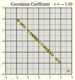</p></td>
<td><p>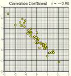</p></td>
<td><p>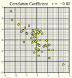</p></td>
</tr>
<tr class = "even">
<td><p>$r = -1.00$</p></td>
<td><p>$r = -0.96$</p></td>
<td><p>$r = -0.80$</p></td>
</tr>
</tbody>
</table>
<br><br> 
<table>
<thead>
<tr class = "header">
<th><p>Figure 4</p></th>
<th><p>Figure 5</p></th>
<th><p>Figure 6</p></th>
</tr>
</thead>
<tbody>
<tr class = "odd">
<td><p>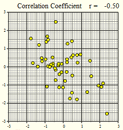</p></td>
<td><p>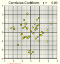</p></td>
<td><p>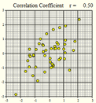</p></td>
</tr>
<tr class = "even">
<td><p>$r = -0.50$</p></td>
<td><p>$r = 0$</p></td>
<td><p>$r = 0.50$</p></td>
</tr>
</tbody>
</table>
<br><br>
<table>
<thead>
<tr class = "header">
<th><p>Figure 7</p></th>
<th><p>Figure 8</p></th>
<th><p>Figure 9</p></th>
</tr>
</thead>
<tbody>
<tr class = "odd">
<td><p>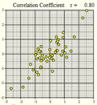</p></td>
<td><p>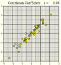</p></td>
<td><p>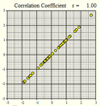</p></td>
</tr>
<tr class = "even">
<td><p>$r = 0.80$</p></td>
<td><p>$r = 0.96$</p></td>
<td><p>$r = 1.00$</p></td>
</tr>
<tr class = "odd">
<td></td>
<td></td>
<td></td>
</tr>
</tbody>
</table>
</center>
<br>

<div class = "QuestionsHeading">Answer the following questions:</div>
<div class = "Questions">
1. If $r$ is positive, and $X$ increases, what do we expect will happen with $Y$?  Does this represent a positive or negative association?

<a href = "javascript:showhide('Q1')"><span style = "font-size:8pt;">Show/Hide Solution</span></a>
<div id = "Q1" style = "display:none;">
- When $r$ is positive, if $X$ increases then $Y$ will also increase.  This represents a positive association.
</div>
<br>

2. If $r$ is negative, and $X$ increases, what do we expect will happen with $Y$?  Does this represent a positive or negative association?

<a href = "javascript:showhide('Q2')"><span style = "font-size:8pt;">Show/Hide Solution</span></a>
<div id = "Q2" style = "display:none;">
- When $r$ is negative, if $X$ increases then $Y$ will decrease.  This represents a negative association.
</div>
<br>

3. If $r \approx 0$, what can we conclude about the strength of the relationship between $X$ and $Y$?

<a href = "javascript:showhide('Q3')"><span style = "font-size:8pt;">Show/Hide Solution</span></a>
<div id = "Q3" style = "display:none;">
- We can conclude that there is no relationship between $X$ and $Y$ or that it there is a very weak relationship. 
</div>
<br>

4. If $r \approx 1$, what can we conclude about the strength of the relationship between $X$ and $Y$?

<a href = "javascript:showhide('Q4')"><span style = "font-size:8pt;">Show/Hide Solution</span></a>
<div id = "Q4" style = "display:none;">
- We can conclude that the relationship between $X$ and $Y$ is very strong and positive.  
</div>
<br>

5. If $r \approx -1$, what can we conclude about the strength of the relationship between $X$ and $Y$?

<a href = "javascript:showhide('Q5')"><span style = "font-size:8pt;">Show/Hide Solution</span></a>
<div id = "Q5" style = "display:none;">
- We can conclude that the relationship between $X$ and $Y$ is very strong.  The reason it is negative is because it is negatively associated, not because it is a weak association.
</div>
<br>

6. If $r = 1$, what can we conclude about the strength of the relationship between $X$ and $Y$?

<a href = "javascript:showhide('Q6')"><span style = "font-size:8pt;">Show/Hide Solution</span></a>
<div id = "Q6" style = "display:none;">
- If $r = 1$, there is a perfect positive linear relationship between $X$ and $Y$. All the points are in an upward-sloping line.
</div>
<br>

7. If $r = -1$, what can we conclude about the strength of the relationship between $X$ and $Y$?

<a href = "javascript:showhide('Q7')"><span style = "font-size:8pt;">Show/Hide Solution</span></a>
<div id = "Q7" style = "display:none;">
- If $r = -1$, there is a perfect negative linear relationship between $X$ and $Y$.  All the points are exactly on a line that slopes downward.
</div>
&nbsp;
</div>
<br>

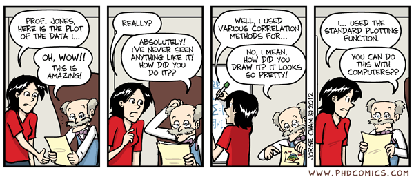

<br>

#### Effect of Outliers

An  **outlier** is any point that is very far from the others.  Each of the following scatterplots shows data where there is one outlier present. Notice how one point can influence the correlation coefficient. Imagining that the outlier was removed from each of the following plots, estimate the correlation coefficient in your mind.  Compare that value to the specified correlation coefficient with the outlier included.

<br>
<center>

<table>
<thead>
<tr class = "header">
<th><p>Figure 10</p></th>
<th><p>Figure 11</p></th>
<th><p>Figure 12</p></th>
</tr>
</thead>
<tbody>
<tr class = "odd">
<td><p>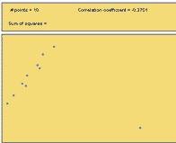</p></td>
<td><p>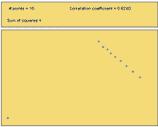</p></td>
<td><p>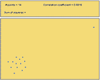</p></td>
</tr>
<tr class = "even">
<td><p>$r = -0.37$</p></td>
<td><p>$r = +0.62$</p></td>
<td><p>$r = +0.88$</p></td>
</tr>
</tbody>
</table>

<!-- {| class = "wikitable" style = "text-align:center" width = "80%" -->
<!-- ! Figure 10 !! Figure 11 !! Figure 12 -->
<!-- |- -->
<!-- |[[File:CorrOutliersR-37.png"> -->
<!-- |- -->
<!-- |$r = -0.37$ || $r = +0.62$ || $r = +0.88$   -->
<!-- |} -->
</center>

<div class = "QuestionsHeading">Answer the following question:</div>
<div class = "Questions">
8. What can you say about the effect of outliers on the correlation coefficient?

<a href = "javascript:showhide('Q8')"><span style = "font-size:8pt;">Show/Hide Solution</span></a>
<div id = "Q8" style = "display:none;">
- Outliers can dramatically affect the value of the correlation coefficient.  It is possible for one outlier to change a correlation coefficient from a strong positive value to a negative value, like in Figure 10.  It is possible for one outlier to change uncorrelated data to a data set that has a very high correlation, like in Figure 12.
</div>
&nbsp;
</div>
<br>

#### Nonlinear Relationships

The following figures illustrate possible situations where the relationship between two variables does not follow a straight line.  You can have a correlation coefficient that is close to zero, even though there is a perfect *nonlinear* association between the data. This is why it is meaningful to show a scatterplot *and* the correlation coefficient. That way we know if we are really measuring the strength and direction of a *linear* relationship or not.

<br>
<center>
<table>
<thead>
<tr class = "header">
<th><p>Figure 13</p></th>
<th><p>Figure 14</p></th>
</tr>
</thead>
<tbody>
<tr class = "odd">
<td><p>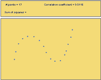</p></td>
<td><p>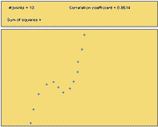</p></td>
</tr>
<tr class = "even">
<td><p>$r = +0.01$</p></td>
<td><p>$r = +0.86$</p></td>
</tr>
</tbody>
</table>
<p><br />
<br />

<br>
<table>
<thead>
<tr class = "header">
<th><p>Figure 15</p></th>
<th><p>Figure 16</p></th>
</tr>
</thead>
<tbody>
<tr class = "odd">
<td><p>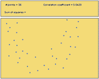</p></td>
<td><p>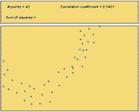</p></td>
</tr>
<tr class = "even">
<td><p>$r = +0.04$</p></td>
<td><p>$r = +0.74$</p></td>
</tr>
</tbody>
</table>
<p><br />
<br />
</center>
<!-- <center> -->
<!-- {| class = "wikitable" style = "text-align:center" width = "80%" -->
<!-- ! Figure 13 !! Figure 14 -->
<!-- |- -->
<!-- |[[File:CorrNonlinStrongRelWeakCorr.png">  -->
<!-- |- -->
<!-- |$r = +0.01$ || $r = +0.86$   -->
<!-- |} -->
<!-- <br><br> -->
<!-- {| class = "wikitable" style = "text-align:center" width = "80%" -->
<!-- ! Figure 15 !! Figure 16 -->
<!-- |- -->
<!-- |[[File:CorrNonlinModRelWeakCorr.png"> -->
<!-- |- -->
<!-- |$r = +0.04$ || $r = +0.74$     -->
<!-- |} -->
<!-- </center> -->

<div class = "QuestionsHeading">Answer the following questions:</div>
<div class = "Questions">
9. Out of Figures 13-16, which scatterplots show a very strong nonlinear relationship?

<a href = "javascript:showhide('Q9')"><span style = "font-size:8pt;">Show/Hide Solution</span></a>
<div id = "Q9" style = "display:none;">
- All four figures show distinct nonlinear relations.  Figures 13 and 14 show very strong nonlinear relationships.
</div>
<br>

10. Out of Figures 13-16, which scatterplots illustrate data with the highest correlation coefficient?

<a href = "javascript:showhide('Q10')"><span style = "font-size:8pt;">Show/Hide Solution</span></a>
<div id = "Q10" style = "display:none;">
- Figures 14 and 16 both have relatively high correlation coefficient, $r = 0.86$ and $r = 0.74$, respectively.
</div>
<br>

11. How well does the correlation coefficient measure the strength of the *nonlinear* relationship between two variables?

<a href = "javascript:showhide('Q11')"><span style = "font-size:8pt;">Show/Hide Solution</span></a>
<div id = "Q11" style = "display:none;">
- The correlation coefficient does not measure the strength of nonlinear relationships.  It only measures the strength of the linear association.
</div>
&nbsp;
</div>
<br>

#### Properties of the Correlation Coefficient

We will summarize the properties of the correlation coefficient, $r$:

- $r$ is a number between $-1$ and $1$
- positive values of $r$ imply a positive linear relationship between the two variables
- negative values of $r$ imply a negative linear relationship between the two variables
- a value of $r = 0$ implies no correlation.
- values of $r$ close to zero suggest there is a weak linear relationship between the two variables
- if $r$ is close to $1$, it is evidence of a strong positive linear relationship between the two variables
- if $r$ is close to $-1$, there is evidence of a strong negative linear relationship between the two variables
- if $r$ equals $1$ or $-1$, then there is a perfect linear relationship between the two variables (the points are all exactly on the line)
- the correlation of $X$ and $Y$ is the same as the correlation between $Y$ and $X$ (i.e.there is no distinction between explanatory and response variables.)
- the correlation coefficient measures the strength of the linear relationship between two variables; it does not give the strength of a nonlinear relationship, no matter how strong
- the correlation coefficient is affected by outliers

#### Sample Statistic and Population Parameter

The correlation coefficient, $r$, is a sample statistic. It is sometimes called the sample correlation coefficient.  The value of $r$ is computed using data.  It is an estimate of the population correlation coefficient, which we will denote as $\rho$.  Usually, we do not know $\rho$.

## Case Study: Predicting Old Faithful


<div style = "float:right;">

</div>

A geyser is a hot spring that periodically erupts a mixture of hot water and steam.  Old Faithful in Yellowstone National Park is the world's most famous geyser.  This geyser earned its name from the predictability of the waiting time between its eruptions.  At the Old Faithful Visitors Center, there is a sign predicting when the next eruption will occur.  Rangers observing the behavior of the geyser maintain this sign for the convenience of park visitors.

The amount of time between eruptions (wait time) is random.  However, it can be predicted, give-or-take a reasonable error bound.

<div style = "clear:both;"></div>


Researchers observed 272 eruptions of this geyser <!--<cite>Azzalini90</cite>-->. The researchers recorded the duration of each eruption (in minutes) and the waiting time until the next eruption (in minutes.) The data are given in the file [old_faithful](./data/old_faithful).

<div class = "QuestionsHeading">Answer the following questions:</div>
<div class = "Questions">
12. Suppose the U.S.Park Service has asked you to improve the way they predict eruptions of Old Faithful.  What analyses would you conduct to better predict the wait time until the next eruption?

<a href = "javascript:showhide('Q12')"><span style = "font-size:8pt;">Show/Hide Solution</span></a>
<div id = "Q12" style = "display:none;">
- Answers will vary.
- One way to guess wait times until the next eruption, is to just compute the mean or median amount of time people have had to wait for the next eruption to occur. We could also compute the standard deviation of the waiting times, and even make a 95% confidence interval for the true mean waiting time.
</div>
<br>

&nbsp;
</div>
<br>


<div class = "QuestionsHeading">Answer the following questions:</div>
<div class = "Questions">
13. Conduct the analysis you proposed in Question 1.  What is your prediction for the waiting time between eruptions?

<a href = "javascript:showhide('Q13')"><span style = "font-size:8pt;">Show/Hide Solution</span></a>
<div id = "Q13" style = "display:none;">
- The mean waiting times for the $n = 272$ observations in the data set is $\bar x = 70.9$ minutes.  A 95% confidence interval for the true mean waiting time is: $(69.3,72.5)$ minutes.  We are 95% confident the true mean waiting time between eruptions is between $69.3$ and $72.5$ minutes.  This is a true statement, but does it provide a good prediction?  To assess this, we create a histogram of the waiting times: 

<center>
```{r, echo = FALSE}
old_faithful <- read_excel("./data/old_faithful.xlsx") %>% data.frame()
hist(old_faithful$wait, 
     col = "steelblue3", 
     xlab = "Waiting Time to Next Eruption (Minutes)", 
     ylab = "Frequency", 
     main = "Old Faithful",
     breaks = seq(40,96,2))
```
</center>

- Since this distribution is bimodal, the mean of the waiting times does not provide the most useful prediction tool.
</div>
<br>

14. How would you describe the shape of the distribution of the waiting times?

<a href = "javascript:showhide('Q14')"><span style = "font-size:8pt;">Show/Hide Solution</span></a>
<div id = "Q14" style = "display:none;">
- The shape of the distribution is bimodal.  This can be seen in the histogram computed as part of the solution to question 2.
</div>
&nbsp;
</div>
<br>


There appear to be two peaks in the histogram representing the waiting times.  This bimodal distribution is curious.  Why should there be a bimodal distribution in the duration of the eruptions?  Could there be a relationship between the length of an eruption and the waiting time until the next eruption?

This can be explored using a scatterplot.

For the Old Faithful data, we plot the eruption duration on the $X$-axis and the waiting time before the next eruption on the $Y$-axis of a scatterplot.

<!--
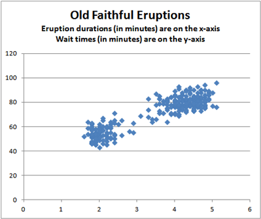
-->

<center>
```{r, echo = FALSE}
plot(wait ~ duration, data = old_faithful,
     col = "steelblue3", # specify the color
     pch = 16, # choose a plotting symbol, options are 1, 2, ..., 25.
     xlab = "Eruption Duration (Minutes)",
     ylab = "Waiting Time (Minutes)",
     main = "Old Faithful Eruptions")
```
</center>

Each point in the plot represents both the actual eruption time and the wait time until the next eruption of Old Faithful.  The position of the point on the horizontal (X) axis represents the duration of the eruption, and the height of the point on the vertical (Y) axis represents the wait time for the next eruption.  This helps us to visualize the relationship between the wait time and the duration of the eruption.  Notice that when the wait time increases, so does the eruption duration.  

<div class = "QuestionsHeading">Answer the following questions:</div>
<div class = "Questions">
15. What do you observe in the scatterplot?  Are there any features that draw your attention?

<a href = "javascript:showhide('Q19')"><span style = "font-size:8pt;">Show/Hide Solution</span></a>
<div id = "Q19" style = "display:none;">
- The scatter-plot shows that there are two groups of data points and that the points are going up and to the right, showing that they are positively associated.  
</div>
<br>

16. Based on the scatterplot, does $\bar x = 70.9$ minutes seem like a good estimate of the mean waiting time between eruptions?  

<a href = "javascript:showhide('Q16')"><span style = "font-size:8pt;">Show/Hide Solution</span></a>
<div id = "Q16" style = "display:none;">
- 70.9 minutes is right in the middle of the two groups of data, so it might be a good "average", but it looks like it is very rare for the waiting time to actually be 70.9 minutes.
</div>
&nbsp;
</div>
<br>

<!-- ## Covariance -->

<!-- The English idiom, "Don't put all your eggs in one basket" counsels you to avoid investing all your time or money in one thing.  It is better to spread your resources across many opportunities to avoid losing everything.  This advice is very appropriate in the financial markets. -->

<!-- When considering a portfolio of stocks and bonds, it is wise to diversify the investments.  If one company or one sector of the economy declines, a diversified portfolio involving many different stocks and bonds can help minimize losses.  It is important for investors to understand the risk associated with a particular portfolio.  We can use the variability of the investments as a measure of the risk of a portfolio.   -->

<!-- In a financial market, investments do not act independently; they vary together.  For example, if the value of Apple Computers' stock drops, Microsoft's stock is also likely to decrease in value.  When making investment decisions, it is important to take into account the interrelationships among the investments.   -->

<!-- The **covariance** is a measure of how two variables (such as stock returns) vary together.  The covariance of two variables, $X$ and $Y$, is calculated by multiplying the following three items together: -->
<!-- - the correlation coefficient of $X$ and $Y$ -->
<!-- - the standard deviation of $X$, and -->
<!-- - the standard deviation of $Y$    -->

<!-- We compute the covariance for a data set using the formula: -->
<!-- $$ -->
<!-- s_{xy} = r \cdot s_x \cdot s_y -->
<!-- $$ -->

<!-- ### Example: Math Self Efficacy -->

<!-- As an example, we will compute the covariance for Goodwin's data.  The correlation coefficient was determined to be $r = 0.728$.  Using the file [math_self_efficacy.xlsx](./data/math_self_efficacy.xlsx), we compute the standard deviation of the mean confidence rating ($X$) to be $s_x = 0.939$ and the standard deviation of the test scores ($Y$) to be $s_y = 16.37$.  Applying the equation for the covariance of a collection of data, we get -->
<!-- $$  -->
<!-- s_{xy} = r \cdot s_x \cdot s_y = 0.728 \cdot 0.939 \cdot 16.37 = 11.19 -->
<!-- $$ -->

<!-- The covariance of $X$ and $Y$ will be positive if increasing values of $X$ correspond to increasing values of $Y$.  This is exactly what happened in Goodwin's data.  On the other hand, the covariance will be negative if an increase in $X$ tends to correspond with a decrease in $Y$.   -->

<!-- <div class = "QuestionsHeading">Answer the following question:</div> -->
<!-- <div class = "Questions"> -->
<!-- 17. Is it possible for the covariance of $X$ and $Y$ to be negative when the correlation coefficient is positive?  If so, how could this occur? -->

<!-- <a href = "javascript:showhide('Q17')"><span style = "font-size:8pt;">Show/Hide Solution</span></a> -->
<!-- <div id = "Q17" style = "display:none;"> -->
<!-- - It is impossible for the covariance of $X$ and $Y$ to be negative when the correlation coefficient is positive.  The covariance is the correlation coefficient multiplied by the standard deviations.  Since the standard deviation of any variable cannot be negative, the sign of the correlation coefficient will be the same as the sign of the covariance. -->
<!-- </div> -->
<!-- &nbsp; -->
<!-- </div> -->
<!-- <br> -->

<!-- If an investor wants to purchase two stocks, and they want to reduce their risk, they can choose two stocks with a negative covariance.  If the return on one stock decreases, the return on the other stock would tend to increase.  This diversification can help protect the investor when market conditions change. -->

<!-- ### Example: Microsoft Versus Apple -->

<!-- Suppose you are considering investing in two stocks.  The annual percent change in the price of Microsoft stock has a mean of 33.48% with a standard deviation of 49.31%.  For Apple, the mean is 42.03% and the standard deviation is 80.84%.  The correlation of these variables is 0.395.  Find the covariance of these two stocks. -->

<!-- $$ -->
<!-- s_{xy} = r \cdot s_x \cdot s_y = 0.395 \cdot 49.31 \cdot 80.84 = 1574.56 -->
<!-- $$ -->

<!-- This number is difficult to interpret directly, but it gives an estimate of the joint variability in the prices of these stocks. -->

<!-- ### Sample Statistic and Population Parameter -->

<!-- The sample correlation coefficient, $r$, is an estimate of the unknown population correlation coefficient, $\rho$.  In a simiilar manner, we will consider the sample covariance and population covariance. -->

<!-- The sample covariance of the variables $X$ and $Y$ is denoted by the symbol $s_{xy}$.  Like all sample statistics, it is computed directly from specific data.  If we define the sample standard deviation of $X$ to be $s_x$ and the sample standard deviation of $Y$ to be $s_y$, then we can write the sample covariance of $X$ and $Y$ as: -->
<!-- $$ -->
<!-- s_{xy} = r \cdot s_x \cdot s_y -->
<!-- $$ -->

<!-- Using similar notation for the population standard deviation of the random variables $X$ and $Y$, we can write the population covariance as: -->
<!-- $$ -->
<!-- \sigma_{xy} = \rho \cdot \sigma_x \cdot \sigma_y -->
<!-- $$ -->

<!-- The sample statistic $s_{xy}$ is an estimator of the population parameter $\sigma_{xy}$.  We usually do not know the value of $\sigma_{xy}$.  Sometimes, we denote the population covariance as $Cov(X,Y)$ instead of $\sigma_{xy}$. -->

<!-- <br> -->

## Summary

<div class = "SummaryHeading">Remember...</div>
<div class = "Summary">

- Creating **scatterplots** of bivariate data allows us to visualize the data by helping us understand its **shape** (linear or nonlinear), **direction** (positive, negative, or neither), and **strength** (strong, moderate, or weak). 

- The **correlation coefficient ($r$)** is a number between $-1$ and $1$ that tells us the direction and strength of the linear association between two variables. A positive $r$ corresponds to a **positive association** while a negative $r$ corresponds to a **negative association**. A value of $r$ closer to $-1$ or $1$ indicates a stronger association than a value of $r$ closer to zero.

- To create a scatterplot in R use the [`plot(...)`](Lesson21.htlm#r-instructions-for-scatterplots) function.

- To compute the correlation in R, use the [`cor(...)`](Lesson21.html#r-instructions-for-computing-correlation) function.


<!-- - The **covariance** is a measure of how two variables vary together. The formula for the covariance is $s_{xy} = r \cdot s_x \cdot s_y$. -->

<br>
</div>
<br>

## Navigation

<center>
| **Previous Reading** | **This Reading** | **Next Reading** |
| :------------------: | :--------------: | :--------------: |
| [Lesson 20: <br> Review for Exam 3](Lesson20.html) | Lesson 21: <br> Describing Bivariate Data: Scatterplots, Correlation, & Covariance | [Lesson 22: <br> Simple Linear Regression](Lesson22.html) |
</center>


