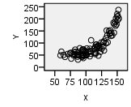

<script type="text/javascript">
 function showhide(id) {
    var e = document.getElementById(id);
    e.style.display = (e.style.display == 'block') ? 'none' : 'block';
 }
</script>

<div style="float:right;width=40%;">
<br/>
<div style="padding-left:10%;">**Optional Lesson Video**</div>
<iframe width="90%" align="right" src="https://www.youtube.com/embed/zlX2v7F0hhY?list=PLaZryQtbPQC-cf5OWjLW7bqFjhgmQAApJ" frameborder="1" allow="autoplay; encrypted-media" allowfullscreen></iframe>
</div>

## Lesson Outcomes

<a href="javascript:showhide('oc')"><span style="font-size:8pt;">Show/Hide Outcomes</span></a>
<div id="oc" style="display:none;">
By the end of this lesson, you should be able to:

- Identify the explanatory and response variable in a study.
- Calculate the slope and intercept of a regression model.
- Interpret the slope of the regression model.
- Make predictions using a regression model.
</div>
<br>

<div style="clear:both;"></div>

<br/>

## Introduction to Regression

Simple linear regression is a method used to fit a line to data.  This provides a powerful tool to model bivariate data (i.e., data involving two variables.)  Regression allows us to write a linear equation that models the relationship between the **independent variable** ($X$) and the **dependent variable** ($Y$) which we can use to predict the value of $Y$ for any given value of $X$. Sometimes the independent variable is also called the **explanatory variable**, and the dependent variable is also called the **response variable**.

We will be using linear equations throughout this lesson.  Click on the link below if you would like to review lines and linear equations.

<!-- BEGIN REVIEW OF LINES  ***********************************************  -->
<a href="javascript:showhide('re')"><span style="font-size:8pt;">Click Here for a Review of the Equation of a Line</span></a>
<div id="re" style="display:none;">


**Linear Equations**

A **linear equation** is the technical term for any equation that describes a line.  Two important characteristics of a line are its slope and its Y-intercept.  

The **Y-intercept** is the value at which the line crosses the Y-axis.  Stated differently, the Y-intercept is the value of $Y$ that corresponds to $X = 0$.  Given the equation of a line, you can find the Y-intercept by substituting $X = 0$ and solving for $Y$.

The **slope** of a line is a measure of how steep the line is.  It is sometimes described as *rise* over *run*.  If the slope is positive, then the values of $Y$ increase as the values of $X$ increase.  When the slope is expressed as a fraction, the numerator tells how much the points on the line change vertically as you move to the right the distance indicated by the denominator.  If the slope is negative, the values of $Y$ decrease as $X$ increases.  If the slope of a line is $\frac{2}{3}$, then the value of $Y$ will increase by 2 units if $X$ increases by three units.  For a line with slope $-5 \left( = \frac{-5}{1}\right)$, the value of $Y$ will *decrease* by 5 units if $X$ increases by one unit.

To describe a line, we need two pieces of information.   If we know the slope and the Y-intercept, these two values uniquely determine the line.  In this course, we will focus the **slope-intercept form** of a line.  The equation of a line in slope-intercept form is often written as:
$$Y = m X + b$$
where $Y$ is the dependent variable, $X$ is the independent variable, $m$ is the slope of the line, and $b$ is the Y-intercept.

<div class="QuestionsHeading">Answer the following questions:</div>
<div class="Questions">

A. If the equation of a line is $Y = 3 X - 2$, where does it cross the Y-axis?

<a href="javascript:showhide('A')"><span style="font-size:8pt;">Show/Hide Solution</span></a>
<div id="A" style="display:none;">
- At $-2$
</div>
<br>

B. If the equation of a line is $Y = 3 X - 2$, what happens to the value of $Y$ as $X$ increases?

<a href="javascript:showhide('B')"><span style="font-size:8pt;">Show/Hide Solution</span></a>
<div id="B" style="display:none;">
- The value of $Y$ increases by 3 as $X$ increases by 1.  
</div>
&nbsp;
</div>
<br>

</div>
<br>
<!-- END REVIEW OF LINES ***********************************************  -->


In statistics, we may use different notation than you encountered in your algebra classes.  We use different symbols to denote the slope and Y-intercept than you may have seen before.  In your algebra class, you may have written the equation of a line as $Y = mX + b$, where $m$ is the slope and $b$ is the Y-intercept.  We represent the Y-intercept with the symbol $b_0$ and the slope with the symbol $b_1$.  In addition, we often write the Y-intercept as the first part of this equation.

<!--
Notice that this is the equation of a straight line. You might have written linear equations in the form $Y=mX+b$ in your algebra classes.  Notice that our equation has the same form.  The slope is given by $b_1$ and the $Y$-intercept is given by $b_0$.
-->
This leads to the following representation of the linear equation:
$$\hat Y = b_0 + b_1 X$$
We use the symbol $\hat Y$ to indicate a predicted value for $Y$. The value $b_0$ is the Y-intercept and $b_1$ is the slope.  Compare this notation to traditional slope-intercept form.

You may wonder why we would use this form (rather than traditional slope-intercept form) to express the equation.  Click on the link below for a brief explanation if you are interested.

<!-- START EXPLANATION OF FORM ***********************************************  -->
<a href="javascript:showhide('ex')"><span style="font-size:8pt;">Click Here for an Explanation</span></a>
<div id="ex" style="display:none;">
  In this course we will relate one independent variable to one dependent variable.  In many cases, we will want to predict the value of $Y$, based on the value of $X$.  This is done using simple linear regression.  
  If there are several independent variables that influence the value of the dependent variable, we call it multiple regression.  A multiple regression equation with two independent variables, $X_1$ and $X_2$, could be written as:
$$Y = b_0 + b_1 X_1 + b_2 X_2$$
  If there were four independent variables, we would have the regression equation
$$Y = b_0 + b_1 X_1 + b_2 X_2 + b_3 X_3 + b_4 X_4$$
  Notice that the Y-intercept is the first term in this sum, and we can simply add more terms as needed.  The reason we write the Y-intercept first is that it allows us to easily add more terms to the model without having to rewrite or reorder any of the existing terms.
  In this course, you will not be conducting multiple regression analyses, but it is good for you to be aware that these procedures exist.  Multiple regression is used in many business forecasting models.


<div class="QuestionsHeading">Answer the following questions:</div>
<div class="Questions">

A. For the linear regression equation, $Y = 1.2 - 3.4 X$, what is the slope?

<a href="javascript:showhide('a2')"><span style="font-size:8pt;">Show/Hide Solution</span></a>
<div id="a2" style="display:none;">
- slope = $-3.4$
</div>
<br>

B. For the linear regression equation, $Y = 1.2 - 3.4 X$, what is the Y-intercept?

<a href="javascript:showhide('b2')"><span style="font-size:8pt;">Show/Hide Solution</span></a>
<div id="b2" style="display:none;">
- y-intercept = $1.2$
</div>
<br>

C. If a line crosses the Y-axis at $-3$ and has a slope of $\frac{5}{2}$, how would you write the equation of this line in slope-intercept form?

<a href="javascript:showhide('c2')"><span style="font-size:8pt;">Show/Hide Solution</span></a>
<div id="c2" style="display:none;">
<center>
$Y = -3 + \frac{5}{2}X$
</center>
</div>
&nbsp;
</div>
</div>
<br>
<br>
<!-- END EXPLANATION OF FORM ***********************************************  -->


## Case Study: SuperCroc

<div style="float:right;padding:10px;">

</div>


A partial skeleton of an enormous extinct crocodilian was found in the Sahara Desert.  With a skull that is about six feet long, this massive creature was a fierce hunter.  Unfortunately, the skeleton is incomplete.  Almost none of the bones for the legs and tail were recovered.  How big was this massive creature?

To answer this question, paleontologist Paul Sereno teamed up with modern crocodile expert Brady Barr.  Their work is demonstrated in the National Geographic video *SuperCroc*.  Using linear regression, these researchers are able to estimate the size of SuperCroc simply by knowing the size of its skull. Before continuing, please follow this link to watch a 15 minute clip of this video.

<br>
<div class="message Note">This video is an hour and a half long. **YOU DO NOT NEED TO WATCH THE ENTIRE VIDEO**. Please watch only the last fifteen minutes, beginning at 1:19:00</div>
<br>
<br>

<iframe id="kaltura_player_1578605835" src="https://cdnapisec.kaltura.com/p/1157612/sp/115761200/embedIframeJs/uiconf_id/41351812/partner_id/1157612?iframeembed=true&playerId=kaltura_player_1578605835&entry_id=0_kh1juzmd" width="800" height="450" allowfullscreen webkitallowfullscreen mozAllowFullScreen allow="autoplay *; fullscreen *; encrypted-media *" frameborder="0"></iframe>

<br/>


We will use Sereno and Barr's measurements on the lengths of Estuarine, or saltwater, Crocodiles' heads to estimate the length of their bodies.  Their measurements are given in the file [EstuarineCrocodiles.xlsx](./Data/EstuarineCrocodiles.xlsx). 

<br/>


Using the information we learned in [Lesson 21](Lesson21.html#r-instructions-for-scatterplots) we create a scatterplot for the Estuarine Crocodile data.

```{r, include=FALSE}
library(readxl)
EstuarineCrocodiles <- read_excel("./Data/EstuarineCrocodiles.xlsx")
```

```{r}
plot(EstuarineCrocodiles$BodyLength ~ EstuarineCrocodiles$HeadLength,
     main="Estuarine Crocodile Measurements",
     ylab="Body Length (cm)",
     xlab="Head Length (cm)",
     col="seagreen", pch=16)
```

Also, using the information we learned in Lesson 21 about [computing correlation](Lesson21.html#r-instructions-for-computing-correlation) we obtain the following.

```{r}
cor(EstuarineCrocodiles$BodyLength, EstuarineCrocodiles$HeadLength)
```

There is a strong positive linear relationship between these two measurements ($r=0.9899$). Because of this strong linear relationship, it seemed reasonable to fit a line to the data. This line can be used to predict the length of a crocodile with a known head length.  In particular, we will use this line to estimate the length of SuperCroc.

<br/>


We can use simple linear regression to develop an equation relating the head length of an estuarine crocodile to its body length.  Let $Y$ be the body length (in cm) and $X$ be the head length (in cm).

If we can assume that there is a linear relationship between the head length and the body length, then we can express this symbolically as:
$$
\hat Y = b_0 + b_1 X
$$
where $\hat Y$ represents the predicted body length of an estuarine crocodile with a head length of $X$. The numbers $b_0$ and $b_1$ are called the estimated "regression coefficients".  "Coefficient" is a fancy term that simply means a number, especially a number that is multiplied by a variable such as $X$.  We will use software to calculate the regression coefficients.

### R Instructions for Performing a Linear Regression

<div class="SoftwareHeading">R Instructions</div>
<div class="Software">
**To find the estimated regression coefficients ($b_0$ and $b_1$) in R, do the following:**

- Import the data into RStudio: [EstuarineCrocodiles.xlsx](./Data/EstuarineCrocodiles.xlsx)
- Use the `lm( )` function to create a "linear model" for the data.
- Put your response variable (Y) first, followed by a `~`, followed by the explanatory variable (X).
- Use the `summary( )` function to view the results of the `lm( )` function.
- The summary shows the "Estimates" for the `(Intercept)` and the slope term. The `(Intercept)` estimate is the value of $b_0$ (y-intercept), and the second Estimate is always for the slope term, $b_1$.

```{r, comment=NA}
estuarine.lm <- lm(EstuarineCrocodiles$BodyLength ~ EstuarineCrocodiles$HeadLength)
summary(estuarine.lm)
```

As shown in the summary output above, the value of $b_0 = -18.274$ and the value of $b_1 = 7.6601$.

<br>
</div>
<br>

### Interpreting the Regression Output

The regression coefficients are given in the column labeled "Estimate". The "(Intercept)" of -18.2740 in this case, gives the value of $b_0$. The "Estimate" below the (Intercept) of 7.6601 is the value for the slope, $b_1$. 

The y-intercept gives the mean y-value for when the x-value is zero. It is sometimes called the *constant term* because it is the term in the equation not multiplied by the value of $x$. For the crocodile data, $b_0=-18.274$, which is somewhat of a silly number if we were to interpret it because it is claiming that the mean body length of crocodiles that have head lengths of 0 cm is -18.274 cm. Since a head length of 0 cm is meaningless, it also makes sense that the y-intercept of -18.274 cm is meaningless, so we ignore this value for this data.

The slope gives the value that is to be multiplied by $X$; this is the slope of the regression equation.  In our model, $X$ represents the head length, in centimeters. The slope in our regression equation is $b_1=7.660$.  This number tells us how much the mean y-value (body length) increases as x (head length) increases.

$$
\underbrace{\hat{Y}}_\text{Predicted Body Length} = -18.274 + 7.660 \underbrace{X}_\text{Head Length}
$$

We put the "hat" on $Y$ to represent that this is an estimate of the value of $Y$. For example, with SuperCroc, we don't know the *actual* body length, but we can use the equation to come up with a predicted value that is reasonable.  The symbol $\hat{Y}$ is read, "$Y$-hat".  We can also express this equation in the following way:
$$
\hat{BodyLength} = -18.274 + 7.660 \cdot HeadLength
$$

The slope of the regression equation is 7.660.  This means that for each one-unit increase in $X$, we expect a corresponding increase in the average of $Y$ of 7.660 centimeters.  For every additional centimeter of head length, we expect that the mean body length to increase by 7.660 cm.

The $Y$-intercept is $-18.274$.  As stated previously it does not make sense to interpret the $Y$-intercept, so we simply state that it is not interpretable.  The $Y$-intercept is included in the regression equation, even though it may not be interpretable.  It must be included to make the predictions more reasonable.

### Predictions

An 87 cm skull from a juvenile sarcosuchus (SuperCroc) was discovered.  We want to estimate the body length of this crocodilian using the regression equation we calculated for the estuarine crocodiles.  

To predict the body length, we can substitute $x=87$ into the regression equation:
$$
\hat Y = -18.274 + 7.660 X = -18.274 + 7.660 (87) = 648.146
$$


Note that if a juvinile sarcosuchus has a head length of 87 cm, then the regression equation predicts the body length to be around 648 cm.

### R Instructions for Graphing the Regression Line

<div class="SoftwareHeading">R Instructions</div>
<div class="Software">
**To add a regression line to a scatterplot in RStudio, do the following:**

- Import the data into RStudio: [EstuarineCrocodiles.xlsx](./Data/EstuarineCrocodiles.xlsx)
- Perform the regression:

```{r}
estuarine.lm <- lm(EstuarineCrocodiles$BodyLength ~ EstuarineCrocodiles$HeadLength)
```

- Create the scatterplot and use `abline( )` with the name of your regression, `estuarine.lm` in this case, to graph the regression line.

```{r}
plot(EstuarineCrocodiles$BodyLength ~ EstuarineCrocodiles$HeadLength,
     main="Estuarine Crocodile Measurements",
     ylab="Body Length (cm)",
     xlab="Head Length (cm)",
     col="seagreen", pch=16)

abline(estuarine.lm)
```

<br/>

</div>

<br/>

If you looked carefully at the scatterplot shown above you might realize that the x-axis of the graph only goes up to 60 cm. The juvenile sarcosuchus we were using to make predictions had a head lenght of 87 cm, which is way off the chart! Further, the estimated body length our regression predicts for this juvenile sarcosuchus is over six and a half meters long!  That is over 21 feet! Imagine how big it might have been if it reached maturity! Further, to actually draw the prediction on our graph we would need to use the `xlim=c(0,90)` and `ylim=c(0,650)` commands inside the `plot( )` function.

```{r}
plot(EstuarineCrocodiles$BodyLength ~ EstuarineCrocodiles$HeadLength,
     main="Estuarine Crocodile Measurements",
     ylab="Body Length (cm)",
     xlab="Head Length (cm)",
     col="seagreen", pch=16,
     xlim=c(0,90),
     ylim=c(0,650))

abline(estuarine.lm)

points(87, 648, pch=16, cex=1.2, col="orange")
text(87,648, "Predicted Body Length of 648 cm", pos=2)
```

<div class="QuestionsHeading">Answer the following question:</div>

<div class="Questions">
1. The fossil of the mature specimen of sarcosuchus had a head length of 160 cm. Using the linear regression equation, how long would we predict the body would be?

<a href="javascript:showhide('Q1')"><span style="font-size:8pt;">Show/Hide Solution</span></a>

<div id="Q1" style="display:none;">

Using the regression equation we calculated from the data with a value of $x=160$ gives:

$$
\hat Y = -18.274 + 7.660 X = -18.274 + 7.660 (160) = 1207.326
$$
If you did some unit conversions, this turns out to be about 39 feet!

Further, if we wanted to draw a picture of this prediction, it would look as follows.

```{r}
plot(EstuarineCrocodiles$BodyLength ~ EstuarineCrocodiles$HeadLength,
     main="Estuarine Crocodile Measurements",
     ylab="Body Length (cm)",
     xlab="Head Length (cm)",
     col="seagreen", pch=16,
     xlim=c(0,165),
     ylim=c(0,1210))

abline(estuarine.lm)

#Predictions for Juvenile
points(87, 648, pch=16, cex=1.2, col="orange")
text(87,648, "Juvenile Predicted Body Length of 648 cm", pos=2)

#Predictions for Adult
points(160, 1207, pch=16, cex=1.2, col="orange")
text(160,1207, "Adult Predicted Body Length of 648 cm", pos=2)

```

</div>

<br/>
</div>

<br/>
<br/>


## Case Study: Manatees and Powerboats

<div style="float:right;padding:10px;">

</div>


Manatees are curious, peaceful sea creatures that like to sun themselves just below the ocean's surface.  Some environmentalists have claimed that manatees are being killed by powerboat propellers.  

Is there a relationship between the number of powerboats registered in Florida and the number of manatees killed there by powerboats each year?  If the powerboats are killing the manatees, then we would expect to see a relationship between the number of powerboats and the number of manatees killed by powerboats.  As the number of powerboats increases, we would expect to observe a corresponding increase in manatee deaths due to powerboats.

We can use simple linear regression to model the relationship between the powerboat registrations and the manatee deaths.  In the next lesson, we will be able to conduct a hypothesis test to determine if this relationship is statistically significant.


The data set [Manatees.xlsx](./Data/Manatees.xlsx) gives the number of Florida powerboat registrations (in thousands) and the number of manatees killed by powerboats for the years 1977-2006. <!--<cite>Manatees06,Manatees-ManateeData,Manatees-PowerboatData</cite>-->


As part of a regression analysis, it is important that you first create a scatterplot and visually examine the data.  If the cloud of data in your scatterplot shows a curvilinear pattern, it is not appropriate to conduct simple linear regression.  Procedures exist for handling curvilinear relationships.  If you have a situation in your profession that involves a curvilinear relationship, you can consult a statistician or else a textbook on Linear Regression such as Kuntner, et. al., *Applied Linear Regression Models*.

In other words, simple linear regression is not appropriate when the graph shows a "curvilinear" shape (suggesting a nonlinear relationship).  We apply simple linear regression when the two variables show a "linear" shape.  If the data look like a random scattering of points, we would conclude that there is no linear relationship in the data.

+---------------+----------------------------------------+--------------------------------------------+-----------------------------------------+
| Graph         | |  |  |
+===============+========================================+============================================+=========================================+
| **Type**      | Linear Pattern                         | Apparent Random Scatter                    | Nonlinear Pattern                       |
+---------------+----------------------------------------+--------------------------------------------+-----------------------------------------+
|**Decision**   | Conduct regression analysis            | Linear regression is not appropriate       | Linear regression is not appropriate    |
|               | to determine if there is a             |                                            |                                         |
|               | significant linear relationship        |                                            |                                         |
+---------------+----------------------------------------+--------------------------------------------+-----------------------------------------+


### Regression Equation

We can use simple linear regression to develop an equation relating the number of powerboats to the number of manatees killed.  Consider a model where $Y$ is the number of manatees killed and $X$ is the number of powerboats registered (in thousands).

If we can assume that as the number of powerboat registrations increase, the increase in the number of manatees killed will be proportional, then we can write our model in the following way:
$$
\hat Y = b_0 + b_1 X
$$
where $\hat Y$ is the predicted number of manatees killed in a year in which the number of powerboat registrations (in thousands) is given by $X$.

Notice that this is the equation of a straight line. You might have written linear equations in the form $Y=mX+b$ in your algebra classes.  Notice that our equation has the same form.  The slope is given by $b_1$ and the $Y$-intercept is given by $b_0$.

### Interpreting the Regression Output

The output from the commands given above will include a table similar to the one shown here:

```{r, include=FALSE}
Manatees <- read_excel("./Data/Manatees.xlsx")
```

```{r, comment=NA}
manatee.lm <- lm(Manatees$Manatees ~ Manatees$`Power Boats (in 1000's)`)
summary(manatee.lm)
```

The Y-intercept term is not multiplied by anything.  This is the value of $b_0$: $b_0=-42.542$.  The value of the slope is to be multiplied by $X$; this is the slope of the regression equation.  In our model, $X$ represents the number of powerboat registrations in Florida, in thousands.  The slope for our regression equation is $b_1=0.129$.  We get the equation:
$$
\hat Y = -42.542 + 0.129 X
$$

We can also write the linear regression equation in the following way:
$$
\widehat{Manatee Deaths} = -42.542 + 0.129 \cdot Powerboats Registered
$$

The slope of the regression equation is 0.129.  This means that for each one-unit increase in $X$, we expect a corresponding increase in the average number of manatee deaths ($Y$) of 0.129 units.  Remember that the number of powerboats registered ($X$) was given in thousands.  So, a one-unit increase in $X$ implies an increase of a thousand powerboats.  So, for every thousand additional powerboats registered in Florida, we expect that an additional 0.129 manatees will be killed.  In other words, if there are one-hundred thousand additional powerboat registrations, we would expect to see about $0.129 \cdot 100 = 12.9$  additional manatee deaths.

The Y-intercept is $-42.542$.  How should we interpret this value?  If there were $X=0$ thousand powerboat registrations, we would expect that approximately negative 43 ($-43$) manatees would be killed by powerboats.  This is absurd.  If it does not make sense to interpret the $Y$-intercept for these data, we simply state that it is not interpretable.  The $Y$-intercept is included in the regression equation, even though it may not be interpretable.  It must be included to make the predictions more reasonable.

The Y-intercept is not always negative or uninterpretable.  In some cases, the Y-intercept is the most important number in the equation, but often the y-intercept is not of interest to us.


### Predictions

If we want to predict the number of manatees that will be killed if, say, 850 thousand powerboats are registered, then we enter $X=850$ into the equation we have obtained and compute the predicted value.

$$
\hat Y = -42.542 + 0.129 (850) = 67.108
$$
Note that if there are 850 thousand powerboats registered, then the regression equation suggests that there will be an estimated 67 manatees killed.  


### Drawing the Regression Line on a Scatterplot

The following plot shows the regression line on the scatterplot.

```{r}
plot(Manatees$Manatees ~ Manatees$`Power Boats (in 1000's)`,
     main="Manatee Deaths in Florida, 1977-2006",
     xlab="Number of Registered Power Boats that Year",
     ylab="Number of Manatees that Died that Year",
     col="darkgray")

abline(manatee.lm)
```

You will observe that the points are not as tightly clustered around the regression line for the manatee data, compared to the crocodile data, but that there is still a fairly strong correlation in the data of $0.9376$.

```{r, comment=NA}
cor(Manatees$`Power Boats (in 1000's)`, Manatees$Manatees)
```

<br>


Knowledge of how the manatee deaths are so strongly related to the number of registered power boats should invite discussion on what action should be taken, but does not specifically tell us the action to take. Actions that have been taken in response to this data include idle speed zones, slow speed zones, motorboats prohibited zones, and no entry zones. ([See here](https://myfwc.com/media/25256/guidelinesprotectingmanatees.pdf) for details if you are interested.)

## Introduction to Multiple Regression

Sometimes it is necessary to use more than one predictor (independent) variable to predict the value of a response (dependent) variable.  For example, if we want to predict the stopping distance for a car on dry roads, we might want to use ($i$) the initial speed of the car, ($ii$) the weight of the car, and ($iii$) the amount of tread on the tires to predict the distance required to stop the car.

Although it is fairly straightforward to create a model and get the estimated multiple regression equation, the interpretation of the results can be a little tricky.  If you need to conduct multiple regression (that is, regression with several predictor variables) you may want to study the topic in depth or hire a statistician.
<!--
Most statistical packages (including SPSS) will easily handle multiple regression analyses.  Unfortunately, in many cases Excel provides incorrect results for multiple regression.  Microsoft seems to have been aware of the issues for decades, but the problem has not been corrected.  Using Excel to conduct multiple regression analyses is strongly discouraged.
-->

<br>

## What's in a Name?

When we want to refer to simple linear regression, there are a variety of names that could be used: simple linear regression, ordinary least-squares regression, linear regression, regression, or (most ostentatiously) simple ordinary linear least squares regression.

If we need to distinguish between simple linear regression and multiple regression, the key will be whether we use the word "multiple."  If we are discussing regression, and the word "multiple" is not used, then assume we are talking about simple least squares regression.
<!--

## Historical Notes
### Why is error called error?
### Why is regression called regression?

TextGoesHere

-->

<br>

## Summary

<div class="SummaryHeading">Remember...</div>
<div class="Summary">

- In statistics, we write the **linear regression equation** as $\hat Y=b_0+b_1X$ where $b_0$ is the **Y-intercept** of the line and $b_1$ is the **slope** of the line. 

- To calculate the values of $b_0$ and $b_1$ in R use the `lm( )` function and the `summary( )` function as [shown here](Lesson22.html#r-instructions-for-performing-a-linear-regression).

- To add the regression line to a scatterplot, use the `abline( )` function as [shown here](Lesson22.html#r-instructions-for-graphing-the-regression-line).

- Linear regression allows us to predict values of $Y$ for a given $X$. This is done by first calculating the coefficients $b_0$ and $b_1$ and then plugging in the desired value of $X$ and solving for $Y$.

- The **independent (or explanatory) variable ($X$)** is the variable which is *not* affected by what happens to the other variable. The **dependent (or response) variable ($Y$)** is the variable which *is* affected by what happens to the other variable. For example, in the correlation between number of powerboats and number of manatee deaths, the number of deaths is affected by the number of powerboats in the water, but not the other way around. So, we would assign $X$ to represent the number of powerboats and $Y$ to represent the number of manatee deaths.

- The y-intercept $b_0$ is interpreted as the mean y-value for when the x-value equals zero.

- The slope $b_1$ is interpreted as the change in the mean y-value for each one unit change in the x-value.

<br>
</div>
<br>

## Navigation

<center>
| **Previous Reading** | **This Reading** | **Next Reading** |
| :------------------: | :--------------: | :--------------: |
| [Lesson 21: <br> Describing Bivariate Data: Scatterplots, Correlation, & Covariance](Lesson21.html) | Lesson 22:  <br> Simple Linear Regression | [Lesson 23: <br> Inference for Bivariate Data)](Lesson23.html) |
</center>
