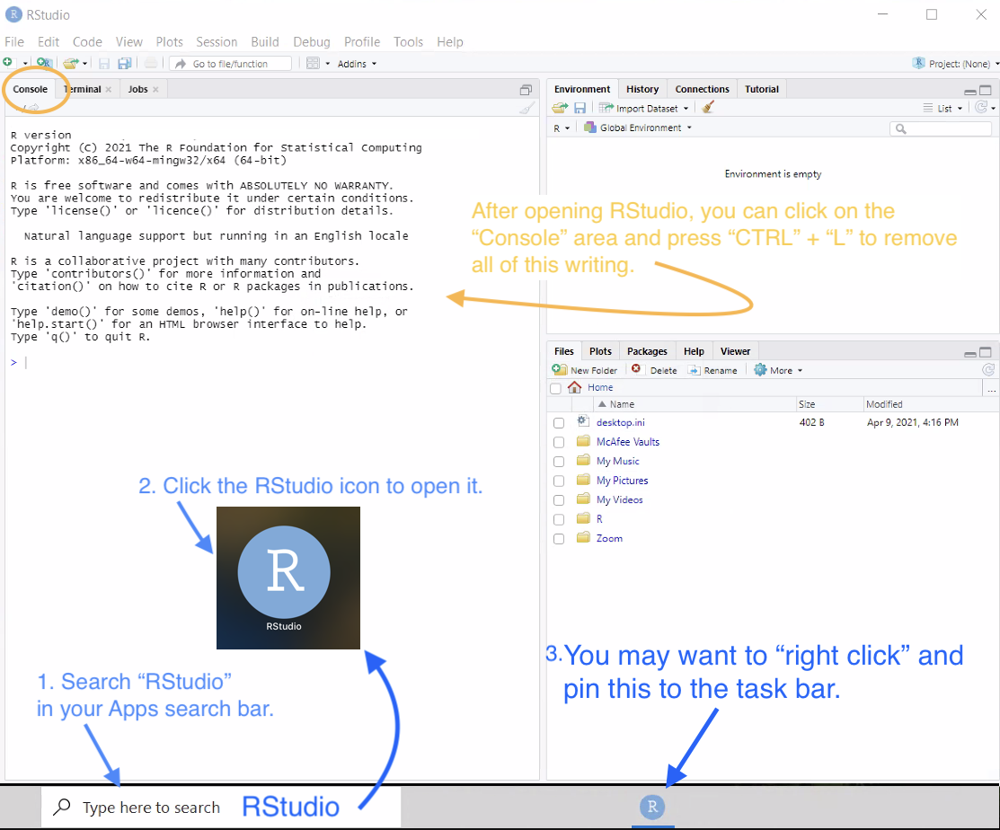

We will use [RStudio](https://www.rstudio.com/products/rstudio/download/) for all of our data analysis this semester. This page will guide you through the installation process and help you get started working with data in R.

## Installing R and RStudio {.tabset .tabset-fade}

### Quick Instructions

<table align="left">
  <tr>
    <td style="padding:5px;">
**First**, install:
    </td><td style="padding:5px;">
&nbsp;(<a href="https://cran.r-project.org/bin/macosx/R-4.0.5.pkg" target="_blank">Mac OS X</a> | <a href="https://cran.r-project.org/bin/windows/base/R-4.0.5-win.exe" target="_blank">Windows</a>),
    </td>
  </tr><tr>
    <td style="padding:5px;">
**Second**, install:
    </td><td style="padding:5px;">
&nbsp;(<a href="https://download1.rstudio.org/desktop/macos/RStudio-1.4.1106.dmg" target="_blank">Mac OS X</a> | <a href="https://download1.rstudio.org/desktop/windows/RStudio-1.4.1106.exe" target="_blank">Windows</a>).
    </td>
  </tr>
</table>

If you are using a Chromebook or other "web browsing only" type computer that will not allow you to install software, then set up an account at <a href="https://rstudio.cloud/">RStudio Cloud</a> instead of installing R and RStudio as shown here.

 

Just accept all of the default options when installing.

----

 

 

### Detailed Instructions

To install the statistical analysis program **RStudio** you will first need to install a piece of software called **R**. Funny name, right? (There was originally a software called "S" for statistics, and then "R" was invented later on. Part of the reason they used "R" was to claim that "R" was a "leap ahead" of "S.")

<table align="left">
  <tr>
    <td style="padding:5px;">
Install the R Software by clicking here:
    </td><td style="padding:5px;">
&nbsp;(<a href="https://cran.r-project.org/bin/macosx/R-4.0.5.pkg" target="_blank">Mac OS X</a> | <a href="https://cran.r-project.org/bin/windows/base/R-4.0.5-win.exe" target="_blank">Windows</a>),
    </td>
  </tr>
</table>

 

Once that download finishes, open the resulting file. It should look something like this:

Click "Continue" or "Okay" or "Accept" for all of the several various windows that will appear. Once the installation is complete you should get a window like this:

Now that R is properly installed on your computer, we need to install RStudio. RStudio is an app that runs R inside of it and provides you with many other tools that go way beyond what R can do. This is why R must be installed first, so that RStudio can use it. You will never need to open R yourself. Just use RStudio. But without R, RStudio won't work properly.

<table align="left">
  <tr>
    <td style="padding:5px;">
Install the RStudio app by clicking here:
    </td><td style="padding:5px;">
&nbsp;(<a href="https://download1.rstudio.org/desktop/macos/RStudio-1.4.1106.dmg" target="_blank">Mac OS X</a> | <a href="https://download1.rstudio.org/desktop/windows/RStudio-1.4.1106.exe" target="_blank">Windows</a>).
    </td>
  </tr>
</table>

 

Once the RStudio installer downloads, open the resulting file. A window like this should appear:

Again, work through the installation process, agreeing with all the defaults and terms of conditions.

Once the installation finishes you can use your computer's search bar to search for "RStudio" in your apps. It will have an icon like this: .

Once you have successfully opened RStudio it should look like this:

----

 
 

## Reading in Data {.tabset .tabset-fade}

### Quick Instructions

### Detailed Instructions

